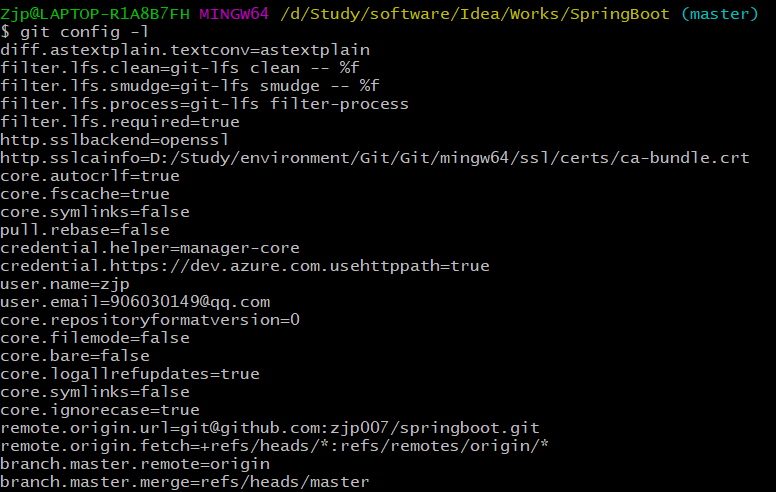

# Git

* [版本控制](#版本控制)
  * [Git历史](#git历史)
  * [Git环境配置](#git环境配置)
  * [Git基本理论](#git基本理论)
  * [Git项目搭建](#git项目搭建)
  * [Git文件操作](#git文件操作)
  * [使用码云](#使用码云)
  * [IDEA中集成Git](#idea中集成git)
  * [说明：Git分支](#说明git分支)

## 版本控制

## Git历史

## Git环境配置

> Git 配置

所有的配置文件，其实都保存在本地！
查看配置`git config -l`



查看不同级别的配置文件：

```bash
#查看系统config
git config--system--list
#查看当前用户（g1oba1）配置
git config--global--list
```

**Git相关的配置文件：**
1）、Git\mingw64\etc\gitconfig:Git 安装目录下的gitconfig-system系统级

2）、C:\Users\Administrator\.gitconfig 只适用于当前登录用户的配置-global全局

这里可以直接编辑配置文件，通过命令设置后会响应到这里。

> 设置用户名与邮箱（用户标识，必要）

当你安装Git后首先要做的事情是设置你的用户名称和e-mail地址。这是非常重要的，因为每次Git提交都会使用该信息。它被永远的嵌入到了你的提交中：

```bash
git config--global user.name"kuangshen"#名称
git config--global user.email 24736743@qq.com#邮箱
```


## Git基本理论

## Git项目搭建

## Git文件操作

## 使用码云

## IDEA中集成Git

## 说明：Git分支