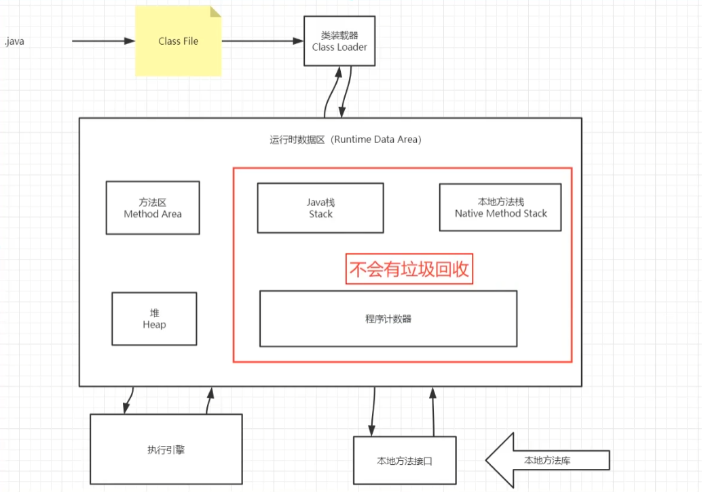
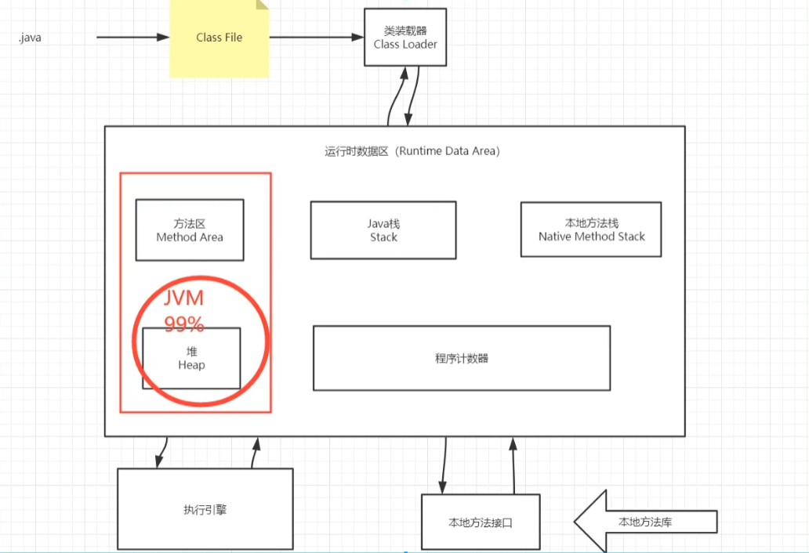
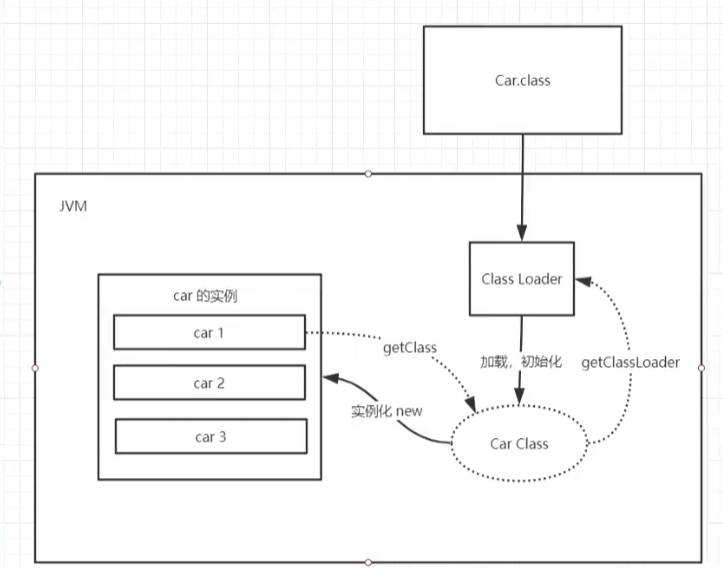
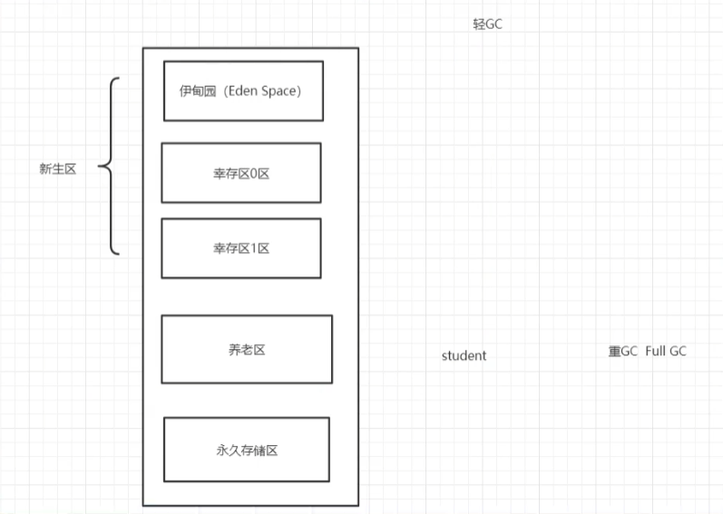
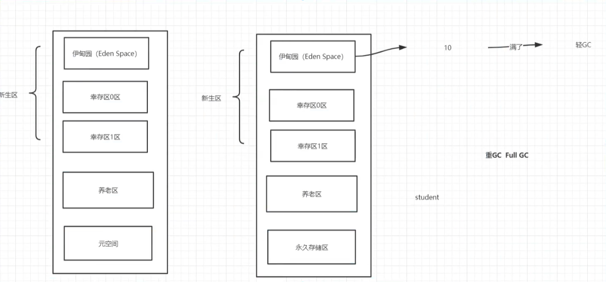
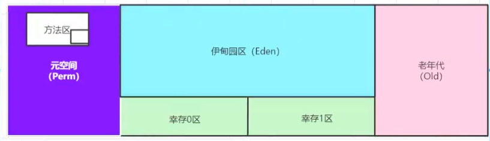
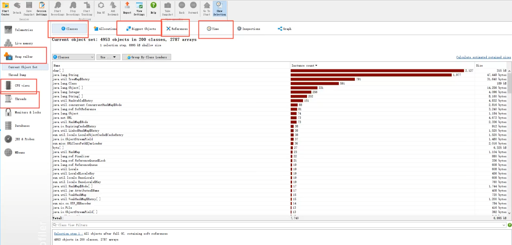
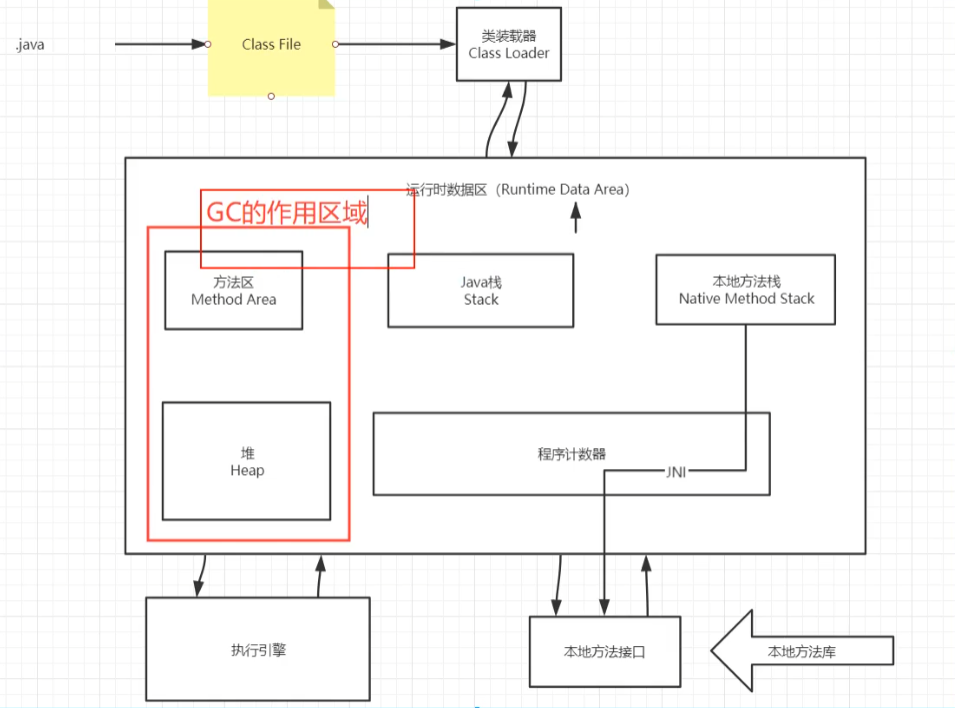

# JVM

* 目录
  * [面试问题](#面试问题)
  * [JVM的位置](#jvm的位置)
  * [JVM的体系结构](#jvm的体系结构)
  * [类加载器](#类加载器)
  * [双亲委派机制](#双亲委派机制)
  * [沙箱安全机制](#沙箱安全机制)
  * [Native](#native)
  * [PC寄存器](#pc寄存器)
  * [方法区](#方法区)
  * [栈](#栈)
  * [三种利VM](#三种利vm)
  * [堆（Heap）](#堆heap)
  * [新生区、老年区](#新生区老年区)
  * [永久区](#永久区)
  * [堆内存调优](#堆内存调优)
  * [GC:垃圾回收](#gc垃圾回收)
    * [常用算法](#常用算法)
  * [JMM](#jmm)
  * [总结](#总结)

## 面试问题

- 请你谈谈你对VM的理解？java8虚拟机和之前的变化更新？
- 什么是0OM，什么是栈溢出StackOverFlowError？怎么分析？
- JVM的常用调优参数有哪些？
- 内存快照如何抓取，怎么分析Dump文件？知道吗？
- 谈谈VM中，类加载器你的认识？


## JVM的位置

操作系统之上，和普通软件是一个层级；Java软件运行与JVM之上

## JVM的体系结构



JVM调优，对堆进行



## 类加载器

作用：加载Class文件~



1. 虚拟机自带的加载器
2. 启动类（根）加载器
3. 扩展类加载器
4. 应用程序（系统类）加载器


## 双亲委派机制


当一个Hello.class这样的文件要被加载时。不考虑我们自定义类加载器，首先会在AppClassLoader中**检查是否加载过**，如果有那就无需再加载了。如果没有，那么会拿到**父加载器**，然后调用父加载器的**loadClass**方法。父类中同理会先检查自己是否已经加载过，如果没有再往上。注意这个过程，知道到达**Bootstrap classLoader**之前，都是没有哪个加载器自己选择加载的。如果父加载器无法加载，会下沉到子加载器去加载，一直到最底层，如果没有任何加载器能加载，就会抛出**ClassNotFoundException**。

## 沙箱安全机制

Java安全模型的核心就是Java沙箱（sandbox），什么是沙箱？沙箱是一个限制程序运行的环境。沙箱机制就是将 Java 代码限定在虚拟机(JVM)特定的运行范围中，并且严格限制代码对本地系统资源访问，通过这样的措施来保证对代码的有效隔离，防止对本地系统造成破坏。沙箱主要限制系统资源访问，那系统资源包括什么？——CPU、内存、文件系统、网络。不同级别的沙箱对这些资源访问的限制也可以不一样。

## Native

```java
//native：凡是带了native 关键字的，说则java的作用滋围达不到了，间去调用底层c语言的库！
//会进入本地方法钱
//谢用本地方法本地接口 JNI
//JN工作/用：扩展Java的使用，融合不同的编程语言为为ava所/用！最初：C、C++。
//Java诞生的时食C、C++横行，想要这足，必须要有谢IIC、C++的程产
//它在内存区域中专门开辟了一块标记区域：Native Method stack，登i记 native 方法
//在最终执行的时候，加我本地方法库中的方法通过NT
//Java广探动打印机，管理系统，掌提即可，在企业级应用小较为少见！
private native void starte（）；
```


## PC寄存器

程序计数器：Program Counter Register

每个线程都有一个程序计数器，是线程私有的，就是一个指针，指向方法区中的方法字节码（用来存储指向像一条指令的地址，也即将要执行的指令代码），在执行引擎读取下一条指令，是一个非常小的内存空间，几乎可以忽略不计

## 方法区

Method Area方法区

方法区是被所有线程共享，所有字段和方法字节码，以及一些特殊方法，如构造函数，接口代码也在此定义，简单说，所有定义的方法的信息都保存在该区域，**此区域属于共享区间**；

==静态变量、常量、类信息（构造方法、接口定义）、运行时的常量池存在方法区中，但是实例变量存在堆内存中，和方法区无关==

static、final、Class模板、常量池、方法（引用）

jdk1.8：

1. 移除了永久代（PermGen），替换为元空间（Metaspace）
2. 永久代中的 class metadata（Class模板） 转移到了 native memory（本地内存，而不是虚拟机）
3. 永久代中的 interned Strings（String常量池） 和 class static variables（类静态变量） 转移到了 Java heap（堆）
4. 永久代参数 （PermSize MaxPermSize） -> 元空间参数（MetaspaceSize MaxMetaspaceSize）
5. 运行时常量池在方法区中，字符串常量池在堆中 元空间方法实现


## 栈

栈：先进后出、后进先出

队列，先进先出（FIFO	First input first ouput）

main()先执行，最后结束

栈：栈内存，主管程序的运行，生命周期和线程同步；

线程介绍，栈内存也就释放，对应栈来说，==不存在垃圾回收的问题==

一旦线程结束，栈就Over

栈：8大基本类型 + 对象引用（地址）+ 实例的方法

栈运行原理：栈帧

## 三种利VM

- Sun公司 HotSpot` Java Hotspot（TM）64-Bit server M（build 25.181-b13，mixed mode）`
- BEA `JRockit `
- IBM `J9VM`

## 堆（Heap）

一个JVM只有一个堆内存，堆内存的大小是可以调节的。

类加载器读取了类文件后，一般会把 (实例化)类、方法、常量、变量放到堆中，保存所有引用类型的真实对象；

堆内存细分三区域：

- 新生区（伊甸园区） Young/Eden
- 养老去 old
- 永久区 Perm

新生代：Eden、s0 from,s1 to



GC 垃圾回收，主要是在伊甸园区和养老区

在JDK8以后，永久存储区改了个名字（元空间）；

## 新生区、老年区

**新生区**

- 类(实例)：诞生 和成长的地方，甚至死亡
- 伊甸园：所有实例类都是在伊甸园区被 new 出的
- 幸存者区（0，1）

**老年区**



真理：经过研究，99%的对象都是临时对象！

## 永久区

这个区域常驻内存。用来存放JDK自身携带的Class对象。Interface元数据，存储的是Java运行时的一些环境或类信息；这个区域不存在垃圾回收。关闭JVM虚拟就会释放这个区域的内存。

- jdk1.6之前：永久代，常量池是在方法区；

- jdk1.7：永久代，但是慢慢的退化了，`去永久代`，常量池在堆中

- jdk1.8之后：无永久代，常量池在元空间

  

  元空间：逻辑上存在：物理上不存在（不在JVM内存中，在本地[系统]内存）

## 堆内存调优

```java
//默认情况下：分配的总内存是电脑内存的1/4，而初始化的内存：1/64

// OOM 
	// 1. 尝试扩大堆内存看结果
	// 2. 分析内存，看一些那个地方出现了问题（专业工具）
//-Xms1024m -Xmx1024m -XX:+PrintGCDetails
```

在一个项目中，突然出现了OOM故障，那么该如何排除，研究为什么出错

- 能够看到代码第几行出错：内存快照分析工具，MAT(Eclipse)、Jprofiler
- Dubug，一行行分析代码！

MAT，Jprofiler作用：

- 分析Dump内存文件，快速定位内存泄露；

- 获得堆中的数据·获得大的对象~
- ……

```JAVA
// -Xms设置初始化内存分配大小	1/64
// -Xmx设置最大分配内存，	1/4
// -XX：+PrintGcDetails	//打印GC垃圾回收回收信息
// -XX：+HeapDumpOnOutofMemoryError	//oom DUMP
// -Xms1m -Xmx8m -XX:+HeapDumpOnOutOfMemoryError
```




## GC:垃圾回收



JVM在进行GC时，并不是对这三个区域统一回收。大部分时候，回收都是新生代~

- 新生代
- 幸存区
- 老年区

对象从Young generation区域消失的过程我们称之为”**minor GC**“

对象从老年代中消失的过程，我们称之为**”major GC“ **

GC两种类：轻GC（MinorGC）、重GC（MajorGC）

### 常用算法

四大算法应该为：复制算法，标记整理算法，标记清除算法，分代收集算法

引用计数法应该与可达性分析归为一类

## JMM

## 总结


单点登录~~SSO