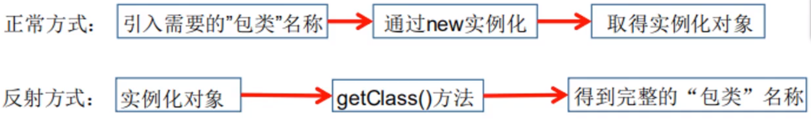
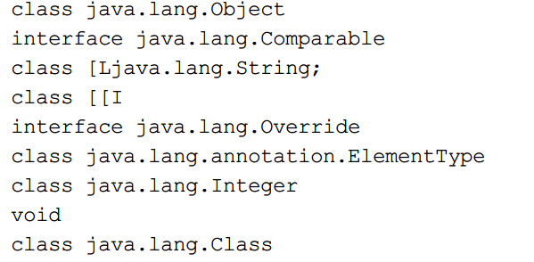
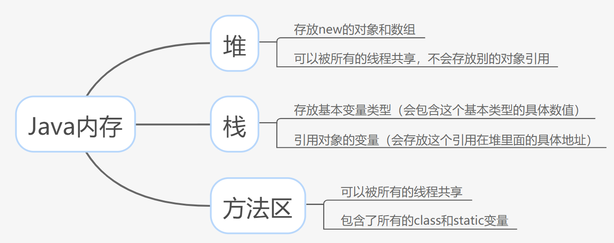
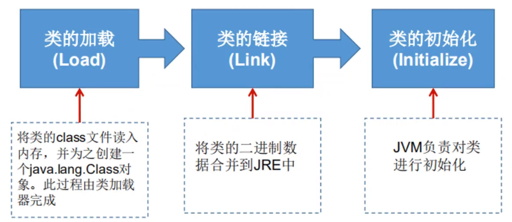
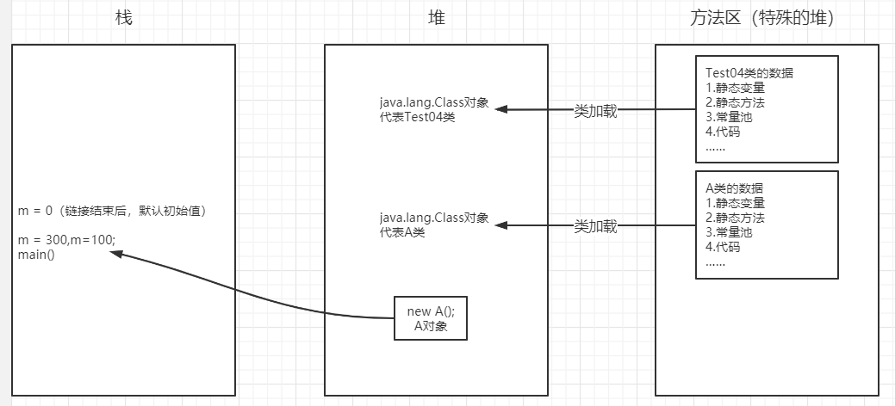
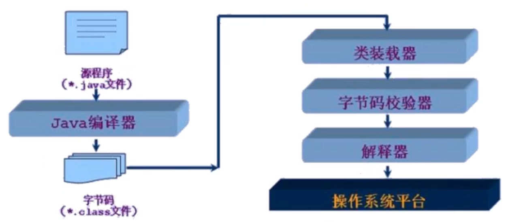
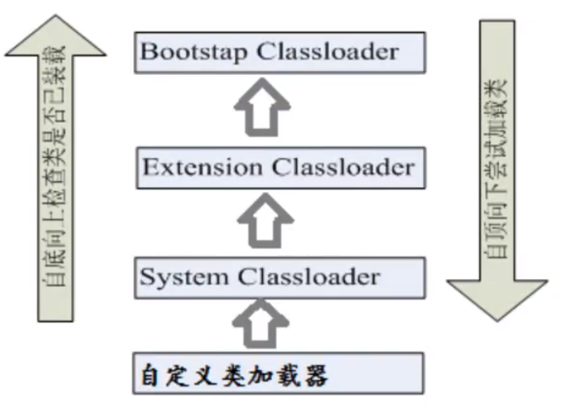

# Java

* 目录
  * [注解](#注解)
    * [元注解](#元注解)
    * [自定义注解](#自定义注解)
  * [反射](#反射)
    * [Java反射机制概述](#java反射机制概述)
    * [理解Class类并获取Class实例](#理解class类并获取class实例)
      * [Class类](#class类)
      * [哪些类型有Class对象](#哪些类型有class对象)
    * [类的加载与ClassLoader](#类的加载与classloader)
      * [Java内存分析](#java内存分析)
      * [类加载过程](#类加载过程)
      * [类的加载与ClassLoader](#类的加载与classloader-1)
      * [什么时候会发生类的初始化](#什么时候会发生类的初始化)
      * [类加载器的作用](#类加载器的作用)
    * [获取运行时类的完整结构](#获取运行时类的完整结构)
    * [调用运行时类的指定结构](#调用运行时类的指定结构)
    * [反射操作泛型](#反射操作泛型)
    * [反射操作注解](#反射操作注解)

## 注解

### 元注解

- **@Target**：用于描述注解的使用范围（即：被描述的注解可以用在什么地方）
- **@Retention**：表示需要在什么级别保存该注释信息，用于描述注解的生命周期
  - （SOURCE<CLASS<**RUNTIME**）
- @Document：说明该注解将被包含在javadoc中
- @lnherited：说明子类可以**继承**父类中的该注解

### 自定义注解

1. 使用@interface自定义注解时，自动继承了java.lang.annotation.Annotation接口

2. 分析：

   - @interface用来声明一个注解，格式：public@interface 注解名{定义内容}
   - 其中的每一个方法实际上是声明了一个配置参数.
   - 方法的名称就是参数的名称.
   - 返回值类型就是参数的类型（返回值只能是基本类型，Class，String，enum）.
   - 可以通过default来声明参数的默认值
   - 如果只有一个参数成员，一般参数名为value
   - 注解元素必须要有值，我们定义注解元素时，经常使用空字符串，0作为默认值.

    ```java
   // 自定义注解
   public class MyAnnotationTest02 {
   
       //注解可以显示赋值，如果没有默认值，我们就必须给注解赋值
       @MyAnnotation2(name = "找加农炮",schoolds = {"湖北大学","aaaa"})
       public void test(){}
   
       // 只有一个注解，默认名称使用value后可以省略
       @MyAnnotation3("赵建平")
       public void test2(){}
   }
   
   @Target({ElementType.TYPE,ElementType.METHOD})
   @Retention(RetentionPolicy.RUNTIME)
   @interface MyAnnotation2{
       // 注解的参数： 参数类型 + 参数名（）;
       String name();
       int age() default 0;
       int id() default -1;// 如果默认值是-1，代表不存在
   
       String[] schoolds() default {"清华","北大"};
   
   }
   
   @Target({ElementType.TYPE,ElementType.METHOD})
   @Retention(RetentionPolicy.RUNTIME)
   @interface MyAnnotation3{
       String value();
   }
    ```

   

## 反射

### Java反射机制概述

- `Reflection`（反射）是Java被视为动态语言的关键，反射机制允许程序在执行期借助于Reflection API取得任何类的内部信息，并能直接操作任意对象的内部属性及方法。

  ```java
  Class c = Class.forName("java.lang.String");
  ```

  

- 加载完类之后，在堆内存的方法区中就产生了一个Class类型的对象（一个类只有一个Class对象），这个对象就包含了完整的类的结构信息。我们可以通过这个对象看到类的结构。这个对象就像一面镜子，透过这个镜子看到类的结构，所以，我们形象的称之为：反射

  

  优点：可以实现动态创建对象和编译，体现出很大的灵活性

  缺点：对性能有影响。

### 理解Class类并获取Class实例

#### Class类

对象照镜子后可以得到的信息：某个类的属性、方法和构造器、某个类到底实现了哪些接口。对于每个类而言，JRE都为其保留一个不变的Class类型的对象。一个Class对象包含了特定某个结构（class/interface/enum/annotation/primitive type/void/]）的有关信息。

- Class 本身也是一个类
- Class对象只能由系统建立对象
- 一个加载的类在JVM中只会有一个Class实例
- 一个Class对象对应的是一个加载到JVM中的一个class文件
- 每个类的实例都会记得自己是由哪个Class实例所生成
- 通过Class可以完整地得到一个类中的所有被加载的结构
- Class类是Reflection的根源，针对任何你想动态加载、运行的类，唯有先获得相应的Class对象

```java
Person person = new Student("学生");
System.out.println("人==>" + person.name);

// 方式一：通过对象获得
Class c1 = person.getClass();

// 方式二：for Name获得
Class c2 = Class.forName("com.zjp.Reflection.Student");
System.out.println(c1 == c2);

// 方式三：通过类名.class获得
Class c3 = Student.class;
System.out.println(c1 == c3);

// 方式四：基本内置类型的包装类都有一个Type属性
Class c4 = Integer.TYPE;
System.out.println(c4);

// 获得父类类型
Class c5 = c1.getSuperclass();
System.out.println(c5);
```

#### 哪些类型有Class对象

- class：外部类，成员（成员内部类，静态内部类），局部内部类，匿名内部类。

- interface：接口

- []：数组

- enum：枚举

- annotation：注解@interface 

- primitive type：基本数据类型

- void

  ```java
  Class c1 = Object.class;//类
  Class c2 = Comparable.class;// 接口
  Class c3 = String[].class;//一维数组
  Class c4 = int[][].class;//二维数组
  Class c5 = Override.class;//注解
  Class c6 = ElementType.class;//枚举
  Class c7 = Integer.class;//基本数据类型
  Class c8 = void.class;//void类型
  Class c9 = Class.class;//Class
  ```

  

##创建运行时类的对象

### 类的加载与ClassLoader

#### Java内存分析



#### 类加载过程

当程序主动使用某个类时，如果该类还未被加载到内存中，则系统会通过如下三个步骤来对该类进行初始化。



#### 类的加载与ClassLoader

- **加载：将class文件字节码内容加载到内存中，并将这些静态数据转换成方法区的运行时数据结构，然后生成一个代表这个类的java.lang.Class对象.**

- **链接：将Java类的二进制代码合并到JVM的运行状态之中的过程。**

  - 验证：确保加载的类信息符合JVM规范，没有安全方面的问题
  - 准备：正式为类变量（static）分配内存并设置类变量默认初始值的阶段，这些内存都将在方法区中进行分配。
  - 解析：虚拟机常量池内的符号引用（常量名）替换为直接引用（地址）的过程。

- **初始化：**

  - 执行类构造器<clinit>（）方法的过程。类构造器<clinit>（）方法是由编译期自动收集类中所有类变量的赋值动作和静态代码块中的语句合并产生的。（类构造器是构造类信息的，不是构造该类对象的构造器）。
  - 当初始化一个类的时候，如果发现其父类还没有进行初始化，则需要先触发其父类的初始化。
  - 虚拟机会保证一个类的<clinit>（）方法在多线程环境中被正确加锁和同步。

  ```java
  class A{
      static {
          System.out.println("A类静态代码块初始化");
          m = 300;
      }
  
      static int m = 100;
  
      public A(){
          System.out.println("A类的无参构造器");
      }
  }
  
  A a = new A();
  System.out.println(A.m);
  /*
          * 1.加载到内存，会产生一个类对应Class对象
          * 2.连接，链接结束后 m = 0
          * 3.初始化
          *   <clinit>(){
          *       System.out.println("A类静态代码块初始化");
          *       m = 300;
          *       m = 100;
          *   }
          *   m = 100
          * */
  ```

  

  

  #### 什么时候会发生类的初始化

  1. 类的主动引用（一定会发生类的初始化）
     - 当虚拟机启动，先初始化main方法所在的类
     - new一个类的对象
     - 调用类的静态成员（除了final常量）和静态方法
     - 使用java.lang.reflect包的方法对类进行反射调用
     - 当初始化一个类，如果其父类没有被初始化，则先会初始化它的父类
  2. 类的被动引用（不会发生类的初始化）
     - 当访问一个静态域时，只有真正声明这个域的类才会被初始化。如：当通过子类引用父类的静态变量，不会导致子类初始化
     - 通过数组定义类引用，不会触发此类的初始化
     - 引用常量不会触发此类的初始化（常量在编译阶段就存入调用类的常量池中了）

  #### 类加载器的作用

  - 类加载的作用：将class文件字节码内容加载到内存中，并将这些静态数据转换成方法区的运行时数据结构，然后在堆中生成一个代表这个类的java.lang.Class对象，作为方法区中类数据的访问入口。

  - 类缓存：标准的JavaSE类加载器可以按要求查找类，但一旦某个类被加载到类加载器中，它将维持加载（缓存）一段时间。不过JVM垃圾回收机制可以回收这些Class对象

    

  类加载器作用是用来把类（class）装载进内存的。JVM规范定义了如下类型的类的加载器。

  - 引导类加载器（Bootstrap ClassLoader）：用C++编写的，是JVM自带的类加载器，负责Java平台核心库，用来装载核心类库。该加载器无法直接获取
  - 扩展类加载器（Extension ClassLoader）：负责re/ib/ext目录下的jar包或-Djava.ext.dirs 指定目录下的jar包装入工作库
  - 系统类加载器（System ClassLoader）：负责java-cl悉spath或-D java.class.path所指的目录下的类与jar包装入工作，是最常用的加载器

  

  

### 获取运行时类的完整结构


```java
Class<?> userClass = Class.forName("com.zjp.Reflection.User");

// 类的名称
System.out.println(userClass.getName());//获得包名 + 类名
System.out.println(userClass.getSimpleName());// 获得类名

System.out.println("==============public属性==============");
// 获得类的属性
Field[] fields = userClass.getFields();// 只能找到public属性
for (Field field : fields) {
  System.out.println(field);
}

System.out.println("==============全部的属性==============");
fields = userClass.getDeclaredFields();//找到全部的属性
for (Field field : fields) {
  System.out.println(field);
}
System.out.println("=============指定属性===============");

// 获得指定属性的值(public)
//Field name = userClass.getField("name");
//System.out.println(name);

Field name2 = userClass.getDeclaredField("name");
System.out.println(name2);

System.out.println("==============全部public方法==============");
// 获得类的方法 获得本类机器父类的全部public方法
Method[] methods = userClass.getMethods();
for (Method method : methods) {
  System.out.println(method);
}

System.out.println("==============本类所有方法==============");
// 获得类的方法 获得本类的所有方法（包含private）
Method[] methods2 = userClass.getDeclaredMethods();
for (Method method : methods2) {
  System.out.println(method);
}

// 获得指定的方法
// parameterTypes   重载，确定寻找那个方法
System.out.println("==============指定方法==============");
Method getMethod = userClass.getMethod("getName", null);
Method setMethod = userClass.getMethod("setName", String.class);
System.out.println(getMethod);
System.out.println(setMethod);

System.out.println("==============构造器==============");
Constructor<?>[] constructors = userClass.getConstructors();// 本类public的构造方法
Constructor<?>[] declaredConstructors = userClass.getDeclaredConstructors();// 本类所有的构造方法
for (Constructor<?> constructor : constructors) {
  System.out.println(constructor);
}
System.out.println("==============declared构造器==============");
for (Constructor<?> declaredConstructor : declaredConstructors) {
  System.out.println(declaredConstructor);
}

System.out.println("==============指定构造器==============");
Constructor<?> declaredConstructor = userClass.getDeclaredConstructor(String.class, int.class, int.class);
System.out.println(declaredConstructor);
```


### 调用运行时类的指定结构

1. 创建类的对象：调用Class对象的newlnstance（）方法
   - 类必须有一个无参数的构造器。
   - 类的构造器的访问权限需要足够

- 步骤

1. 通过Class类的getDeclaredConstructor（Class.…parameterTypes）取得本类的指定形参类型的构造器

2. 向构造器的形参中传递一个对象数组进去，里面包含了构造器中所需的各个参数。

3. 通过Constructor实例化对象

   ```java
   //获得CLass对象
   Class c1 = Class.forName("com.zjp.Reflection.User");
   
   // 构造一个对象
   User user = (User) c1.newInstance();
   System.out.println(user);
   
   // 通过构造器创建对象
   Constructor declaredConstructor = c1.getDeclaredConstructor(String.class, int.class, int.class);
   User user2 = (User)declaredConstructor.newInstance("找加农炮",001, 18);
   System.out.println(user2);
   ```

   

1. 调用指定方法

   通过反射，调用类中的方法，通过Method类完成。

   1. 通过Class类的getMethod（String name，Class...parameterTypes）方法取得一个Method对象，并设置此方法操作时所需要的参数类型。
   2. 之后使用Object invoke（Object obj，Object[]args）进行调用，并向方法中传递要设置的obj对象的参数信息。

   ```java
   //通过反射调用方法
   User user3 = (User) c1.newInstance();
   // 通过反射获得方法
   Method setName = c1.getMethod("setName", String.class);
   // invoke：激活的意思
   //（对象，"方法的值"）
   setName.invoke(user3, "召见破");
   System.out.println(user3);
   
   System.out.println("=================");
   // 通过反射操作属性
   User user4 = (User) c1.newInstance();
   Field name = c1.getDeclaredField("name");
   
   // 不能直接操作私有属性，需要关闭程序的安全检测
   // 属性或方法的setAccessible(true)
   name.setAccessible(true);
   name.set(user4, "召见破222");
   System.out.println(user4);
   ```

   

### 反射操作泛型

- Java采用泛型擦除的机制来引入泛型，Java中的泛型仅仅是给编译器javac使用的，确保数据的安全性和免去强制类型转换问题，但是，一旦编译完成，所有和泛型有关的类型全部擦除
- 为了通过反射操作这些类型，Java新增了ParameterizedType，GenericArrayType，TypeVariable 和Wildcard Type几种类型来代表不能被归一到Class类中的类型但是又和原始类型齐名的类型.
- ParameterizedType：表示一种参数化类型，比如Collection<String>
- GenericArrayType：表示一种元素类型是参数化类型或者类型变量的数组类型
- TypeVariable；是各种类型变量的公共父接口
- WildcardType：代表一种通配符类型表达式

```java
public void test01(Map<String ,User> map, List<User> list, String... tmp){
  System.out.println("test01");
}

public Map<String, User> test02(){
  System.out.println("test02");
  return null;
}

public static void main(String[] args) throws NoSuchMethodException {
  Method method = Test10.class.getMethod("test01", Map.class, List.class, String[].class);
  //获取方法的所有参数类型
  Type[] genericParameterTypes = method.getGenericParameterTypes();
  for (Type genericParameterType : genericParameterTypes) {
    System.out.println("# " + genericParameterType);
    // 判断是否是参数化类型（泛型）
    if(genericParameterType instanceof ParameterizedType){
      //是参数化类型，就获取其中的真实类型
      Type[] actualTypeArguments = ((ParameterizedType) genericParameterType).getActualTypeArguments();
      for (Type actualTypeArgument : actualTypeArguments) {
        System.out.println(actualTypeArgument);
      }
    }
  }

  System.out.println("==========test02==========");
  method = Test10.class.getMethod("test02", null);
  //获取方法的返回值类型
  Type genericReturnType = method.getGenericReturnType();
  System.out.println("# " + genericReturnType);
  // 判断是否是参数化类型（泛型）
  if(genericReturnType instanceof ParameterizedType){
    //是参数化类型，就获取其中的真实类型
    Type[] actualTypeArguments = ((ParameterizedType) genericReturnType).getActualTypeArguments();
    for (Type actualTypeArgument : actualTypeArguments) {
      System.out.println(actualTypeArgument);
    }
  }
}
```

### 反射操作注解

- getAnnotations
- getAnnotation

联系ORM（对象关系映射）

```java
// 联系反射操作注解
public class Test11 {

    public static void main(String[] args) throws ClassNotFoundException, NoSuchFieldException {
        Class c1 = Class.forName("com.zjp.Reflection.Student2");

        //通过反射获取注解
        Annotation[] annotations = c1.getAnnotations();
        for (Annotation annotation : annotations) {
            System.out.println(annotation);
        }

        //获取注解的value的值
        TableZJP tableZJP = (TableZJP)c1.getAnnotation(TableZJP.class);
        String valur = tableZJP.value();
        System.out.println(valur);

        //获得类指定的注解
        Field name = c1.getDeclaredField("name");
        FieldZJP fieldZJP = name.getAnnotation(FieldZJP.class);
        System.out.println(fieldZJP.columnName());
        System.out.println(fieldZJP.type());
        System.out.println(fieldZJP.length());
    }

}

@TableZJP("db_sdtudent")
class Student2{
    @FieldZJP(columnName = "db_id",type = "int",length = 10)
    private int id;
    @FieldZJP(columnName = "db_age",type = "int",length = 10)
    private int age;
    @FieldZJP(columnName = "db_name",type = "varchar",length = 3)
    private String name;
  	//无参、有参构造方法
  	//getter、setter
}

//类名的注解
@Target(ElementType.TYPE)
@Retention(RetentionPolicy.RUNTIME)
@interface TableZJP{
    String value();
}

//属性的注解
@Target(ElementType.FIELD)
@Retention(RetentionPolicy.RUNTIME)
@interface FieldZJP{
    String columnName();
    String type();
    int length();
}
```

