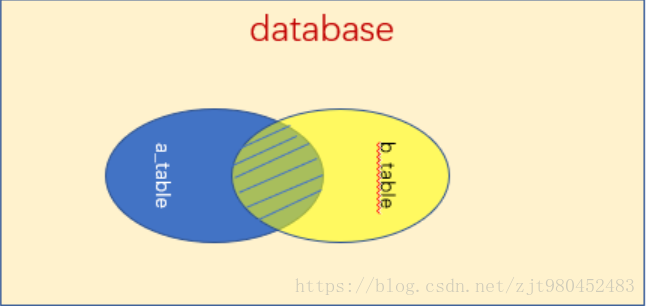
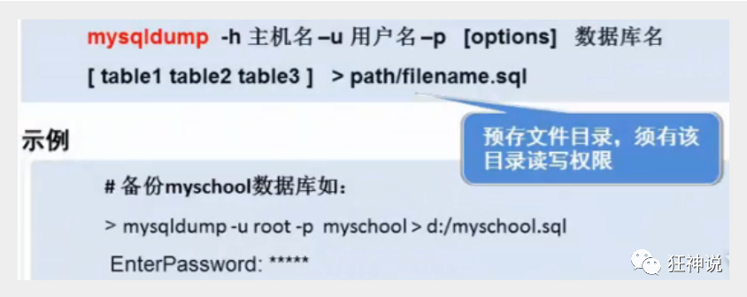
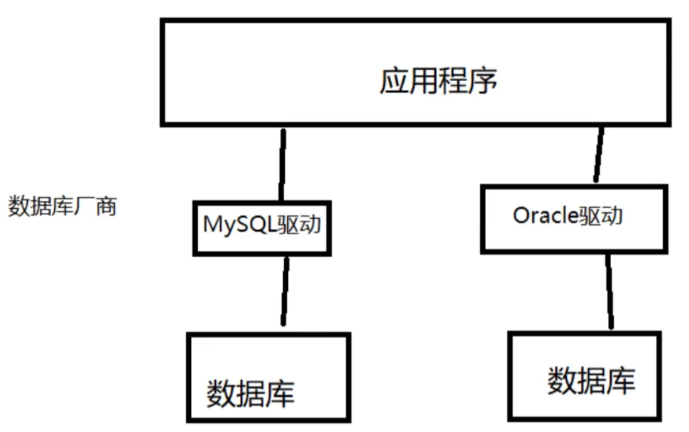
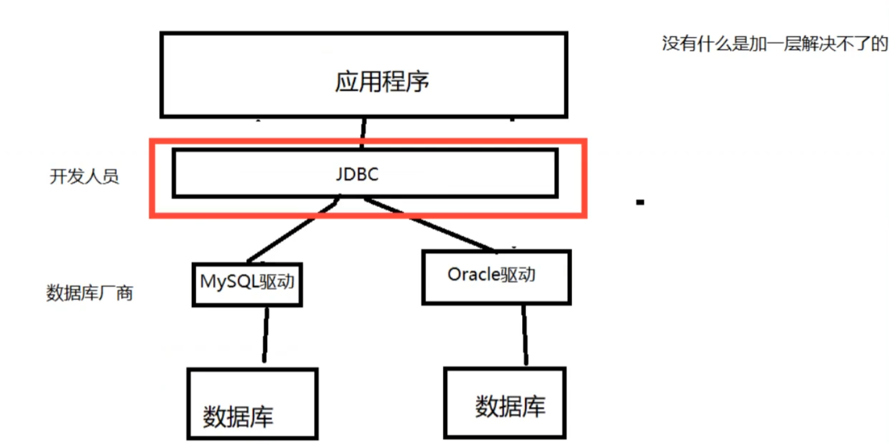

# MySQL

* 目录
  * [1\. 连接数据库](#1-连接数据库)
  * [2\. 操作数据库](#2-操作数据库)
    * [2\.1 操作数据库](#21-操作数据库)
    * [2\.2 数据库的列类型](#22-数据库的列类型)
    * [2\.3 数据库的字段属性（重点）](#23-数据库的字段属性重点)
      * [2\.4 创建数据库表](#24-创建数据库表)
    * [2\.4 数据表的类型（InnoDB | MyISAM）](#24-数据表的类型innodb--myisam)
    * [2\.5 修改表](#25-修改表)
  * [3、MySQL数据管理](#3mysql数据管理)
    * [3\.1 外键](#31-外键)
    * [3\.2 DML语言（背下来）](#32-dml语言背下来)
    * [新增](#新增)
      * [更新](#更新)
      * [删除表](#删除表)
  * [4\. DQL查询数据](#4-dql查询数据)
    * [4\.1查找指定字段](#41查找指定字段)
      * [4\.4 联表查询](#44-联表查询)
  * [MySQL函数](#mysql函数)
    * [5\.1常用函数](#51常用函数)
    * [5\.2 聚合函数](#52-聚合函数)
  * [事务（重要）](#事务重要)
    * [6\.1 什么是事务](#61-什么是事务)
  * [7\.索引](#7索引)
      * [7\.1 索引的分类](#71-索引的分类)
    * [7\.2 索引原则](#72-索引原则)
  * [8\.权限与备份](#8权限与备份)
    * [8\.1 权限](#81-权限)
    * [8\.2 备份](#82-备份)
  * [9\. 设计数据库设计](#9-设计数据库设计)
    * [9\.1 为什么需要设计](#91-为什么需要设计)
    * [9\.2 数据库三大范式](#92-数据库三大范式)
  * [10、JDBC](#10jdbc)
    * [10\.1 数据库驱动](#101-数据库驱动)
    * [10\.2 JDBC](#102-jdbc)
    * [10\.3 Statement对象](#103-statement对象)
    * [10\.4 PreparedStatement对象](#104-preparedstatement对象)
    * [10\.5 事务](#105-事务)
  * [数据库连接池](#数据库连接池)

阿里规范

```sql
/*每一个表，都必须存在以下五个字段！
id			主键
version		乐观锁
is_delete	伪删除
gmt_create 	创建时间
gmt_update 	修改时间
*/
```


## 1. 连接数据库

```sql
mysq1-uroot-p123456--连接数据库
update mysql.user set authentication_string=password（'123456'）where user='root'and Host='1ocalhost';--修改用户密码
flush privileges;--刷新权限
-----------------------------------------------------------------------------------------------------------------------
--所有的语句都使用；结尾
show databases;--查看所有的数据库
mysq1>use school--切换数据库 use数据库名
Database changed show tables;--查看数据库中所有的表
describe student;--显示数据库中指定表的信息

create database westos；--创建一个数据库

exit；--退出连接
--单行注释（SQL的本来的注释）
/*（sq1的多行注释）
he1loi 
asdas
dasdas
*/
```

## 2. 操作数据库

操作数据库>操作数据库中的表>操作数据库中表的数据

==mysql关键字不分区大小写==

### 2.1 操作数据库

1. 创建数据库

   ```sql
   CREATE DATABASE [IF NOT EXISTS] westos;
   ```

2. 删除数据库

   ```sql
   DROP DATABASE [IF EXISTS] westos
   ```

3. 使用数据库

   ```sql
   -- tab键的上面，如果你的表名或者字段名是一个特殊字符，就需要带
   USE `school`
   ```

4. 查看数据库

   ```sql
   SHOW DATABASES	-- 查看所有的数据库
   ```

### 2.2 数据库的列类型

> 数值类型

- tinyint 						十分小的数据 			1个字节
- smallint                         较小的数据			 2个字节
- mediumint               中等大小的数据          3个字节
- ==int                                  标准的整数              4个字节== 常用的                    int 
- bigint                              较大的数据             8个字节
- float                         浮点数 （单精度）       4个字节
- double                    浮点数（双精度）         8个字节（精度问题！）
- decimal              字符串形式的浮点数         金融计算的时候，一般是使用decimal

> 字符串

| 类型        | 说明                  | 大小范围    | 用法/Java对应类型 |
| ----------- | --------------------- | ----------- | ----------------- |
| char        | 字符串固定大小的      | 0-255       |                   |
| **varchar** | **可变字符串0-65535** | **0-65535** | 常用的变量 String |
| tinytext    | 微型文本              | 2^8-1       |                   |
| **text**    | **文本串**            | **2^16-1**  | 保存大文本        |

> 时间日期

| 类型      | 格式                | 说明                                 |
| --------- | ------------------- | ------------------------------------ |
| date      | YYYY-MM-DD 日期格式 |                                      |
| time      | HH:mm:ss 时间格式   | 最常用的时间格式                     |
| datetime  | YYYY-MM-DD HH:mm:ss | 1970.1.1到现在的毫秒数！也较为常用！ |
| timestamp | 时间戳              |                                      |
| year      | 年份表示            |                                      |

> null

- 没有值，未知
- ==注意，不要使用NULL进行运算，结果为NULL==

### 2.3 数据库的字段属性（重点）

==**UnSigned**==

- 无符号的
- 声明该数据列不允许负数 .

==**ZEROFILL**==

- 0填充的
- 不足位数的用0来填充 , 如int(3),5则为005

==**Auto_InCrement**==

- 自动增长的 , 每添加一条数据 , 自动在上一个记录数上加 1(默认)

- 通常用于设置**主键** , 且为整数类型

- 可定义起始值和步长

- - 当前表设置步长(AUTO_INCREMENT=100) : 只影响当前表
  - SET @@auto_increment_increment=5 ; 影响所有使用自增的表(全局)

==**NULL 和 NOT NULL**==

- 默认为NULL , 即没有插入该列的数值
- 如果设置为NOT NULL , 则该列必须有值

==**DEFAULT**==

- 默认的
- 用于设置默认值
- 例如,性别字段,默认为"男" , 否则为 "女" ; 若无指定该列的值 , 则默认值为"男"的值

#### 2.4 创建数据库表

```sql
CREATE TABLE IF NOT EXISTS `student` (
  `id` int(4) NOT NULL AUTO_INCREMENT COMMENT '学号',
  `name` varchar(30) NOT NULL COMMENT '姓名',
  `birthday` datetime DEFAULT NULL COMMENT '出生日期',
  PRIMARY KEY (`id`)
) ENGINE=InnoDB DEFAULT CHARSET=utf8;
```

格式

```sql
CREATE TABLE[IF NOT EXISTS]表名（
    `字段名` 列类型 [属性] [索引] [注释],
    `字段名` 列类型 [属性] [索引] [注释],
    ……
    `字段名` 列类型 [属性] [索引] [注释]
)[表类型] [字符集设置] [注释]
```

常用命令

```sql
SHOW CREATE DATABASE school		--查看创建数据库的语句
SHOW CREATE TABLE student		--查看student数据表的定义语句
DESC student					--显示表的结构
```

### 2.4 数据表的类型（InnoDB | MyISAM）

```sql
--关于数据库引擎
/*
INNODB	默认使用~
MYISAM	早些年使用的
*/
```


|            | MYISAM         | INNODB        |
| ---------- | -------------- | ------------- |
| 事务支持   | 不支持         | 支持          |
| 数据行锁定 | 不支持    表锁 | 支持    行锁  |
| 外键约束   | 不支持         | 支持          |
| 全文索引   | 支持           | 不支持        |
| 表空间大小 | 较小           | 较大，约为2倍 |

常规使用操作：

- MYISAM	节约空间，速度较快
- INNODB    安全性高，事务的处理，多表多用户操作


> 在物理空间存在的位置

所有的数据库文件都存在data目录下，一个文件夹对应一个数据库

本质还是文件的存储！

MySQL引擎在文件上的区别

- InnoDB在数据库表中只有一个*.frm文件，以及上级目录下的ibdata1文件*
- MYISAM对应文件
  - *.frm 	表结构的定义文件
  - *.MYD    数据文件（data）
  - *.MYI      索引文件（index）

> 设置数据库表的字符集编码

```sql
CHARSET=utf8
```

不设置的话，会是mysql默认的字符集编码~（不支持中文！）

MySQL的默认编码是Latin1，不支持中文

在my.ini中配置默认的编码

```ini
character-set-server=utf8
```

### 2.5 修改表

```sql
--修改表名：ALTER TABLE 旧表名 RENAMEAS 新表名
ALTER TABLE teacher RENAME AS teacher1
--增加表的字段：ALTER TABLE 表名 ADD 字段名 列属性
ALTER TABLE teacher1 ADD age INT（11）
--修改表的字段（重命名，修改约束！）
--ALTER TABLE 表名 MODIFY 字段名 列属性[]
ALTER TABLE teacher1 MODIFY age VARCHAR（11）--修改约束
--ALTER TABLE 表名 CHANGE 旧名字 新名字 列属性[]
ALTER TABLE teacher1 CHANGE age agel INT（1）--字段重名名
--删除表的字段：ALTER TABLE 表名 DROP 字段名
ALTER TABLE teacher1 DROP agel

--删除表（如果表存在再删除）
DROP TABLE IF EXISTS teacher1
```

## 3、MySQL数据管理

### 3.1 外键

> 方式一、在创建表的时候，增加约束（麻烦，比较复杂）

```sql
CREATE TABLE `grade`(
	`gradeid` INT（10）NOT NULL AUTO_INCREMENT COMMENT '年级id',
	`gradename` VARCHAR（50）NOT NULL COMMENT '年级名称',
	PRIMARY KEY (`gradeid`)
)ENGINE=INNODB DEFAULT CHARSET=utf8
--学生表的gradeid 字段要去引用年级表的 gradeid
--定义外键key
--给这个外键添加约束（执行引用）references引用
CREATE TABLE IF NOT EXISTS `student`(
    `id` INT(4)NOT NULL AUTO_INCREMENT COMMENT'学号',
    `name` VARCHAR(30) NOT NULL DEFAULT'匿名’COMMENT'姓名,
    `gradeid` INT(10)NOT NULL COMMENT'学生的年级',
    PRIMARY KEY(`id`),
    KEYFK_gradeid(gradeid),
    CONSTRAINT `FK_gradeid` FOREIGN KEY (`gradeid`)REFERENCES `grade`(`gradeid`)
)ENGINE=INNODB DEFAULT CHARSET=utf8
```


> 方式二、创建表后添加约束

```sql
--创建表的时候没有外键关系
ALTER TABLE `student` ADD CONSTRAINT `FK_gradeid` FOREIGN KEY (`gradeid） REFERENCES `grade`(`gradeid`);
--ALTER TABLE 表 ADD CONSTRAINT 约束名 FOREIGN KEY(作为外键的列) REFERENCES 那个表(哪个字段)
```

==最佳实践==

- 数据库就是单纯的表，只用来存数据，只有行（数据）和列（字段）
- 我们想使用多张表的数据，想使用外键（程序去实现）

###  3.2 DML语言（背下来）

### 新增

#### 更新

#### 删除表

> TRUNCATE 命令

```sql
--清空student表
TRUNCATE `student`
```

> delete 和 TRUNCATE 区别

- 相同点：都能删除数据，都不会删除表结构
- 不同：
  - TRUNCATE重新设置自增列计数器会归零
  - TRUNCATE不会影响事务

## 4. DQL查询数据

### 4.1查找指定字段

```sql
--查询全部的学生SELECT字段FROM表
SELECT * FROM student
--查询指定字段
SELECT `studentNo`,`studentName` FRoM student
--别名，给结果起一个名字AS可以给字段起别名，也可以给表起别名SELECT `studentNo` AS 学号，`studentName` AS 学生姓名 FROM student AS s
--函数Concat（a，b）
SELECT CONCAT（'姓名：',studentName）AS 新名字 FROM student
```


>去重 distinct

作用：去除SELECT查询出来的结果中重复的数据，重复的数据只显示一条

```sql
--查询一下有哪些同学参加了考试，成绩
SELECT * FROM result					--查询全部的考试成绩
SELECT `studentNo` FROM result			--查询有哪些同学参加了考试
SELECT DISTINCT `studentNoFROM` result	--发现重复数据，去重
```

> 数据库的列（表达式）

```sql
SELECT VERSION（）--查询系统版本（函数）
SELECT 100*3-1 AS 计算结果--用来计算（表达式）
SELECT @@auto_increment_increment--查询自增的步长（变量）
--学员考试成绩+1分查看
SELECT `studentNo`,`studentResult`+1 As '提分后' FROM result
```

> select 语法

```sql
SELECT [ALL | DISTINCT]
{* | table.* | [table.field1[as alias1][,table.field2[as alias2]][,..J]}
FROM table_name [as table_alias]
    [left | right | inner join table_name2]	--联合查询
    [WHERE...]				--指定结果需满足的条件
    [GROUP BY...]			--指定结果按照哪几个字段来分组
    [HAVING]				--过滤分组的记录必须满足的次要条件
    [ORDER BY...]			--指定查询记录按一个或多个条件排序
    [LIMIT {offset,]row_count | row_countoFFSET offset}];
    --指定查询的记录从哪条至哪条
```

**注意：[] 括号代表可选的，{} 括号代表必选得**

#### 4.4 联表查询

| 操作       | 描述       | 图                                                 |
| ---------- | ---------- | -------------------------------------------------- |
| inner join | 内连接查询 | 返回两个表的交集（阴影）部分                       |
| left join  | 左连接查询 | 返回左表中全部数据，以及右边表中与左边有交集的数据 |
| right join | 右连接     | 返回右表中全部数据，以及左边表中与右边有交集的数据 |
| union      | 全连接     | union会自动将完全重复的数据去除掉                  |
| union all  | 全连接     | union all会保留那些重复的数据                      |

```sql
SELECT '' as teamID ,'' as teamName,'' as team,'' as address
union
SELECT team_id,team_name,master_team as team,address FROM `ball_team` INNER JOIN ball_game on ball_team.team_id = ball_game.master_team where game_id = '123'
union all
SELECT team_id,team_name,visitor_team as team,'' as address FROM `ball_team` INNER JOIN ball_game on ball_team.team_id = ball_game.visitor_team where game_id = '123';
```

**union语句注意事项：**

​     **1.通过union连接的SQL它们分别单独取出的列数必须相同；**

​     **2.不要求合并的表列名称相同时，以第一个sql 表列名为准；**

​     **3.使用union 时，完全相等的行，将会被合并，由于合并比较耗时，一般不直接使用 union 进行合并，而是通常采用union all 进行合并；**

​     **4.被union 连接的sql 子句，单个子句中不用写order by ，因为不会有排序的效果。但可以对最终的结果集进行排序；**



> 自连接（树结构）

```sql
--查询父子信息：把一张表看为两个一模一样的表
SELECT a.categoryName AS '父栏目', b.categoryNameAs '子栏目'
FROM `category` As a,`id` As b WHERE a.`categoryid`=b.`pid`
```

## MySQL函数

### 5.1常用函数

> **数据函数**

```sql
 SELECT ABS(-8);  /*绝对值*/
 SELECT CEILING(9.4); /*向上取整*/
 SELECT FLOOR(9.4);   /*向下取整*/
 SELECT RAND();  /*随机数,返回一个0-1之间的随机数*/
 SELECT SIGN(0); /*符号函数: 负数返回-1,正数返回1,0返回0*/
```

>**字符串函数**

```sql

 SELECT CHAR_LENGTH('狂神说坚持就能成功'); /*返回字符串包含的字符数*/
 SELECT CONCAT('我','爱','程序');  /*合并字符串,参数可以有多个*/
 SELECT INSERT('我爱编程helloworld',1,2,'超级热爱');  /*替换字符串,从某个位置开始替换某个长度*/
 SELECT LOWER('KuangShen'); /*小写*/
 SELECT UPPER('KuangShen'); /*大写*/
 SELECT LEFT('hello,world',5);   /*从左边截取*/
 SELECT RIGHT('hello,world',5);  /*从右边截取*/
 SELECT REPLACE('狂神说坚持就能成功','坚持','努力');  /*替换字符串*/
 SELECT SUBSTR('狂神说坚持就能成功',4,6); /*截取字符串,开始和长度*/
 SELECT REVERSE('狂神说坚持就能成功'); /*反转
 
 -- 查询姓周的同学,改成邹
 SELECT REPLACE(studentname,'周','邹') AS 新名字
 FROM student WHERE studentname LIKE '周%';
```

> **日期和时间函数**

```sql
 SELECT CURRENT_DATE();   /*获取当前日期*/
 SELECT CURDATE();   /*获取当前日期*/
 SELECT NOW();   /*获取当前日期和时间*/
 SELECT LOCALTIME();   /*获取当前日期和时间*/
 SELECT SYSDATE();   /*获取当前日期和时间*/
 
 -- 获取年月日,时分秒
 SELECT YEAR(NOW());
 SELECT MONTH(NOW());
 SELECT DAY(NOW());
 SELECT HOUR(NOW());
 SELECT MINUTE(NOW());
 SELECT SECOND(NOW());
```

> **系统信息函数**

```sql
 SELECT VERSION();  /*版本*/
 SELECT USER();     /*用户*/
```

### 5.2 聚合函数

| 函数名称 | 描述                                                         |
| :------- | :----------------------------------------------------------- |
| COUNT()  | 返回满足Select条件的记录总和数，如 select count(*) 【不建议使用 *，效率低】 |
| SUM()    | 返回数字字段或表达式列作统计，返回一列的总和。               |
| AVG()    | 通常为数值字段或表达列作统计，返回一列的平均值               |
| MAX()    | 可以为数值字段，字符字段或表达式列作统计，返回最大的值。     |
| MIN()    | 可以为数值字段，字符字段或表达式列作统计，返回最小的值。     |

```sql
 -- 聚合函数
 /*COUNT:非空的*/
 SELECT COUNT(studentname) FROM student;
 SELECT COUNT(*) FROM student;
 SELECT COUNT(1) FROM student;  /*推荐*/
 
 -- 从含义上讲，count(1) 与 count(*) 都表示对全部数据行的查询。
 -- count(字段) 会统计该字段在表中出现的次数，忽略字段为null 的情况。即不统计字段为null 的记录。
 -- count(*) 包括了所有的列，相当于行数，在统计结果的时候，包含字段为null 的记录；
 -- count(1) 用1代表代码行，在统计结果的时候，包含字段为null 的记录 。
 /*
 很多人认为count(1)执行的效率会比count(*)高，原因是count(*)会存在全表扫描，而count(1)可以针对一个字段进行查询。其实不然，count(1)和count(*)都会对全表进行扫描，统计所有记录的条数，包括那些为null的记录，因此，它们的效率可以说是相差无几。而count(字段)则与前两者不同，它会统计该字段不为null的记录条数。
 
 下面它们之间的一些对比：
 
 1）在表没有主键时，count(1)比count(*)快
 2）有主键时，主键作为计算条件，count(主键)效率最高；
 3）若表格只有一个字段，则count(*)效率较高。
 */
 
 SELECT SUM(StudentResult) AS 总和 FROM result;
 SELECT AVG(StudentResult) AS 平均分 FROM result;
 SELECT MAX(StudentResult) AS 最高分 FROM result;
 SELECT MIN(StudentResult) AS 最低分 FROM result;
```


> MD5 加密

**一、MD5简介**

MD5即Message-Digest Algorithm 5（信息-摘要算法5），用于确保信息传输完整一致。是计算机广泛使用的杂凑算法之一（又译摘要算法、哈希算法），主流编程语言普遍已有MD5实现。将数据（如汉字）运算为另一固定长度值，是杂凑算法的基础原理，MD5的前身有MD2、MD3和MD4。

**二、实现数据加密**

新建一个表 testmd5

```sql
 CREATE TABLE `testmd5` (
   `id` INT(4) NOT NULL,
   `name` VARCHAR(20) NOT NULL,
   `pwd` VARCHAR(50) NOT NULL,
   PRIMARY KEY (`id`)
 ) ENGINE=INNODB DEFAULT CHARSET=utf8
```

插入一些数据

```sql
 INSERT INTO testmd5 VALUES(1,'kuangshen','123456'),(2,'qinjiang','456789')
```

如果我们要对pwd这一列数据进行加密，语法是：

```sql
 update testmd5 set pwd = md5(pwd);
```

如果单独对某个用户(如kuangshen)的密码加密：

```sql
 INSERT INTO testmd5 VALUES(3,'kuangshen2','123456')
 update testmd5 set pwd = md5(pwd) where name = 'kuangshen2';
```

插入新的数据自动加密

```sql
 INSERT INTO testmd5 VALUES(4,'kuangshen3',md5('123456'));
```

查询登录用户信息（md5对比使用，查看用户输入加密后的密码进行比对）

```sql
 SELECT * FROM testmd5 WHERE `name`='kuangshen' AND pwd=MD5('123456');
```

## 事务（重要）

### 6.1 什么是事务

==要么都成功，要么都失败==

> 事务原则：ACID

- 原子性（Atomically）

  - 针对同一个事务
  - 所有步骤要么都成功，要么都失败

- 一致性（Consistency）

  - 针对事务操作前与操作后的状态一致（最终一致性）

    操作前A：800	B：200

    操作后A：600	B：400

- 持久性（Isolation）

  - 事务结束后的数据不会随外界原因导致数据丢失（事务一旦提交就不可逆）

    事务没有提及，恢复到原装

    事务已经提交，持久化到数据库

- 隔离性（Durablility）

  - 针对多用户同时操还，排除启用事务对本次事务的影响

> 隔离导致的问题（事务隔离级别）

- 脏读

  一个事务读取了另外一个事务未提交的数据

- 不可重复读

  在一个事务类读取表中数据的某一行，多次读取结果不同（不一定是错误 ，只是某些场合不对）

- 幻读（虚读）

  一个事务内读取到了别的事务**插入**的数据，导致前后读取不一致。（一般是行影响，多了一行）

> 设置隔离级别

- read uccommitted:未提交读，任何问题都解决不了 四种读问题全会发生
- read committed：已提交读，解决脏读；但是解决不了不可重复读和虚读
- repeatable read:重复读，可以解决脏读和重复读；
- Serializable：序列号，解决所有读的问题，效率低；

## 7.索引

MySQL官方对索引的定义为：索引（Index）是帮助MySQL高效获取数据的数据结构。提取句子主干，就可以得到索引的本质：索引是数据结构。

>  索引的作用

- 提高查询速度
- 确保数据的唯一性
- 可以加速表和表之间的连接 , 实现表与表之间的参照完整性
- 使用分组和排序子句进行数据检索时 , 可以显著减少分组和排序的时间
- 全文检索字段进行搜索优化.

#### 7.1 索引的分类

- 主键索引（PRIMARY KEY）

  - ==主键== : 某一个属性组能唯一标识一条记录
  - 特点：
    - 最常见的索引类型
    - 确保数据记录的唯一性
    - 确定特定数据记录在数据库中的位置

- 唯一索引（UNIQUE KEY）

  - 作用 : ==避免同一个表中某数据列中的值重复==
  - 与主键索引的区别
    - 主键索引只能有一个
    - **唯一索引可能有多个**

- 常规索引（KEY/INDEX）

  - 作用 : **快速定位特定数据**

    注意 :

    - index 和 key 关键字都可以设置常规索引
    - 应加在查询找条件的字段
    - **不宜添加太多常规索引**,影响数据的插入,删除和修改操作

- 全文索引（FullText）

  百度搜索：全文索引

  - 作用 : 快速定位特定数据

    注意 :

    - **只能用于MyISAM类型的数据表**
    - 只能用于**CHAR** , **VARCHAR** , **TEXT**数据列类型
    - 适合大型数据集

```sql
/*
#方法一：创建表时
    　　CREATE TABLE 表名 (
                字段名1  数据类型 [完整性约束条件…],
                字段名2  数据类型 [完整性约束条件…],
                [UNIQUE | FULLTEXT | SPATIAL ]   INDEX | KEY
                [索引名]  (字段名[(长度)]  [ASC |DESC])
                );
#方法二：CREATE在已存在的表上创建索引
        CREATE  [UNIQUE | FULLTEXT | SPATIAL ]  INDEX  索引名
                     ON 表名 (字段名[(长度)]  [ASC |DESC]) ;
#方法三：ALTER TABLE在已存在的表上创建索引
        ALTER TABLE 表名 ADD  [UNIQUE | FULLTEXT | SPATIAL ] INDEX
                             索引名 (字段名[(长度)]  [ASC |DESC]) ;
                            
                            
#删除索引：DROP INDEX 索引名 ON 表名字;
#删除主键索引: ALTER TABLE 表名 DROP PRIMARY KEY;
#显示索引信息: SHOW INDEX FROM student;
*/
 
/*增加全文索引*/
ALTER TABLE `school`.`student` ADD FULLTEXT INDEX `studentname` (`StudentName`);
 
/*EXPLAIN : 分析SQL语句执行性能*/
EXPLAIN SELECT * FROM student WHERE studentno='1000';
 
/*使用全文索引*/
-- 全文搜索通过 MATCH() 函数完成。
-- 搜索字符串作为 against() 的参数被给定。搜索以忽略字母大小写的方式执行。对于表中的每个记录行，MATCH() 返回一个相关性值。即，在搜索字符串与记录行在 MATCH() 列表中指定的列的文本之间的相似性尺度。
EXPLAIN SELECT *FROM student WHERE MATCH(studentname) AGAINST('love');
 
/*
开始之前，先说一下全文索引的版本、存储引擎、数据类型的支持情况
MySQL 5.6 以前的版本，只有 MyISAM 存储引擎支持全文索引；
MySQL 5.6 及以后的版本，MyISAM 和 InnoDB 存储引擎均支持全文索引;
只有字段的数据类型为 char、varchar、text 及其系列才可以建全文索引。
测试或使用全文索引时，要先看一下自己的 MySQL 版本、存储引擎和数据类型是否支持全文索引。
*/

```

### 7.2 索引原则

- 索引不是越多越好
- 不要对经常变动的数据加索引
- 小数据量的表建议不要加索引
- 索引一般应加在查找条件的字段

> 索引的数据结构

```sql
-- 我们可以在创建上述索引的时候，为其指定索引类型，分两类
hash类型的索引：查询单条快，范围查询慢
btree类型的索引：b+树，层数越多，数据量指数级增长（我们就用它，因为innodb默认支持它）
 
-- 不同的存储引擎支持的索引类型也不一样
InnoDB 支持事务，支持行级别锁定，支持 B-tree、Full-text 等索引，不支持 Hash 索引；
MyISAM 不支持事务，支持表级别锁定，支持 B-tree、Full-text 等索引，不支持 Hash 索引；
Memory 不支持事务，支持表级别锁定，支持 B-tree、Hash 等索引，不支持 Full-text 索引；
NDB 支持事务，支持行级别锁定，支持 Hash 索引，不支持 B-tree、Full-text 等索引；
Archive 不支持事务，支持表级别锁定，不支持 B-tree、Hash、Full-text 等索引；
```

## 8.权限与备份

### 8.1 权限

> MySQL 权限命令

```sql
/* 用户和权限管理 */ ------------------
用户信息表：mysql.user
 
-- 刷新权限
FLUSH PRIVILEGES
 
-- 增加用户  CREATE USER kuangshen IDENTIFIED BY '123456'
CREATE USER 用户名 IDENTIFIED BY [PASSWORD] 密码(字符串)
    - 必须拥有mysql数据库的全局CREATE USER权限，或拥有INSERT权限。
    - 只能创建用户，不能赋予权限。
    - 用户名，注意引号：如 'user_name'@'192.168.1.1'
    - 密码也需引号，纯数字密码也要加引号
    - 要在纯文本中指定密码，需忽略PASSWORD关键词。要把密码指定为由PASSWORD()函数返回的混编值，需包含关键字PASSWORD
 
-- 重命名用户  RENAME USER kuangshen TO kuangshen2
RENAME USER old_user TO new_user
 
-- 设置密码
SET PASSWORD = PASSWORD('密码')    -- 为当前用户设置密码
SET PASSWORD FOR 用户名 = PASSWORD('密码')    -- 为指定用户设置密码
 
-- 删除用户  DROP USER kuangshen2
DROP USER 用户名
 
-- 分配权限/添加用户
GRANT 权限列表 ON 表名 TO 用户名 [IDENTIFIED BY [PASSWORD] 'password']
    - all privileges 表示所有权限
    - *.* 表示所有库的所有表
    - 库名.表名 表示某库下面的某表
 
-- 查看权限   SHOW GRANTS FOR root@localhost;
SHOW GRANTS FOR 用户名
    -- 查看当前用户权限
    SHOW GRANTS; 或 SHOW GRANTS FOR CURRENT_USER; 或 SHOW GRANTS FOR CURRENT_USER();
 
-- 撤消权限
REVOKE 权限列表 ON 表名 FROM 用户名
REVOKE ALL PRIVILEGES, GRANT OPTION FROM 用户名    -- 撤销所有权限
```

### 8.2 备份

数据库备份必要性

- 保证重要数据不丢失
- 数据转移

MySQL数据库备份方法

- mysqldump备份工具
- 数据库管理工具,如SQLyog
- 直接拷贝数据库文件和相关配置文件

**mysqldump客户端**

作用 :

- 转储数据库
- 搜集数据库进行备份
- 将数据转移到另一个SQL服务器,不一定是MySQL服务器



```sql
-- 导出
1. 导出一张表 -- mysqldump -uroot -p123456 school student >D:/a.sql
　　mysqldump -u用户名 -p密码 库名 表名 > 文件名(D:/a.sql)
2. 导出多张表 -- mysqldump -uroot -p123456 school student result >D:/a.sql
　　mysqldump -u用户名 -p密码 库名 表1 表2 表3 > 文件名(D:/a.sql)
3. 导出所有表 -- mysqldump -uroot -p123456 school >D:/a.sql
　　mysqldump -u用户名 -p密码 库名 > 文件名(D:/a.sql)
4. 导出一个库 -- mysqldump -uroot -p123456 -B school >D:/a.sql
　　mysqldump -u用户名 -p密码 -B 库名 > 文件名(D:/a.sql)
 
可以-w携带备份条件
 
-- 导入
1. 在登录mysql的情况下：-- source D:/a.sql
　　source  备份文件
2. 在不登录的情况下
　　mysql -u用户名 -p密码 库名 < 备份文件
```

## 9. 设计数据库设计

### 9.1 为什么需要设计

==但数据库比较复杂时，需要设计==

**糟糕的数据库设计：**

- 数据冗余，浪费空间
- 数据库插入和删除都会麻烦、异常【屏蔽使用物理外键】
- 程序的性能差

**良好的数据库设计：**

- 节省内存空间
- 保证数据库的完整性
- 方便我们开发系统

### 9.2 数据库三大范式

**为什么需要数据规范化？**

- 信息重复
- 更新异常
- 插入异常
  - 无法正常显示信息

- 删除异常
  - 丢失有效的信息

>  三大范式

**第一范式（1NF）**

原子性：保证每一列不可再分

**第二范式（2NF）**

前提：满足第一范式

每张表只描述一件事情（数据库表中的每一列都和主键相关，而不能只与主键的某一部分相关）

**第三范式（3NF）**

前提：满足第一范式和第二范式

第三范式需要确保数据表中的每一列数据都和主键直接相关，而不能间接相关。


**规范性** 和 **性能**的问题

关联查询的表不得超过三张表

- 考虑商业化的需求和目标，（成本，用户体验！）数据库的性能更加重要
- 在规范性能的问题的时候，需要适当的考虑一下规范性！

## 10、JDBC

### 10.1 数据库驱动



### 10.2 JDBC

SUN公司为了简化开发人员的（对数据库的统一）操作，提供了一个Java操作数据库的）规范，俗称JDBC这些规范的实现由具体的厂商去做~



> 编写测试

```java
public static void main(String[] args) throws SQLException, ClassNotFoundException {
    //1.加载驱动
    Class.forName("com.mysql.jdbc.Driver");     // 固定写法，加载驱动
    //2.用户信息和url
    String url = "jdbc:mysql://localhost:3306/jdbcstudy?serverTimezone=UTC&useUnicode=true&characterEncoding=utf-8&useSSL=false";
    String userName = "root";
    String pwd = "123456";
    //3.连接成功，数据库对象  Connection 代表数据库
    Connection connection = DriverManager.getConnection(url, userName, pwd);

    //4.执行sQL的对象        Statement 执行SQL的对象
    Statement statement = connection.createStatement();

    //5.执行sQL的对象去执行sQL，可能存在结果，查看返回结果
    String sql = "select * from users";
    ResultSet resultSet = statement.executeQuery(sql);  // 返回的结果集，结果集中封装了我们全部的查询出来的结果

    while (resultSet.next()){
        System.out.println("id = " + resultSet.getObject("id"));
        System.out.println("name = " + resultSet.getObject("NAME"));
        System.out.println("pwd = " + resultSet.getObject("PASSWORD"));
        System.out.println("email = " + resultSet.getObject("email"));
        System.out.println("birth = " + resultSet.getObject("birthday"));
        System.out.println("=======================================================");
    }
    //6、释放连接
    resultSet.close();
    statement.close();
    connection.close();
}
```

步骤总结：
	1、加载驱动
	2、连接数据库DriverManager
	3、获得执行sql的对象Statement
	4、获得返回的结果集
	5、释放连接

> DriverManager

```java
//DriverManager.registerDriver(new com.mysql.jdbc.Driver());
Class.forName("com.mysql.jdbc.Driver");     // 固定写法，加载驱动

Connection connection = DriverManager.getConnection(url, userName, pwd);
// connectin	代表数据库
// 数据库设置自动提交
// 事务提交
// 事务滚回
connection.rollback();
connection.commit();
connection.setAutoCommit();
```

> URL

```java
String url = "jdbc:mysql://localhost:3306/jdbcstudy?
    serverTimezone=UTC&useUnicode=true&characterEncoding=utf-8&useSSL=false";
    
// MySQL---3306
// jdbc:mysql://主机地址:端口号/数据库名?参数1&参数2&参数3
// oracle---1521
// jdbc:oracle:thin:@loaclhost:1521:sid
```

> Statement	执行SQL类	PrepareStatement

```java
String sql = "select * from users";	// 编写SQL

statement.executeQuery();// 查询操作返间ResultSet
statement.execute();    // 执行任何sql
statement.executeUpdate();// 更新、插入、删除。都是用这个，返回一个受影响的行数
```

> ResultSet	查询的结果集：封装了所有的查询结果

获得指定的数据类型

```java
resultSet.getObject()   // 不知道列类型的情况下使用
// 如果知道列的类型就使用指定的类型
resultSet.getString()
resultSet.getInt()
resultSet.getFloat()
resultSet.getDate()
```

遍历

```java
resultSet.beforeFirst();//移动到最前而
resultSet.afterLast();//移动到最后面
resultSet.next();//移动到下一个数据
resultSet.previoust();//移动到前一行
resultset.absolute(row);//移动到指定行
```

> 释放资源

```java
//6、释放连接
resultSet.close();
statement.close();
connection.close();//耗资源，用完关掉
```

### 10.3 Statement对象

Jdbc中的==statement对象用于向数据库发送SQL语句==，想完成对数据库的增删改查，只需要通过这个对象向数据库发送增删改查语句即可。

Statement对象的**executeUpdate**方法，用于向数据库发送增、删、改的sql语句，executeUpdate执行完后，将会返回一个整数（即增删改语句导致了数据库几行数据发生了变化）。

Statement.**executeQuery**方法用于向数据库发送查询语句，executeQuery方法返回代表查询结果的ResultSet对象。

### 10.4 PreparedStatement对象

PreparedStatement 可以防止SQL注入。效率更好！

新增

```java
Connection con = null;
PreparedStatement  st = null;
try {
    con = JdbcUtils.getConnection();

    //区别
    //使用？卢位符代替参数
    String sql = "INSERT INTO `jdbcstudy`.`users` (`id`, `NAME`, `PASSWORD`, `email`, `birthday`) " +
        "VALUES (?, ?, ?, ?, ?);";
    st = con.prepareStatement(sql);     //预编译sQL，先写sql，然后不执行
    //手动给参数炼值
    st.setInt(1,4);
    st.setString(2,"zjp");
    st.setString(3,"123456");
    st.setString(4,"906030149@qq.com");
    //注意点：  sql.Date    数据库     java.sql.Date（）
    //          util.Date   Java        new Date（）.getTime（）获得时间e
    st.setDate(5,new java.sql.Date(new Date().getTime()));

    // 执行
    int i = st.executeUpdate();
    if(i>0){
        System.out.println("插入成功！");
    }
}catch (Exception e){
    e.printStackTrace();
}finally {
    JdbcUtils.closeConnection(null,st,con);
}
```

查询

```java
private static void query(String name, String pwd) {
    Connection con = null;
    PreparedStatement st = null;
    ResultSet rs = null;
    try {
        con = JdbcUtils.getConnection();

        //PreparedStatement 防ll.sQL注入的木质，把传递进来的参数当做字符
		//假设其中存在转义字符，比如说’会被直接转义
        String sql = "select * from `jdbcstudy`.`users` where  `NAME` = ? and `PASSWORD` = ?;";
        st = con.prepareStatement(sql);     //预编译sQL，先写sql，然后不执行
        //手动给参数炼值
        st.setString(1,name);
        st.setString(2,pwd);

        // 执行
        rs = st.executeQuery();
        while (rs.next()){
            System.out.println(rs.getObject("NAME"));
            System.out.println(rs.getObject("PASSWORD"));
            System.out.println("========================================");
        }
    }catch (Exception e){
        e.printStackTrace();
    }finally {
        JdbcUtils.closeConnection(rs,st,con);
    }
}
```

### 10.5 事务

```java
Connection con = null;
PreparedStatement st = null;
ResultSet rs = null;
try {
    con = JdbcUtils.getConnection();
    con.setAutoCommit(false);
    String sql1 = " A - 100";
    con.prepareStatement(sql1);
    st.executeUpdate();

    // int x = 1/0

    String sql2 = " B + 100";
    con.prepareStatement(sql2);
    st.executeUpdate();

    con.commit();
}catch (Exception e){
    try {
        con.rollback();
    } catch (SQLException ex) {
        ex.printStackTrace();
    }
    e.printStackTrace();
}
```

## 数据库连接池

数据库连接--执行完毕--释放

连接-释放十分浪费系统资源

**池化技术：准备一些预先的资源，过来就连接预先准备好的**

常用连接数

最小连接数：

最大连接数

编写连接池，实现一个接口 DataSource 

> 开源数据源

DBCP

C3P0

Druid（德鲁伊）：阿里

> DBCP

需要用到的jar包

commons-dbcp-1.4、commons-pool-1.6

```java
InputStream in = JdbcUtils.class.getClassLoader().getResourceAsStream("db.properties");
Properties properties = new Properties();
properties.load(in);

// 创建数据源 工程模式-->创建
dataSource = BasicDataSourceFactory.createDataSource(properties);

dataSource.getConnection();  // 从数据源中获取
```

> C3P0

需要用到的jar包

C3p0-0.9.5.5、mchange-commons-java-0.2.19

```java
// 创建数据源 工程模式-->创建
dataSource = new ComboPooledDataSource("MySQL");      // 配置文件写法

// 代码配置
//            dataSource = new ComboPooledDataSource();
//            dataSource.setDriverClass();
//            dataSource.setJdbcUrl();
//            dataSource.setUser();
//            dataSource.setPassword();
//
//            dataSource.setMaxPoolSize();
//            dataSource.setMinPoolSize();

dataSource.getConnection();  // 从数据源中获取
```

> 结论

无论使用什么数据源，本质还是一样的，DataSource接口不会变，方法就不会变

