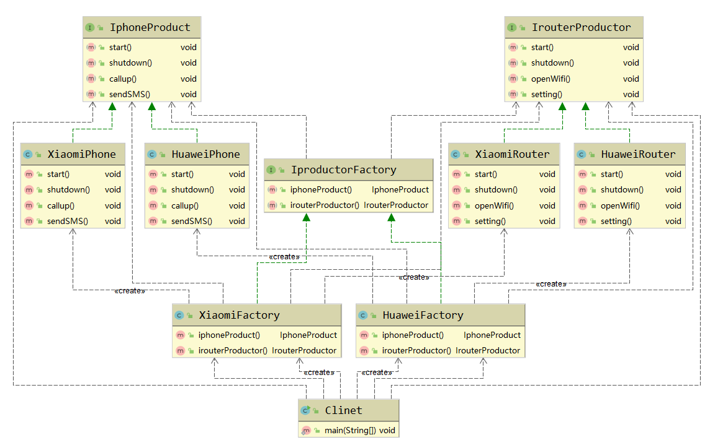

# 设计模式（GoF23）

* 目录
  * [1、分类](#1分类)
  * [2、OOP七大原则](#2oop七大原则)
  * [设计模式详解](#设计模式详解)
    * [创建型模式](#创建型模式)
      * [单例模式](#单例模式)
      * [工厂模式](#工厂模式)
      * [抽象工厂模式](#抽象工厂模式)
      * [建造者模式](#建造者模式)
      * [原型模式](#原型模式)
    * [结构型模式](#结构型模式)
      * [适配器模式](#适配器模式)
      * [桥接模式](#桥接模式)
      * [静态代理](#静态代理)
      * [动态代理](#动态代理)

## 1、分类

> 创建型模式：

单例模式、工厂模式、抽象工厂模式、建造者模式、原型模式。

> 结构型模式：

适配器模式，桥接模式，装饰模式，组合模式，外观模式，享元模式，代理模式

> 行为型模式：

模板方法模式，命令模式，迭代器模式，观察者模式，中介者模式，备忘录模式，解释器模式，状态模式，策略模式，职责链模式，访问者模式。


## 2、OOP七大原则

1. 开闭原则：对扩展开放，对修改关闭（不修改原有代码，只是扩展）
2. 里氏替换原则：继承必须确保超类所拥有的性质在子类中仍然成立
3. 依赖倒置原则：要面向接口编程，不要面向实现编程
4. 单一职责原则：控制类的粒度大小、将对象解耦、提高其内聚性
5. 接口隔离原则：要围绕各个类建立他它们需要的专用接口
6. 迪米特法则：只与直接朋友交谈，不跟”陌生人“说话
7. 合成复用原则：尽量先使用组合或者聚合等关系来实现，其次才考虑使用继承关系实现

## 设计模式详解

### 创建型模式

#### 单例模式

> 饿汉式

```java
// 饿汉式单例
public class Hungry {
    // 可能会浪费空间
    private byte[] data1 = new byte[1024*1024];
    private byte[] data2 = new byte[1024*1024];
    private byte[] data3 = new byte[1024*1024];
    private byte[] data4 = new byte[1024*1024];

    private Hungry(){
    }

    private final static Hungry HUNGRY = new Hungry();

    public static Hungry getInstance(){
        return HUNGRY;
    }
}
```

> DCL 懒汉式

```java
// 懒汉式单例
public class LazyMan {

    private static boolean zjp = false;

    private LazyMan(){
//        if(lazyMan != null){
//            throw new RuntimeException("不要试图反射破坏单例");
//        }
        if(zjp == false){
            zjp = true;
        }else {
            throw new RuntimeException("不要试图反射破坏单例");
        }
        System.out.println(Thread.currentThread().getName() + "-->ok");
    }

    private volatile static LazyMan lazyMan;
    //双重检测锁模式的颜汉式单例     DCL懒汉式（存在问题 new）
    public static LazyMan getInstaance(){
        if(lazyMan == null){// 加一个判断，提高性能，避免其他线程等待已经初始化过的lazyMan
            synchronized (LazyMan.class){
                if(lazyMan == null){
                    lazyMan = new LazyMan();// 不是原子性操作
                    /**
                     * 1、分配内存空间
                     * 2、执行构造方法，初始化对象
                     * 3、初始化完毕的对象指向内存空间
                     * 正常   123
                     * A线程  132    没有问题
                     * B线程  获取lazyMan   此时lazyMan还没完成构造  给lazyMan加上volatile
                     */
                }
            }
        }
        return lazyMan;
    }
    // 单线程下确实ok
    // 多线程下就不是单例，需要枷锁
//    public static void main(String[] args) {
//        for (int i = 0;i < 10;i++){
//            new Thread(()->{
//                LazyMan.getInstaance();
//            }).start();
//        }
//    }
}

public static void main(String[] args) throws NoSuchMethodException, InvocationTargetException, NoSuchFieldException, InstantiationException, IllegalAccessException {
        Reflect(args);

    }

// 反射 破坏单例模式
private static void Reflect(String[] args) throws NoSuchMethodException, IllegalAccessException, InvocationTargetException, InstantiationException, NoSuchFieldException {
    //LazyMan lazyMan = LazyMan.getInstaance();
    LazyMan lazyMan2;
    Constructor<LazyMan> constructor = LazyMan.class.getDeclaredConstructor(null);
    constructor.setAccessible(true);
    lazyMan2 = constructor.newInstance(args);

    Field zjp = LazyMan.class.getDeclaredField("zjp");
    zjp.setAccessible(true);
    zjp.set(lazyMan2, false);

    LazyMan lazyMan = constructor.newInstance(args);
    System.out.println(lazyMan);
    System.out.println(lazyMan2);
}
```

> 静态内部类

```java
// 静态内部类
public class Holder {

    private Holder(){
    }

    public static class InnerClass {
        private static final Holder HOLDER = new Holder();
    }

    public static Holder getInstance(){
        return InnerClass.HOLDER;
    }
}
```

==单例不安全，反射==

> 枚举

```java
// enum 是什么
public enum EnumSingle {
    INSTANCE;

    public EnumSingle getInstance(){
        return INSTANCE;
    }
}

class TestEnum{
    public static void main(String[] args) throws NoSuchMethodException, IllegalAccessException, InvocationTargetException, InstantiationException {
        EnumSingle enumSingle1 = EnumSingle.INSTANCE;
        Constructor<EnumSingle> declaredConstructor = EnumSingle.class.getDeclaredConstructor(String.class,int.class);
        declaredConstructor.setAccessible(true);
        EnumSingle enumSingle2 = declaredConstructor.newInstance();
        System.out.println(enumSingle1);
        System.out.println(enumSingle2);
    }
}
```

使用`javap`反编译查看枚举类（不准确）


枚举类型最终反编译源码

```java
public final class EnumSingle extends Enum
{

    public static EnumSingle[] values()
    {
        return (EnumSingle[])$VALUES.clone();
    }

    public static EnumSingle valueOf(String name)
    {
        return (EnumSingle)Enum.valueOf(com/zjp/DesignPattern/single/EnumSingle, name);
    }

    private EnumSingle(String s, int i)
    {
        super(s, i);
    }

    public EnumSingle getInstance()
    {
        return INSTANCE;
    }

    public static final EnumSingle INSTANCE;
    private static final EnumSingle $VALUES[];

    static 
    {
        INSTANCE = new EnumSingle("INSTANCE", 0);
        $VALUES = (new EnumSingle[] {
            INSTANCE
        });
    }
}
```

#### 工厂模式

**实现了创建者和调用者的分离**

分类：简单工厂模式、工厂方法模式、抽象工厂模式

本质：

- 实例化对象不使用new用工厂方法代替
- 将选择实现类，创建对象统一管理和控制。从而将调用者跟我们的实现类解耦。

> 简单工厂模式（静态工厂模式）


> 工厂方法模式


#### 抽象工厂模式

> 概念

定义：抽象工厂模式提供了一个创建一系列相关或者相互依赖对象的接口，无需指定它们具体的类 

是围绕一个超级工厂创建其他工厂。该超级工厂又称为其他工厂的工厂

> 场景

适用场景：

- 客户端（应用层）不依赖于产品类实例如何被创建、实现等细节
- 强调一系列相关的产品对象（属于同一产品族）一起使用创建对象需要大量的重复代码
- 提供一个产品类的库，所有的产品以同样的接口出现，从而使得客户端不依赖于具体的实现

> 优缺点

优点：

- 具体产品在应用层的代码隔离，无需关心创建的细节
- 将一个系列的产品统一到一起创建

缺点：

- 规定了所有可能被创建的产品集合，产品簇中扩展新的产品困难；
- 增加了系统的抽象性和理解难度

> 实例类图



> 小结

小结：

- 简单工厂模式（静态工厂模式）
  - 虽然某种程度上不符合设计原则，但实际使用最多！
- 工厂方法模式
  - 不修改已有类的前提下，通过增加新的工厂类实现扩展。
- 抽象工厂模式
  - 不可以增加产品，可以增加产品族！

应用场景：

- JDK中Calendar的getlnstance方法
- JDBC中的Connection对象的获取
- Spring中IOC容器创建管理bean对象
- 反射中Class对象的newlnstance方法

#### 建造者模式

> 概念

定义：将一个复杂对象的构建与的表示分离，使得同样的构建过程可以创建不同的表示主要

作用：在用户不知对象的建造过程和细节的情况下就可以直接创建复杂的对象。

用户只需要给出指定复杂对象的类型和内容，建造者模式负责按顺序创建复杂对象（把内部的建造过程和细节隐藏起来）

> 实例

例子：

- 工厂（建造者模式）：负责制造汽车（组装过>程和细技在工厂内）
- 汽车购买者（用户）：你只需要说出你需要的>型号、（对象的类型和内容），然后直接购买就可以使用了（不需要知道汽车是怎么组装的（车轮、车门、>发动机、方向盘等等））


> 有指挥类的建造者模式

导演类Director类，它用于指导具体构建者如何构建产品，控制调用先后次序，并向调用者返回完整的产品类

Product：产品（房子 : [buildA、buildB、buildC、buildD]）

Builder：抽象的建造者，规定产品需要的步骤（方法：[buildA()、buildB()、buildC()、buildD()]）

Worker：具体的建造者（构造器中创建产品，实现抽象建造者的方法），建造出产品（房子）

Director：指挥（核心），具体产品的构建过程控制（指挥工人安装顺序建房子，执行 Worker方法的顺序）

使用：创建指挥者 和 具体的工人 ，指挥工人搭建房子(builder方法)

```java
Product  product = new Director().builder(new Woker());
```

> 代码

Product

```java
public class Product {
    private String buildA;
    private String buildB;
    private String buildC;
    private String buildD;
    getter and setter
    toStrintg
}
```

Builder

```java
// 抽象的建造者：方法
public abstract class Builder {
    abstract void buildA();//地基
    abstract void buildB();//钢筋工程
    abstract void buildC();//铺电线
    abstract void buildD();//粉刷

    // 完工：得到产品（房子）
    abstract Product getProduct();
}
```

Woker

```java
// 具体的建造者
public class Woker extends Builder {
    
    private Product product;
    
    public Woker() {
        this.product = new Product();
    }
    
    @Override
    void buildA() {
        product.setBuildA("地基");
        System.out.println("地基");
    }
    @Override
    void buildB() {
        product.setBuildB("钢筋工程");
        System.out.println("钢筋工程");
    }
    @Override
    void buildC() {
        product.setBuildC("铺电线");
        System.out.println("铺电线");
    }
    @Override
    void buildD() {
        product.setBuildD("粉刷");
        System.out.println("粉刷");
    }
    @Override
    Product getProduct() {
        return product;
    }
}
```

Director

```java
// 指挥：核心，之后构建一个工程，工厂如何构建，由他决定
public class Director {

    // 指挥工人安装顺序建房子
    public Product builder(Builder builder){
        builder.buildA();
        builder.buildB();
        builder.buildC();
        builder.buildD();

        return builder.getProduct();
    }
}
```

测试

```java
public static void main(String[] args) {
    // 指挥
    Director director = new Director();

    System.out.println(director.builder(new Woker()));
}
```

> 有指挥类的建造者模式--类图


> 无指挥类的建造者模式

Product：产品（KFC套餐，属性有默认值）

Builder：抽象的建造者，规定产品属性

Worker：具体的建造者（服务，根据客户需求建造产品[套餐]）

使用，可以指定需要的产品（套餐），如果不指定，返回默认的产品（套餐）

> 代码

Product

```java
// 产品：套餐
public class Product {
    private String buildA = "汉堡";
    private String buildB = "可乐";
    private String buildC = "薯条";
    private String buildD = "甜点";
    getter and setter
    toStrintg
}
```

Builder

```java
public abstract class Builder {
    abstract Builder builderA(String msg);//汉堡
    abstract Builder builderB(String msg);//可乐
    abstract Builder builderC(String msg);//薯条
    abstract Builder builderD(String msg);//甜点

    abstract Product getProduct();
}
```

Worker

```java
// 具体的建造者
public class Worker extends Builder {
    private Product product;

    public Worker() {
        this.product = new Product();
    }
    
    @Override
    Builder builderA(String msg) {
        product.setBuildA(msg);
        return this;
    }
    @Override
    Builder builderB(String msg) {
        product.setBuildB(msg);
        return this;
    }
    @Override
    Builder builderC(String msg) {
        product.setBuildC(msg);
        return this;
    }
    @Override
    Builder builderD(String msg) {
        product.setBuildD(msg);
        return this;
    }
    @Override
    Product getProduct() {
        return product;
    }
}
```

测试

```java
public static void main(String[] args) {
    // 服务员
    Worker worker = new Worker();
    Product p = worker.builderA("全家桶").builderB("鸡翅")
        .getProduct();
    System.out.println(p);
}
```


> 无指挥类的建造者模式--类图2


#### 原型模式

> 概念

是用于创建重复的对象，同时又能保证性能。这种类型的设计模式属于创建型模式，

深度克隆

```java
/**
 * 1、实现一个接口     Cloneable
 * 2、重写一个方法     clone()
 */
// 视频的类
public class Video implements Cloneable {// 无良up主，克隆别人的视频
    private String name;
    private Date createTime;

    @Override
    protected Object clone() throws CloneNotSupportedException {
        Object object = super.clone();
        // 实现深克隆
        Video video = (Video)object;
        // 将对象的属性也进行克隆
        video.setCreateTime((Date) this.createTime.clone());
        return video;
    }
    getter and setter
    toString
}
```

```java
// 客户端 : 实现克隆
public class Bilibili {

    public static void main(String[] args) throws CloneNotSupportedException {
        // 原型对象
        Video video = new Video("Java",new Date());
        System.out.println("v1=>" + video);
        System.out.println("v1=>hash: " + video.hashCode());

        // 克隆出 v2
        Video v2 = (Video) video.clone();
        v2.setName("zjp2222");
        System.out.println("v2=>" + v2);
        System.out.println("v2=>hash: " + v2.hashCode());
        System.out.println(video.getCreateTime() == v2.getCreateTime());

    }
}
```

### 结构型模式

**作用：**从程序的结构上实现==松耦合==，从而可以扩大整体的类结构，用来解决更大的问题。

#### 适配器模式

将一个类的接口转换成客户希望的另外一个接口。Adapter模式使得原本由于接口不兼容而不能一起工作的那些类可以在一起工作！

> 角色分析

目标接口：客户期待的接口，目标可以是具体的或抽象的类，也可以是接口。

需要适配的类：需要适配的类或适配者类。

适配器：通过包装一个需要适配的对象，把原接口转换成目标对象！


> 类适配器

缺点：

- 对于Java、C#等不支持多重类继承的语言，一次最多只能适配一个适配者类，不能同时适配多个适配
- 在Java、C#等语言中，类适配器模式中的目标抽象类只能为接口，不能为类，其使用有一定的局限性。

类图：


代码：

```java
// 接口转换器的抽象实现
public interface NetToUsb {
    // 处理请求，网线=>usb
    public void handleRequest();
}
```

```java
// 要被适配的类：网线
public class Adaptee {
    public void request(){
        System.out.println("连接网线上网");
    }
}
```

```java
// 1、继承（类适配器，单继承）
// 2、组合（对象适配器：常用）
// 真正的适配器   需要连接USB、连接网线
public class Adapter extends Adaptee implements NetToUsb{
    @Override
    public void handleRequest() {
        super.request();// 可以上网了
    }
}
```

```java
// 客户端类：想上网，插不上网线
public class Computer {

    public void net(NetToUsb adapter){
        // 上网的具体实现，找一个转接头
        adapter.handleRequest();
    }

    public static void main(String[] args) {
        //电脑、适配器、网线
        Computer computer = new Computer();//电脑
        Adaptee adaptee = new Adaptee();//网线
        Adapter adapter = new Adapter();//适配器

        computer.net(adapter);
    }
}
```


> 对象适配器（推荐）

优点:

- 一个对象适配器可以把多个不同的适配者适配到同一个目标
- 可以适配一个适配者的子类，由于适配器和适配者之间是关联关系，根据“里氏代换原则”，适配者的子类也可通过该适配器进行适配。

类图


代码：

```java
// 接口转换器的抽象实现
public interface NetToUsb {
    // 处理请求，网线=>usb
    public void handleRequest();
}
```

```java
// 要被适配的类：网线
public class Adaptee {
    public void request(){
        System.out.println("连接网线上网");
    }
}
```

```java
// 2、组合（对象适配器：常用）   可以实现热拔插
// 真正的适配器   需要连接USB、连接网线
public class Adapter2 implements NetToUsb {
    private Adaptee adaptee;

    public Adapter2(Adaptee adaptee) {
        this.adaptee = adaptee;
    }

    @Override
    public void handleRequest() {
        adaptee.request();
    }
}
```

```java
// 客户端类：想上网，插不上网线
public class Computer {

    public void net(NetToUsb adapter){
        // 上网的具体实现，找一个转接头
        adapter.handleRequest();
    }

    public static void main(String[] args) {
        //电脑、适配器、网线
        Computer computer2 = new Computer();//电脑
        Adaptee adaptee2 = new Adaptee();//网线
        Adapter2 adapter2 = new Adapter2(adaptee2);//适配器，接上网线

        computer2.net(adapter2);// 电脑接上适配器
    }
}
```

####  桥接模式

> 概念

桥接模式是将抽象部分与它的实现部分分离，使它们都可以独立地变化。它是一种对象结构型模式，又称为柄体（Handle and Body）模式或接口（Interfce）模式。

> 代码

Brand：品牌抽象类

Apple、Lenovo：具体品牌

Computer：电脑类型抽象类

Desktop、Laptop：电脑具体类型

> 类图


```java
// 品牌
public interface Brand {
    void info();
}
```

```java
// 苹果品牌
public class Apple implements Brand {
    @Override
    public void info() {
        System.out.print("苹果");
    }
}
```

```java
// 联想品牌
public class Lenovo implements Brand {
    @Override
    public void info() {
        System.out.print("联想");
    }
}
```

```java
// 抽象的电脑类型类
public abstract class Computer {
    // 组合品牌
    // 桥
    protected Brand brand;

    public Computer(Brand brand) {
        this.brand = brand;
    }

    public void info(){
        brand.info();// 自带品牌
    }
}

class Desktop extends Computer{
    public Desktop(Brand brand) {
        super(brand);
    }

    @Override
    public void info(){
        super.info();
        System.out.println("台式机");
    }
}

class Laptop extends Computer {
    public Laptop(Brand brand) {
        super(brand);
    }

    @Override
    public void info(){
        super.info();
        System.out.println("笔记本");
    }
}
```

测试：

```java
public static void main(String[] args) {
    // 苹果笔记本
    Computer computer = new Laptop(new Apple());
    computer.info();
    // 联想台式机
    Computer computer2 = new Desktop(new Lenovo());
    computer2.info();
}
```


> 优缺点

好处分析：

- 桥接模式偶尔类似于多继承方案，但是多继承方案违背了类的单一职责原则，复用性比较差，类的个数也非常多，桥接模式是比多继承方案更好的解决方法。极大的减少了子类的个数，从而降低管理和维护的成本
- 桥接模式提高了系统的可扩充性（在两个变化维度中任意扩展一个维度，都不需要修改原有系统。符合开闭原则，就像一座桥，可以吧两个变化的维度连接起来！

劣势分析：

- 桥接模式的引入会增加系统的理解与设计难度，由于聚合关联关系建立在抽象层，要求开发者针对抽象进行设计与编程。
- 桥接模式要求正确识别出系统中两个独立变化的维度，因此其使用范围具有一定的局限性。

> 实践与场景

实践：

- 如果一个系统需要在构建的抽象化角色和具体化角色之间增加吏多的灵活性，避免在两个层次之间建立静态的继承联系，通过桥接模式可以总们在抽象层建立个关联关系。
- 一个类存在两个独立变化的维度，且这两个维度都需要进行扩展。
- 虽然在系统中使用继承是没有问题的，但是由于抽象化角色和具体化角色需要独立变化，设计要求需要独立管理这两者。对于那些不希望使用继承或因为多层次继承导致系统类的个数急剧增加的系统，桥接模式尤为适用。

场景：

- Java语言通过Java虚拟机实现了平台的无关性。
- AWT中的Peer架构
- JDBC驱动程序也是桥接模式的应用之一。

#### 静态代理

​	角色分析：

- 抽象角色：一般使用接口或抽象类来解决（房子）
- 真实角色：被代理的角色（房东）
- 代理角色：代理真实角色，代理证书角色后，一般会做一些附属操作（中介）
- 客户：访问代理对象的人（租房者）

代理模式的好处：

- 使真实角色的操作更加纯粹，不用关注一些公共的业务
- 公共的业务交给代理角色，实现了业务的分工
- 公共业务发生扩展的时候，方便扩展

缺点：

- 一个真实的角色就会产生一个代理角色；代码量会翻倍，开发效率会变低

 

备注：在不改变源代码的基础上，多功能进行扩展

```java
private UserService userService;

public void setUserService(UserService userService) {
    this.userService = userService;
}

public void add(){
    printMsg("增加");
    userService.add();
}

public void delete(){
    printMsg("删除");
    userService.delete();
}

public void update(){
    printMsg("更新");
    userService.update();
}

public void query(){
    printMsg("查询");
    userService.query();
}

public void printMsg(String msg){
    System.out.println("[debug] " + msg + "一个客户");
}
```

#### 动态代理

- 动态代理和静态代理角色一样

- 动态代理的代理类是动态生成的，不是我们写好的

- 动态代理分为两大类：基于接口的动态代理；基于类的动态代理

  - 基于接口--JDK 动态代理【以此为例】
  - 基于类：cglib
  - java字节码实现：javasist

  了解两个类：Proxy（代理）、InvocationHandler（调用处理程序）

  **InvocationHandler**

动态代理的好处：

- 使真实角色的操作更加纯粹，不用关注一些公共的业务

- 公共的业务交给代理角色，实现了业务的分工

- 公共业务发生扩展的时候，方便扩展

  （以上是静态代理的好处）

- 一个动态代理类代理的是一个接口，一般就是对应的一类业务

- 一个动态代理类可以代理多个类，只要是实现了同一个接口即可

  自动生成动态代理类

  ```java
  //自动生成动态代理类
  public class ProxyInvacationHandler implements InvocationHandler{
      //被代理的接口(被代理的 真实角色)
      private Object target;
    
      public void setTarget(Object target) {
          this.target = target;
      }
    
      //生成得到 代理类（接口）
      public Object getProxy() {
          return Proxy.newProxyInstance(this.getClass().getClassLoader(),target.getClass().getInterfaces(),this);
      }
    
      @Override
      //处理 代理类 实例，并返回结果
      //代理类 所有调用 真实角色 的方法都是执行此invoke方法
      public Object invoke(Object proxy, Method method, Object[] args) throws Throwable {
          //输出日志
          log(method.getName());
          //最终都是调用此方法来执行，反射机制 
          Object result = method.invoke(target,args);
          return result;
      }
    
      public void log(String msg){
          System.out.println("调用" + msg + "方法");
      }
  }
  ```

  使用动态代理

  ```java
  public static void main(String[] args) {
      //真实实例
      UserServiceImpl userService = new UserServiceImpl();
  
      //代理角色(类)--不存在
      ProxyInvacationHandler pix = new ProxyInvacationHandler();
      //设置要代理的对象
      pix.setTarget(userService);
      //动态生成代理类(接口)
      UserService userServiceProxy = (UserService) pix.getProxy();
  
      userServiceProxy.add();
      userServiceProxy.update();
      userServiceProxy.delete();
      userServiceProxy.query();
  }
  ```

  