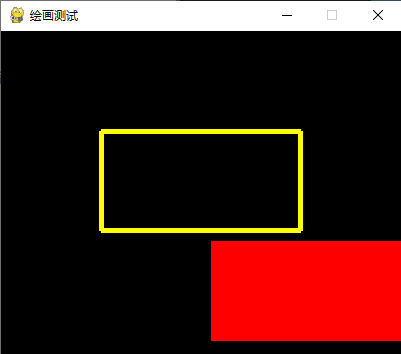

# **Python**

* 目录
  * [基本使用](#基本使用)
    * [pass](#pass)
    * [Number(数字)](#number数字)
    * [字符串](#字符串)
    * [列表(List)](#列表list)
    * [元组 Tuple](#元组-tuple)
    * [字典(Dictionary)](#字典dictionary)
    * [集合（Set）](#集合set)
    * [集合内置方法完整列表](#集合内置方法完整列表)
  * [Python基本语法](#python基本语法)
  * [Pygame](#pygame)
    * [窗体](#窗体)
      * [窗体 pygame\.display](#窗体-pygamedisplay)
      * [图片及React对象](#图片及react对象)
      * [窗体大小改变](#窗体大小改变)
    * [事件](#事件)
      * [键盘事件](#键盘事件)
      * [鼠标事件](#鼠标事件)
    * [色彩与绘图](#色彩与绘图)
      * [色彩机制](#色彩机制)
      * [绘画](#绘画)
      * [文字绘制](#文字绘制)

## 基本使用

### pass 

**pass** 不做任何事情，一般用做占位语句。

与continue的区别：

pass是占位语句，后面的代码继续执行；

continue会跳过后续代码执行，进入下一次循环

### Number(数字)

- **整型(Int)** - 通常被称为是整型或整数，是正或负整数，不带小数点。
- **长整型(long integers)** - 无限大小的整数，整数最后是一个大写或小写的L。
- **浮点型(floating point real values)** - 浮点型由整数部分与小数部分组成，浮点型也可以使用科学计数法表示（2.5e2 = 2.5 x 102 = 250）
- **复数(complex numbers)** - 复数由实数部分和虚数部分构成，可以用a + bj,或者complex(a,b)表示， 复数的实部a和虚部b都是浮点型。

**类型转换**

```python
int(x [,base ])         将x转换为一个整数  
long(x [,base ])        将x转换为一个长整数  
float(x )               将x转换到一个浮点数  
complex(real [,imag ])  创建一个复数  
str(x )                 将对象 x 转换为字符串  
repr(x )                将对象 x 转换为表达式字符串  
eval(str )              用来计算在字符串中的有效Python表达式,并返回一个对象  
tuple(s )               将序列 s 转换为一个元组  
list(s )                将序列 s 转换为一个列表  
chr(x )                 将一个整数转换为一个字符  
unichr(x )              将一个整数转换为Unicode字符  
ord(x )                 将一个字符转换为它的整数值  
hex(x )                 将一个整数转换为一个十六进制字符串  
oct(x )                 将一个整数转换为一个八进制字符串  
```

**运算模块**

Python math 模块提供了许多对浮点数的数学运算函数。

Python cmath 模块包含了一些用于复数运算的函数。

cmath 模块的函数跟 math 模块函数基本一致，区别是 cmath 模块运算的是复数，math 模块运算的是数学运算。

**函数**

| 函数            | 返回值 ( 描述 )                                              |
| :-------------- | :----------------------------------------------------------- |
| abs(x)          | 返回数字的绝对值，如abs(-10) 返回 10                         |
| ceil(x)         | 返回数字的上入整数，如math.ceil(4.1) 返回 5                  |
| cmp(x, y)       | 如果 x < y 返回 -1, 如果 x == y 返回 0, 如果 x > y 返回 1    |
| exp(x)          | 返回e的x次幂(ex),如math.exp(1) 返回2.718281828459045         |
| fabs(x)         | 返回数字的绝对值，如math.fabs(-10) 返回10.0                  |
| floor(x)        | 返回数字的下舍整数，如math.floor(4.9)返回 4                  |
| log(x)          | 如math.log(math.e)返回1.0,math.log(100,10)返回2.0            |
| log10(x)        | 返回以10为基数的x的对数，如math.log10(100)返回 2.0           |
| max(x1, x2,...) | 返回给定参数的最大值，参数可以为序列。                       |
| min(x1, x2,...) | 返回给定参数的最小值，参数可以为序列。                       |
| modf(x)         | 返回x的整数部分与小数部分，两部分的数值符号与x相同，整数部分以浮点型表示。 |
| pow(x, y)       | x**y 运算后的值。                                            |
| round(x ,[n\])  | 返回浮点数x的四舍五入值，如给出n值，则代表舍入到小数点后的位数。 |
| sqrt(x)         | 返回数字x的平方根                                            |

### 字符串

**Python字符串运算符**

| 操作符 | 描述                                                         | 实例                                 |
| :----- | :----------------------------------------------------------- | :----------------------------------- |
| +      | 字符串连接                                                   | >>>a + b 'HelloPython'               |
| *      | 重复输出字符串                                               | >>>a * 2 'HelloHello'                |
| []     | 通过索引获取字符串中字符                                     | >>>a[1] 'e'                          |
| [ : ]  | 截取字符串中的一部分                                         | >>>a[1:4] 'ell'                      |
| in     | 成员运算符 - 如果字符串中包含给定的字符返回 True             | >>>"H" in a True                     |
| not in | 成员运算符 - 如果字符串中不包含给定的字符返回 True           | >>>"M" not in a True                 |
| r/R    | 原始字符串 - 原始字符串：所有的字符串都是直接按照字面的意思来使用，没有转义特殊或不能打印的字符。 原始字符串除在字符串的第一个引号前加上字母"r"（可以大小写）以外，与普通字符串有着几乎完全相同的语法。 | >>>print r'\n' \n >>> print R'\n' \n |
| %      | 格式字符串                                                   | 请看下一章节                         |

python 字符串格式化符号:


| 符  号 | 描述                                 |
| :----- | :----------------------------------- |
| %c     | 格式化字符及其ASCII码                |
| %s     | 格式化字符串                         |
| %d     | 格式化整数                           |
| %u     | 格式化无符号整型                     |
| %o     | 格式化无符号八进制数                 |
| %x     | 格式化无符号十六进制数               |
| %X     | 格式化无符号十六进制数（大写）       |
| %f     | 格式化浮点数字，可指定小数点后的精度 |
| %e     | 用科学计数法格式化浮点数             |
| %E     | 作用同%e，用科学计数法格式化浮点数   |
| %g     | %f和%e的简写                         |
| %G     | %F 和 %E 的简写                      |
| %p     | 用十六进制数格式化变量的地址         |

格式化操作符辅助指令:

| 符号  | 功能                                                         |
| :---- | :----------------------------------------------------------- |
| *     | 定义宽度或者小数点精度                                       |
| -     | 用做左对齐                                                   |
| +     | 在正数前面显示加号( + )                                      |
| <sp>  | 在正数前面显示空格                                           |
| #     | 在八进制数前面显示零('0')，在十六进制前面显示'0x'或者'0X'(取决于用的是'x'还是'X') |
| 0     | 显示的数字前面填充'0'而不是默认的空格                        |
| %     | '%%'输出一个单一的'%'                                        |
| (var) | 映射变量(字典参数)                                           |
| m.n.  | m 是显示的最小总宽度,n 是小数点后的位数(如果可用的话)        |

### 列表(List)

| Python 表达式                | 结果                         | 描述                     |
| :--------------------------- | :--------------------------- | :----------------------- |
| len([1, 2, 3])               | 3                            | 长度                     |
| [1, 2, 3] + [4, 5, 6]        | [1, 2, 3, 4, 5, 6]           | 组合                     |
| ['Hi!'] * 4                  | ['Hi!', 'Hi!', 'Hi!', 'Hi!'] | 重复                     |
| 3 in [1, 2, 3]               | True                         | 元素是否存在于列表中     |
| for x in [1, 2, 3]: print x, | 1 2 3                        | 迭代                     |
| L[2]                         | 'Taobao'                     | 读取列表中第三个元素     |
| L[-2]                        | 'Runoob'                     | 读取列表中倒数第二个元素 |
| L[1:]                        | ['Runoob', 'Taobao']         | 从第二个元素开始截取列表 |

**Python列表函数&方法**

Python包含以下函数:

| 序号 | 函数                                 |
| :--- | :----------------------------------- |
| 1    | cmp(list1, list2) 比较两个列表的元素 |
| 2    | len(list) 列表元素个数               |
| 3    | max(list)返回列表元素最大值          |
| 4    | min(list) 返回列表元素最小值         |
| 5    | list(seq)将元组转换为列表            |

Python包含以下方法:

| 序号 | 方法                                                         |
| :--- | :----------------------------------------------------------- |
| 1    | list.append(obj)在列表末尾添加新的对象                       |
| 2    | list.count(obj)统计某个元素在列表中出现的次数                |
| 3    | list.extend(seq)在列表末尾一次性追加另一个序列中的多个值（用新列表扩展原来的列表） |
| 4    | list.index(obj) 从列表中找出某个值第一个匹配项的索引位置     |
| 5    | list.insert(index, obj)将对象插入列表                        |
| 6    | list.pop([index=-1\]) 移除列表中的一个元素（默认最后一个元素），并且返回该元素的值 |
| 7    | list.remove(obj)移除列表中某个值的第一个匹配项               |
| 8    | list.reverse() 反向列表中元素                                |
| 9    | list.sort(cmp=None, key=None, reverse=False) 对原列表进行排序 |

### 元组 Tuple

Python的元组与列表类似，不同之处在于**元组的元素不能修改**。

元组使用小括号，列表使用方括号。

| Python 表达式                | 结果                         | 描述                         |
| :--------------------------- | :--------------------------- | :--------------------------- |
| len((1, 2, 3))               | 3                            | 计算元素个数                 |
| (1, 2, 3) + (4, 5, 6)        | (1, 2, 3, 4, 5, 6)           | 连接                         |
| ('Hi!',) * 4                 | ('Hi!', 'Hi!', 'Hi!', 'Hi!') | 复制                         |
| 3 in (1, 2, 3)               | True                         | 元素是否存在                 |
| for x in (1, 2, 3): print x, | 1 2 3                        | 迭代                         |
| L[2]                         | 'SPAM!'                      | 读取第三个元素               |
| L[-2]                        | 'Spam'                       | 反向读取，读取倒数第二个元素 |
| L[1:]                        | ('Spam', 'SPAM!')            | 截取元素                     |

**元组内置函数**

| 序号 | 方法及描述                            |
| :--- | :------------------------------------ |
| 1    | cmp(tuple1, tuple2)比较两个元组元素。 |
| 2    | len(tuple) 计算元组元素个数。         |
| 3    | max(tuple)返回元组中元素最大值。      |
| 4    | min(tuple)返回元组中元素最小值。      |
| 5    | tuple(seq) 将列表转换为元组。         |

### 字典(Dictionary)

Java中的Map

**字典内置函数&方法**

Python字典包含了以下内置函数：

| 序号 | 函数及描述                                                   |
| :--- | :----------------------------------------------------------- |
| 1    | cmp(dict1, dict2)比较两个字典元素。                          |
| 2    | len(dict)计算字典元素个数，即键的总数。                      |
| 3    | str(dict) 输出字典可打印的字符串表示。                       |
| 4    | type(variable)返回输入的变量类型，如果变量是字典就返回字典类型。 |

Python字典包含了以下内置方法：

| 序号 | 函数及描述                                                   |
| :--- | :----------------------------------------------------------- |
| 1    | dict.clear() 删除字典内所有元素                              |
| 2    | dict.copy()返回一个字典的浅复制                              |
| 3    | dict.fromkeys(seq[, val\]) 创建一个新字典，以序列 seq 中元素做字典的键，val 为字典所有键对应的初始值 |
| 4    | dict.get(key, default=None)返回指定键的值，如果值不在字典中返回default值 |
| 5    | dict.has_key(key)如果键在字典dict里返回true，否则返回false   |
| 6    | dict.items()以列表返回可遍历的(键, 值) 元组数组              |
| 7    | dict.keys()以列表返回一个字典所有的键                        |
| 8    | dict.setdefault(key, default=None)和get()类似, 但如果键不存在于字典中，将会添加键并将值设为default |
| 9    | dict.update(dict2)把字典dict2的键/值对更新到dict里           |
| 10   | dict.values()以列表返回字典中的所有值                        |
| 11   | pop(key[,default\]) 删除字典给定键 key 所对应的值，返回值为被删除的值。key值必须给出。 否则，返回default值。 |
| 12   | popitem()返回并删除字典中的最后一对键和值                    |

### 集合（Set）

### 集合内置方法完整列表

| 方法                          | 描述                                                         |
| :---------------------------- | :----------------------------------------------------------- |
| add()                         | 为集合添加元素                                               |
| clear()                       | 移除集合中的所有元素                                         |
| copy()                        | 拷贝一个集合                                                 |
| difference()                  | 返回多个集合的差集                                           |
| difference_update()           | 移除集合中的元素，该元素在指定的集合也存在。                 |
| discard()                     | 删除集合中指定的元素                                         |
| intersection()                | 返回集合的交集                                               |
| intersection_update()         | 返回集合的交集。                                             |
| isdisjoint()                  | 判断两个集合是否包含相同的元素，如果没有返回 True，否则返回 False。 |
| issubset()                    | 判断指定集合是否为该方法参数集合的子集。                     |
| issuperset()                  | 判断该方法的参数集合是否为指定集合的子集                     |
| pop()                         | 随机移除元素                                                 |
| remove()                      | 移除指定元素                                                 |
| symmetric_difference()        | 返回两个集合中不重复的元素集合。                             |
| symmetric_difference_update() | 移除当前集合中在另外一个指定集合相同的元素，并将另外一个指定集合中不同的元素插入到当前集合中。 |
| union()                       | 返回两个集合的并集                                           |
| update()                      | 给集合添加元素                                               |

## Python基本语法


## Pygame

### 窗体

#### 窗体 pygame.display

**屏幕尺寸和模式**

```py
pygame.display.set_mode()			# 设置相关屏幕模式
pygame.display.Info()				# 生成屏幕相关信息
```

`pygame.display.set_mode(r=(0,0),flags=0)`
r 是游戏屏幕的分辨率,采用(width,height)方式输入
flags 用来控制显示类型,可用|组合使用,常用显示标签如下：

- pygame.RESIZABLE 窗口大小可调
- pygame.NOFRAME 窗口没有边界显示
- pygame.FULLSCREEN 窗口全屏显示

`pygame.display.Info()`屏幕相关信息

```py
<VideoInfo(hw = 0, wm = 1,video_mem = 0
         blit_hw = 0, blit_hw_CC = 0, blit_hw_A = 0,
         blit_sw = 0, blit_sw_CC = 0, blit_sw_A = 0,
         bitsize  = 32, bytesize = 4,
         masks =  (16711680, 65280, 255, 0),
         shifts = (16, 8, 0, 0),
         losses =  (0, 0, 0, 8),
         current_w = 1920, current_h = 1080					# 屏幕尺寸
>
```

**窗口标题和图标**

```py
pygame.display.set_caption()		# 设置标题信息
pygame.display.set_icon(Surface)	# 设置图标信息	Surface 图片
pygame.display.get_caption()		# 获得图标
```

窗口感知和刷新

```py
pygame.display.get_active()
pygame.display.flip()				# 全屏刷新
pygame.display.update()				# 局部刷新
```

`pygame.display.get_active）`
当窗口在系统中显示（屏幕绘制/非图标化）时返回True，否则返回False
该函数可以用来判断是否游戏窗口被最小化
进一步，判断后可以暂停游戏，改变响应模式等

设置屏幕刷新率

```py
fps = 300									# 刷新率，每秒帧率参数
fclock = pygame.time.Clock()				# 创建CLock对象，用于操作时间

pygame.display.update();					# 局部刷新
fclock.tick(fps);							# 按照每秒300Hz进行刷新，控制帧速度，即窗口刷新速度，例如：
											  clock.tick（100）表示每秒钟100次帧刷新
											  视频中每次展示的静态图像称为帧
```

#### 图片及React对象

```py
size = width ,height = 600,400
screen = pygame.display.set_mode(size);				# 设置屏幕尺寸

ball = pygame.image.load('basketball.png');			# 引入图片
ballRect = ball.get_rect()							# 获取图片的外切矩形Surface对象，可以获取图片左上角的x,y坐标，以及图片的长、宽尺寸

ballRect = ballRect.move(1,-1);						# 移动图片的Surface对象，矩形移动一个偏移量（x，y），即在横轴方向移动x像素，纵轴方向移动y像素，xy为整数
screen.blit(ball,ballRect)							# 将图片重绘到矩形内
```

- Surface对象：所有的图片对象

  Surface对象 ball.get_rect（）

  Pygame使用内部定义的**Surface**对象表示**所有载入的图像**，其中.**get_rect()**方法返回一个**覆盖图像**的**矩形Rect**对象

- Rect对象：图片的外切矩形对象

  Rect对象有一些重要属性，例如：

  top，bottom，left，right 表示上下左右width，height 表示宽度、高度

Rect对象

```py
ballRect = ballRect.move(speed[0],speed[1]);
print('x  = ' + str(ballRect.x))
print('y  = ' + str(ballRect.y))
print('h  = ' + str(ballRect.h))
print('w  = ' + str(ballRect.w))
print('height  = ' + str(ballRect.height))
print('width  = ' + str(ballRect.width))
print('--------------------------------------------')

# 输出
x  = 187
y  = 187
h  = 60
w  = 60
height  = 60
width  = 60
--------------------------------------------
x  = 188
y  = 188
h  = 60
w  = 60
height  = 60
width  = 60
--------------------------------------------
```

#### 窗体大小改变

Pygame.VIDEORESIZE这是一种窗口大小更改的事件
事件发生后，返回event.size元组，包含新窗口的宽度和高度
.size[0]宽度，也可以用event.w
.size[1]高度，也可以用event.h
返回参数仅在事件发生时有用

```py
size = width ,height = 600,400
screen = pygame.display.set_mode(size, pygame.RESIZABLE);		# 窗体大小可变

elif event.type == pygame.VIDEORESIZE:							# 检测到窗体大小改变，重新设置窗体大小
    size =  width ,height = event.w, event.h					
    screen = pygame.display.set_mode(size)
```

### 事件

pygame内部维护者一个**事件队列**


```py
处理事件
pygame.event.get()
pygame.event.poll()
pygame.event.clear()

操作事件队列
pygame.event.set_blocked()
pygame.event.get_blocked()
pygame.event.set_allowed()

生成事件
pygame.event.post()
pygame.event.Event()
```

**pygame.event.get()**

从事件队列中获得事件列表，即获得所有被队列的事件for event in pygame.event.get（）
if event，type pygame.QUIT sys.exit（）
增加参数，获得某类或某些类事件
pygame.event.get（type）
pygame.event.get（typelist）

**pygame.event.poll()**

从事件队列中获得一个事件
While True：event =pygame.event.poll（）
事件获取将从事件队列中删除如果事件队列为空，则返回 event.NOEVENT

**pygame.event.clear()**
从事件队列中删除事件，默认删除所有事件该函数与pygame.event.get（）类似，区别仅是不对事件进行处理

**pygame.event.set_blocked**  (type or typelist)
控制哪些类型事件**不允许**被保存到事件队列中

**pygame.event.set_allowed**  (type or typelist)
控制哪些类型事件**允许**被保存到事件队列中

**pygame.event.get_blocked**  (type)
测试某个事件类型**是否被**事件**队列**所**禁止**
如果事件类型被禁止，则返回True，否则返回False

**pygame.event.post**   (Event)
产生一个事件，并将其放入事件队列一般用于放置用户自定义事件（pygame.USEREVENT）
也可以用于放置系统定义事件（如鼠标或键盘等），给定参数

**pygame.event.Event**  (type，dict)
创建一个给定类型的事件
其中，事件的属性和值采用字典类型复制，属性名采用字符串形式如果创建已有事件，属性需要一致

#### 键盘事件

**pygame.event.KEYDOWN**

- event.unicode 		按键的unicode码		unicode码与平台有关，不推荐使用
- event.key                 按键的常量名称
- event.mod               按键修饰符的组合值

**pygame.event.KEYUP**

- event.key 		按键的常量名称
- event.mod 	  按键修饰符的组合值

按键常量名：K_a~K_z

按键修饰符：KMOD_SHIFT、KMOD_CTR、KOMD_ALT

event.mod 修饰符的按位或运算

```py
event.mod=KMOD_ALT | KMOD_SHIFT
```

#### 鼠标事件

```py
pygame.event.MOUSEMOTION 			# 鼠标移动事件
pygame.event.MOUSEBUTTONUP 			# 鼠标键释放事件
pygame.event.MOUSEBUTTONDOWN		# 鼠标键按下事件
```

**pygame.event.MOUSEMOTION** 鼠标**移动**事件

- event.pos                鼠标当前坐标值（x，y），相对于窗口左上角
- event.rel                  鼠标相对运动距离（X，Y），相对于上次事件
- event.buttons         鼠标按钮状态（a，b，c），对应于鼠标的三个键鼠标移动时，这三个键处于按下状态，对应的位置值为1，反之则为0.

**pygame.event.MOUSEBUTTONUP** 鼠标**键释放**事件

- event.pos 		鼠标当前坐标值（x，y），相对于窗口左上角
- event.button	鼠标按下键编号n取值0/1/2，分别对应三个键

**pygame.event.MOUSEBUTTONDOWN** 鼠标**键按下**事件

- event.pos 		鼠标当前坐标值（x，y），相对于窗口左上角
- event.button 	鼠标按下键编号n取值为整数，左键为1，右键为3，设备相关

### 色彩与绘图

#### 色彩机制

pygame.Color

Color类用于表达色彩，使用RGB或RGBA色彩模式，A可选。
Color类可以用色彩名字、RGBA值、HTML色彩格式等方式定义.
Color (name)例如：Color ("grey")
Color (r，g，b，a)例如：Color (190，190，190，255)
color (rgbvalue)例如：Color ("#BEBEBEFF)

常见颜色的RGB值


RGBA中的A

alpha通道
alpha通道表示不透明度，取值0-255，默认255
alpha通道值越大，不透明度越高，255表示不透明

pygame.Color类
pygame.Color.r	获得Color类的红色值r

pygame.color.g	获得Color类的绿色值g

pygame.color.b	获得Color类的蓝色值b

pygame.color.a	获得Color类的alpha值a

pygame.co1or.normalize 将RGBA各通道值归一到0-1之间

#### 绘画

**pygame.draw**

图形绘制后，返回一个矩形Rect类表示该形状


**pygame.Rect**

表达一个矩形区域的类，用于存储坐标和长度信息Pygame利用Rect类来操作图形/图像等元素，返回外切矩形坐上顶点的坐标值以及宽、高值


**pygame.draw**
.rect() 矩形				.linel() 直线
.polygon() 多边形	.linest() 连续多线
.circle() 圆形		.aaline()无锯齿线
.elipset() 椭圆形		.alines ()连续无锯齿线
.arc ()椭圆弧形

**矩形**

pygame.draw.rect (Surface，color，Rect，width=0)	
Surface 		矩形的绘制屏幕
co1or 			矩形的绘制颜色
Rect 				矩形的绘制区域 
width=0		 绘制边缘的宽度，默认为0，即填充图形

```py
r1rect = pygame.draw.rect(screen, GOLD, (100,100,200,100), 5)
r2rect = pygame.draw.rect(screen, RED, (210,210,200,100), 0)
```



**多边形**

pygame.draw.polygon (Surface，color，pointlist，width=0)
Surface 		多边形的绘制屏幕
co1or 			多边形的绘制颜色
pointlist 		多边形顶点坐标列表
width=0		 绘制边缘的宽度，默认为0，即填充图形

**圆形**

pygame.draw.circle（Surface，color，pos，radius，width=0）
Surface 		圆形的绘制屏幕
co1or 			圆形的绘制颜色
pos 				圆形的圆心坐标
radius 			圆形的半径
width=0			绘制边缘的宽度，默认为0，即填充图形

**椭圆**

pygame.draw.ellipse (Surface，color，Rect，width=0)
Surface 		椭圆形的绘制屏幕
color 			椭圆形的绘制颜色
Rect 			椭圆形的绘制区域
width=0		 绘制边缘的宽度，默认为0，即填充图形

**椭圆弧形**

pygame.draw.arc (Surface，color，Rect，start_angle，stop_angle，width=0)
surface 		椭圆弧形的绘制屏幕
Color			椭圆弧形的绘制颜色
Rect 			椭圆弧形的绘制区域
start angle，stop_angle 	弧形绘制起始和结束弧度值横向右侧为0度
width=0 		绘制边缘的宽度，默认为0，即填充图形

**直线**

pygame.draw.line (Surface，color，start_pos，end_pos，width=1)
surface 		直线的绘制屏幕
color 			直线的绘制颜色
start_pos，end_pos 	直线的起始和结束坐标
width=0 		直线的宽度，默认值为1

**连续多线**

pygame.draw.lines (Surface，color，closed，pointlist，width=1)
Surface 		连续多线的绘制屏幕
Color 			连续多线的绘制颜色
closed 			如果为True，起止节点间自动增加封闭直线
pointlist 		连续多线的顶点坐标列表

width=1 连续多线的宽度，默认值为1

**无锯齿直线**

pygame.draw.aaline (Surface，color，start pos，end_pos，blend=1)
surface 		无锯齿线的绘制屏幕
color 			无锯齿线的绘制颜色
start_pos，end_pos 	无锯齿线的起始和结束坐标

blend-1 不为0时，与线条所在背景颜色进行混合

**连续无锯齿多线**

pygame.draw.aalines (Surface，color，closed，pointlist，blend=1)
Surface 		连续无锯齿多线的绘制屏幕
Color 			连续无锯齿多线的绘制颜色
closed 			如果为True，起止节点间自动增加封闭直线
pointlist 		连续多线的顶点坐标列表

blend-1 不为0时，与线条所在背景颜色进行混合

#### 文字绘制

**pygame.freetype**

向屏幕上绘制特定字体的文字

文字不能直接print ()，而是用像素根据字体点阵图绘制


pygame.freetype **额外** import **引用**

```py
import pygame，sys import pygame.freetype
```

pygame.freetype

pygame.fretype.font	根据字体和字号生成一个Font对象

Font.render_to ()、Font.render ()		用Font对象的render*方法绘制具体文字

**pygame.freetype.Font (file，size=0)**
file 字体类型名称或路径
size 字体的大小

Font类的绘制方法

1. Font.render_to (surf, dest, text, fgcolor=None, bgcolor=None, rotation=0, size=0)→Rect（返回Rect对象）

   surf 		绘制字体的平面，Surface对象

   dest 		在平面中的具体位置，（x, y）

   text 		绘制的文字内容

   fgcolor 	文字颜色

   bgcolor 	背景颜色

   rotation 	逆时针的旋转角度，取值0-359，部分字体可旋转

   size 			文字大小，赋值该参数将覆盖Font中的设定值

2. Font.render (text, fgcolor=None, bgcolor=None, rotation=0, size=0)→(Surface,Rect)（返回一个元组，包含Surface对象和Rect对象）
   text                          绘制的文字内容
   fgcolor,bgcolor      字体颜色、背景颜色

   rotation                  逆时针的旋转角度,取值0-359,部分字体可旋转

   size                          文字大小,赋值该参数将覆盖Font中的设定值

**pygame.Surface**

绘图层，或绘图平面，或图层用于表示图形、文字或图像的绘制效果与当前屏幕主图层可以并列存在

如果不绘制在主图层上，则不会被显示

**pygame.Rect**矩形区域
对应于当前主图层的某个具体区域
相当于某个矩形区域的指针或标识信息
可以指定图层绘制在某个矩形区域中

**主图层**
由pygame.display.set_mode()生成的Surface对象

size=width, height=600, 400
screen=pygame.display.set_mode(size)
在主图层上绘制其他图层使用.blit()方法

screen.blit(bal1，ballrect)
pygame.Surface				pygame.Rect


render文字绘图过程


