# Redis

* 目录
  * [NoSQL](#nosql)
    * [NoSql概述](#nosql概述)
    * [为什么使用NoSQL](#为什么使用nosql)
    * [什么是NoSQL](#什么是nosql)
    * [NoSQL 的四大分类](#nosql-的四大分类)
  * [Redis](#redis-1)
    * [Redis 入门](#redis-入门)
      * [概述](#概述)
    * [Linux下安装Redis](#linux下安装redis)
    * [Redis 基础知识](#redis-基础知识)
    * [Redis 五大数据类型](#redis-五大数据类型)
      * [Redis\-Key](#redis-key)
      * [String（字符串）](#string字符串)
      * [List（列表）](#list列表)
      * [Set（集合）](#set集合)
      * [Hash（哈希）](#hash哈希)
      * [Zset（有序集合）](#zset有序集合)
    * [三种特殊数据类型](#三种特殊数据类型)
      * [geospatial（地理位置）](#geospatial地理位置)
      * [hyperloglogs](#hyperloglogs)
      * [bitmaps(位图)](#bitmaps位图)
    * [事务](#事务)
    * [Jedsi](#jedsi)
      * [常用的API](#常用的api)
    * [SpringBoot整合](#springboot整合)
    * [Redis\.conf详解](#redisconf详解)
    * [Redis持久化](#redis持久化)
      * [RDB（Redis DataBase）](#rdbredis-database)
      * [AOF（Append Only File）](#aofappend-only-file)
    * [Redis发布订阅](#redis发布订阅)
    * [Redis主从复制](#redis主从复制)
      * [概念](#概念)
      * [环境配置](#环境配置)
      * [一主二从](#一主二从)
      * [哨兵模式（重点 ）](#哨兵模式重点-)
    * [Redis缓存穿透和雪崩](#redis缓存穿透和雪崩)
      * [缓存穿透（查不到）](#缓存穿透查不到)
        * [布隆过滤器](#布隆过滤器)
        * [缓存空对象](#缓存空对象)
      * [缓存击穿（量太大，缓存过期）](#缓存击穿量太大缓存过期)
        * [设置热点数据永不过期](#设置热点数据永不过期)
        * [加互斥锁](#加互斥锁)
      * [缓存雪崩](#缓存雪崩)
        * [redis高可用](#redis高可用)
        * [限流降级](#限流降级)
        * [数据预热](#数据预热)

## NoSQL

### NoSql概述

### 为什么使用NoSQL

> 1、单机MySQL时代


> 2、Memcached（缓存）+ MySQL + 垂直拆分 (读写分离)

​	网站80%的情况都是在读，每次都要去查询数据库的话就十分的麻烦！所以说我们希望减轻数据的压力，我们可以使用缓存来保证效率！

发展过程：优化数据结构和索引->文件缓存（IO）--> Memcached

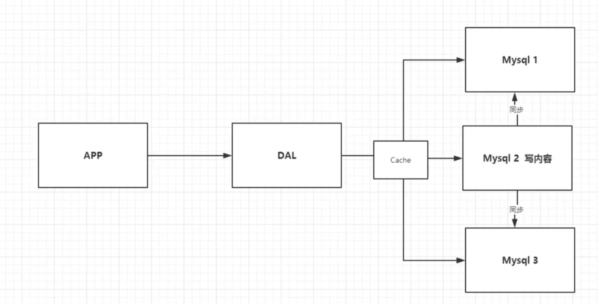

> 3. 分库分表 + 水平拆分 + MySQL集群

==本质：数据库（读，写）==

早些年MyISAM：表锁，十分影响效率！高并发下就会出现严重的锁问题

转战Innodb：行锁

> 为什么要用NoSQL

用户的个人信息，社交网络，地理位置。用户自己产生的数据，用户日志等等爆发式增长！

这时候我们就需要使用NoSQL数据库的，Nosql可以很好的处理以上的情况！

### 什么是NoSQL

NoSQL = Not Only SQL（不仅仅时SSQL）

泛指非关系型数据库

很多的数据类型用户的个人信息，社交网络，地理位置。这些数据类型的存储不需要一个固定的格式！不需要多月的操作就可以横向扩展的！Map<String，Object>使用键值对来控制！

> NoSQL 特点

1. 方便扩展（数据之间没有关系，好扩展！）

2. 大数据量高性能（Redis 1s写8w次，读11w/s，NoSQL的缓存记录级，时一直细粒度的缓存，性能比较高）

3. 书籍类型多样性（不需要实现设计数据库，随取随用，数据量是否大的表，很多人无法设计）

4. 传统 RDBMS 和 NoSQL

   ```
   传统的 RDBMS
       - 结构化组织
       - SQL
       - 数据和关系都存在单独的表中
       - 操作 CURD ，数据定义语言
       - 严格的一致性
       - 基础的事务
       - ……
   ```

   ```
   NoSQL
   	- 不仅仅是数据
   	- 没有固定的查询语言
   	- 键值对存储，列存储，文档存储，图形数据库（社交关系）
   	- 最终一致性
   	- CAP定理 和 BASE 理论（异地多活）
   	- 高性能、高可用、高扩展
   	- ……
   ```

   

5. 5

> 大数据时代：3V + 3高

大数据时代的3V：主要是描述问题的
		1.海量Volume
		2.多样Variety
		3.实时Velocity|
大数据时代的3高：主要是对程序的要求
		1.高并发
		2.高可拓
		3.高性能

### NoSQL 的四大分类

1. KV键值对：
   - 新浪：Redis
   - 美团：Redis + Tair
   - 阿里、百度： Redis + memcache
2. 文档型数据库（bson格式：和json一样）
   - MangoDB（一般必须掌握）
     - MangoDB 基于分布式文件存储的数据库，C++编写，主要用来处理大量文档
     - MangonDB 是一个介于关系型数据库和非关系型数据库中间的产品！MangonDB 是非关系型数据库中功能最丰富、最像关系型数据库的
   - ConthDB
3. 列存储数据库
   - HBase
   - 分布式文件系统
4. 图关系数据库
   - 存储关系，如：朋友圈设计网络，广告推荐
   - Neo4j，InfoGrid


## Redis

### Redis 入门

#### 概述

> Redis 是什么

Redis（==Re==mote ==Di==ctionary ==S==erver），即远程字典服务！

是一个开源的使用ANSIC语言编写、支持网络、可基于内存亦可持久化的日志型、Key-Value数据库，并提供多种语言的API。

redis会周期性的把更新的数据写入磁盘或者把修改操作写入追加的记录文件，并且在此基础上实现了master-slave（主从）同步。

免费和开源！是当下最热门的NoSQL技术之一！也被人们称之为结构化数据库！

> Redis 能干嘛

1. 内存存储、持久化，内存中是断电即失、所以说持久化很重要（rdb、aof）
2. 效率高，可以用于高速缓存
3. 发布订阅系统
4. 地图信息分析
5. 计时器、计数器（浏览量！）
6. ……

> Redis 特性

1. 多样的数据类型
2. 持久化
3. 集群
4. 事务
5. ……

### Linux下安装Redis

1. 下载安装包 `redis-6.0.9.tar.gz`

   ==6.0以上要升级C++编译工具版本 gcc 9==

2. 解压Redis压缩包。放入到/opt目录下

3. 进入解压后的文件，可以看到我们redis的配置文件 `redis.conf`

4. 基本的环境安装

   ```bash
   yum install gcc-c++
   
   make
   
   make install
   ```

5. Redis的默认安装路径，`/usr/local/bin`

   redis-server | redis-cli

6. 将Redis的配置文件拷贝到 `/usr/local/bin/redis_config/` 下

7. redis默认不是后台启动的，修改配置文件`redis.conf`

   ```conf
   daemonize yes
   ```

8. 启动redis服务

   ```bash
   redis-server redis_config/redis.conf		# 通过指定的配置文件启动（服务端）
   ```

9. 使用 redis-cli 测试连接

   ```bash
   redis-cli -p 6379							# 客户端
   ```

   

10. 查看 redis 进程是否开启

    ```bash
    ps -ef|grep redis
    ```

    

11. 关闭 redis 的服务        `shutdown` --> `exit`

    

12. 再次查看redis进程

###redis-benchmark性能测试

​	官方自带的性能测试工具

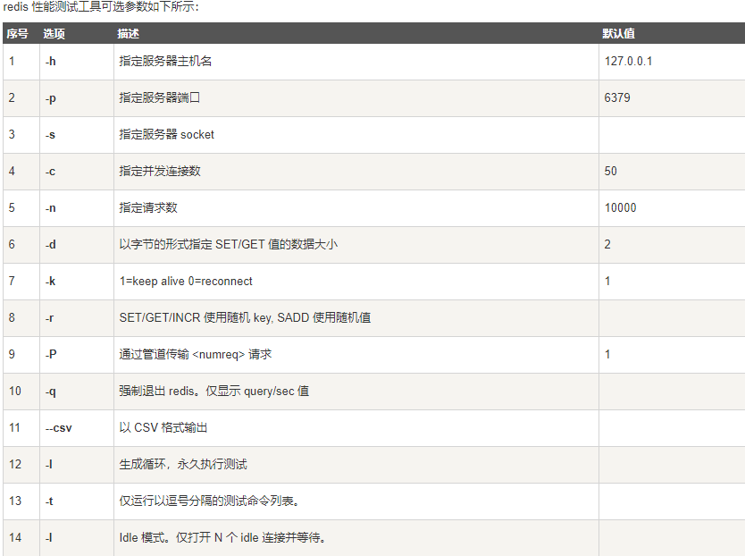

简单测试：

```bash
# 测试：100个并发连接100000请求
redis-benchmark -h localhost -p 6379 -c 100 -n 100000
```

查看分析：

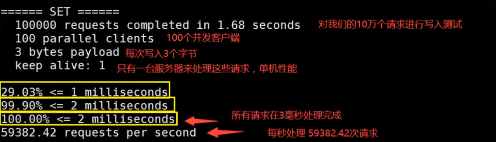

###  Redis 基础知识

​	redis默认有16个数据库	（redis.conf 中设置）

​	默认使用第0个

​	可以使用 select 进行切换

```bash
127.0.0.1：6379>select 3			# 切换数据库OK
127.0.0.1：6379[3]>DBSIZE		# 查看DB大小！
（integer）0
```


```bash
127.0.0.1：6379[3]>keys *	# 查看数据库所有的key
1）"name"
```

清除当前数据库 `flushdb`

清除全部数据库的内容 `flushall`

```bash
127.0.0.1:6379[3]>flushdb
OK
127.0.0.1:6379[3]>keys *
(empty list or set)
```

> Redis 是单线程的！

​	明白Redis是很快的，官方表示，Redis是基于内存操作，CPU不是Redis性能瓶颈，Redis的瓶颈是根据机器的内存和网络带宽，既然可以使用单线程来实现，就使用单线程了！

Redis 是C语言写的，官方提供的数据为100000+的QPS，完全不比同样是使用key-vale的Memecache差！

**Redis为什么单线程还这么快？**

1. 误区1：高性能的服务器一定是多线程的？
2. 误区2：多线程（CPU上下文切换！）一定比单线程效率高

核心：redis是将所有的数据全部放在内存中的，所以说使用单线程去操作效率就是最高的，多线程（CPU上下文会切换：耗时的操作！！！），对于内存系统来说，如果没有上下文，切换效率就是最高的！

### Redis 五大数据类型

> 官网文档

​		Redis 是一个开源（BSD许可）的，内存中的数据结构存储系统，它可以用作==数据库==、==缓存==和==消息中间件==。 它支持多种类型的数据结构，如 字符串（strings）， 散列（hashes）， 列表（lists）， 集合（sets）， 有序集合（sorted sets） 与范围查询， bitmaps， hyperloglogs 和 地理空间（geospatial） 索引半径查询。 Redis 内置了 复制（replication），LUA脚本（Lua scripting）， LRU驱动事件（LRU eviction），事务（transactions） 和不同级别的 磁盘持久化（persistence）， 并通过 Redis哨兵（Sentinel）和自动 分区（Cluster）提供高可用性（high availability）。

#### Redis-Key

```bash
 set name zjp
 exists name		# 判断当前key是否存在
 move name 1		# 将 key值为 name 的数据移动到第1号数据库
 del name			# 删除key
 expire name 10		# 10秒后 key值为 name 的数据会过期
 ttl name 			# 查看还剩几秒到期	ttl--> time to live
 
 type name			# 查看key的数据类型
```


#### String（字符串）

```bash
################################################################################################################
127.0.0.1:6379>set keyl v1					# 设置值
OK
127.0.0.1:6379>get key1						# 获得值
"V1"
127.0.0.1:6379>keys *						# 获得所有的key
1)"key1"
127.0.0.1:6379>EXISTS key1					# 判断某个key是否存在
(integer)1
127.0.0.1:6379>APPEND key1 "hello"			# 追加字符串，如果当前key还不存在，就相当于set key
(integer)7
127.0.0.1:6379>get key1
"v1he11o"
127.0.0.1:6379>STRLEN key1					# 获取字符串的长度
(integer)7
127.0.0.1:6379>APPEND key1", kaungshen"
(integer)17
127.0.0.1:6379>STRLEN key1
(integer)17
127.0.0.1:6379>get key1
"v1he11o, kaungshen"
################################################################################################################
# 步长 i+=n
127.0.0.1：6379>set views 0		# 初始浏	览量为0
OK
127.0.0.1：6379>get views
"O"
127.0.0.1：6379>incr views		# 自增1浏	览量+1
（integer）1
127.0.0.1：6379>incr views
（integer）2
127.0.0.1：6379>get views
"2"
127.0.0.1：6379>decr views		# 自减1浏	览量-1
（integer）1
127.0.0.1：6379>decr views
（integer）0
127.0.0.1：6379>decr views
（integer）-1
127.0.0.1：6379>get views
"-1"
127.0.0.1：6379>INCRBY views 10	# 可以设置步长，指定增量！
（integer）9
127.0.0.1：6379>INCRBY views 10
（integer）19
127.0.0.1：6379>DECRBY views 5
（integer）14
################################################################################################################
# 字符串范围 range
127.0.0.1：6379>set key1 "hello，kuangshen"	# 设置key1的值OK
127.0.0.1：6379>get key1
"he11o，kuangshen"
127.0.0.1：6379>GETRANGE key1 0 3				# 截取字符串[o，3]
"he11"
127.0.0.1：6379>GETRANGE key1 0 -1				# 获取全部的字符串 和get key是一样的
"he11o，kuangshen"

# 替换 setrange
127.0.0.1：6379>set key2 abcdefg OK
127.0.0.1：6379>get key2
"abcdefg"
127.0.0.1：6379>SETRANGE key2 1 xx				# 替换指定位置开始的字符串！
（integer）7127.0.0.1：6379>get key2
"axxdefg"
################################################################################################################
# setex (set with expire)		# 设置过期时间
# setnx (set if not exist)		# 不存在则设置（分布式锁中会常常使用）
127.0.0.1：6379>setex key3 30 "he1lo"		# 设置key3的值为he11o，30秒后过期oK
127.0.0.1：6379>ttl key3
（integer）26
127.0.0.1：6379>get key3
"he11o"
127.0.0.1：6379>setnx mykey"redis"			# 如果mykey不存在，创建mykey
（integer）1127.0.0.1：6379>keys *
1）"key2"
2）"mykey"
3）"key1"
127.0.0.1：6379>ttl key3
（integer）-2
127.0.0.1：6379>setnx mykey "MongoDB"		# 如果mykey存在，创建失败！
（integer）0
127.0.0.1：6379> get mykey
"redis"
################################################################################################################

127.0.0.1：6379>mset kl v1 k2 v2 k3 v3		# 同时设置多个值oK
127.0.0.1：6379>keys *
1）"k1"
2）"k2"
3）"k3"
127.0.0.1：6379>mget k1 k2 k3				# 同时获取多个值1）"v1"2）"v2"3）"v3"
127.0.0.1：6379>msetnx k1 v1 k4 v4			# msetnx是一个原子性的操作，要么一起成功，要么一起失败！
（integer）0
127.0.0.1：6379>get k4
（nil）

# 对象
set user：1{name:zhangsan，age：3}		# 设置一个user：1对象值为json字符来保存一个对象！
# 这里的key是一个巧妙的设计：user:{id}：{filed}，如此设计在Redis中是完全oK了！
127.0.0.1：6379>mset user:1:name zhangsan user:1:age 2
oK
127.0.0.1：6379>mget user:1:name user:1:age
1）"zhangsan"
2）"2"
################################################################################################################
getset 	# 先 get 再 set
127.0.0.1：6379>getset db redis		# 如果不存在值，则返回nil
（nil）
127.0.0.1：6379>get db
"redis
127.0.0.1：6379>getset db mongodb	# 如果存在值，获取原来的值，并设置新的值
"redis"
127.0.0.1：6379>get db
"mongodb"
################################################################################################################
```

数据结构是相同的！
String类似的使用场景：value除了是我们的字符串还可以是我们的数字！

- 计数器
- 统计多单位的数量
- 粉丝数
- 对象缓存存储！

#### List（列表）

在redis里面，我们可以把list玩成，栈、队列、阻塞队列！

所有的list命令都是用l开头的

```bash
################################################################################################################
127.0.0.1：6379>LPUSH list one			# 将一个值或者多个值，插入到列表头部（左）
（integer）1
127.0.0.1：6379>LPUSH list two
（integer）2
127.0.0.1：6379>LPUSH list three
（integer）3
127.0.0.1：6379>LRANGE list 0 -1			# 获取1ist中值！
1）"three"
2）"two"
3）"one"
127.0.0.1：6379>LRANGE 1ist 0 1			# 通过区间获取具体的值！
1）"three"
2）"two"
127.0.0.1：6379>Rpush list righr			# 将一个值或者多个值，插入到列表位部（右）
（integer）4
127.0.0.1：6379>LRANGE list 0 -1
1）"three"
2）"two"
3）"one"
4）"righr"
################################################################################################################
LPOP
RPOP
127.0.0.1：6379>LRANGE list 0 -1
1）"three"
2）"two"
3）"one"
4）"righr"
127.0.0.1：6379>Lpop list		# 移除1ist的第一个元素
"three"
127.0.0.1：6379>Rpop list		# 移除1ist的最后一个元素
"righr"
127.0.0.1：6379>LRANGE list 0 -1
1）"two"
2）"one"
################################################################################################################
Lindex
127.0.0.1：6379>LRANGE list 0 -1
1）"two"
2）"one"
127.0.0.1：6379>lindex 1ist 1		# 通过下标获得1ist中的某一个值！
"one"
127.0.0.1：6379>lindex list 0
"two"
################################################################################################################
LLen
127.0.0.1：6379>Lpush list one
（integer）1
127.0.0.1：6379> Lpush list two
（integer）2
127.0.0.1：6379>Lpush list three
（integer）3
127.0.0.1：6379>L1en list		# 返回列表的长度
（integer）3
################################################################################################################
移除指定的值
Lrem
127.0.0.1：6379>LRANGE list 0 -1
1）"three"
2）"three"
3）"two"
4）"one"
127.0.0.1：6379>lrem 1ist 1 one		# 移除1ist集合中指定个数的value，精确匹配 
（integer）1							# count > 0: 从头往尾移除值为 value 的元素。  
127.0.0.1：6379>LRANGE list 0 -1		# count < 0: 从尾往头移除值为 value 的元素。
1）"three"							# count = 0: 移除所有值为 value 的元素。
2）"three"
3）"two"
127.0.0.1：6379>lrem list 1 three
（integer）1
127.0.0.1：6379>LRANGE list 0 -1
1）"three"
2）"two"
127.0.0.1：6379>Lpush list three
（integer）3
127.0.0.1：6379>lrem list 2 three
（integer）2
127.0.0.1：6379>LRANGE list 0 -1
1）"two"
################################################################################################################
# trim 修剪。1ist 截断！
127.0.0.1：6379>keys *
（empty list or set）
127.0.0.1：6379>Rpush mylist "hello"
（integer）1I
127.0.0.1：6379>Rpush mylist "hello1"
（integer）2
127.0.0.1：6379>Rpush mylist "he11o2"
（integer）3
127.0.0.1：6379>Rpush mylist "hello3"
（integer）4
127.0.0.1：6379>ltrim mylist 12		# 通过下标截取指定的长度，这个1ist已经被改变了，截断了只剩下截取的元素！
OK
127.0.0.1：6379>LRANGE mylist 0 -1
1）"hello1"
2）"he11o2"
################################################################################################################
rpoplpush	#移除列表的最后一个元素，将他移动到新的列表中！
127.0.0.1：6379>rpush mylist "hello"
（integer）1
127.0.0.1：6379>rpush mylist "hello1"
（integer）2
127.0.0.1：6379>rpush mylist "hello2"
（integer）3
127.0.0.1：6379>rpoplpush mylist myotherlist		# 移除列表的最后一个元素，将他移动到新的列表中！
"he11o2"
127.0.0.1：6379>lrange mylist 0 -1		# 查看原来的列表1）"hello"
2）"he1lo1"
127.0.0.1：6379>lrange myotherlist 0 -1	# 查看目标列表中，确实存在改值！
1）"hello2"
################################################################################################################
1set将列表中指定下标的值替换为另外一个值，更新操作
127.0.0.1：6379>EXISTS 1ist						# 判断这个列表是否存在
（integer）0
127.0.0.1：6379>lset list 0 item					# 如果不存在列表我们去更新就会报错
（error）ERR no such key
127.0.0.1：6379>lpush list value1
（integer）1
127.0.0.1：6379>LRANGE list 0 0
1）"value1"
127.0.0.1：6379>lset list 0 item					 # 如果存在，更新当前下标的值OK
127.0.0.1：6379>LRANGE list 0 0
1）"item"
127.0.0.1：6379>lset list 1 other				# 如果不存在，则会报错！
（error）ERR index out of range
################################################################################################################
linsert 	# 将某个具体的value插入到列把你中某个元素的前面或者后面！
127.0.0.1：6379>Rpush mylist "hello"
（integer）1
127.0.0.1：6379>Rpush mylist "world"
（integer）2
127.0.0.1：6379>LINSERT mylist before"world" "other"
（integer）3
127.0.0.1：6379>LRANGE mylist 0 -1
1）"hello"
2）"other"
3）"world"
127.0.0.1：6379>LINSERT mylist after world new
（integer）4
127.0.0.1：6379>LRANGE mylist 0 -1
1）"he1lo"
2）"other"
3）"world"
4）"new"
################################################################################################################
```

> 小结

- 实际上是一个链表，before Node After，left，right都可以插入值
- 如果key不存在，创建新的链表
- 如果key存在，新增内容
- 如果移除了所有值，空链表，也代表不存在！
- 在两边插入或者改动值，效率最高！中间元素，相对来说效率会低一点~

消息排队！消息队列（Lpush Rpop），栈（Lpush Lpop）

#### Set（集合）

set中的值不能重复

```bash
################################################################################################################
redis 127.0.0.1:6379> sadd myset hello			# set集合中添加元素
(integer) 1
redis 127.0.0.1:6379> sadd myset zjp
(integer) 1
redis 127.0.0.1:6379> sadd myset zzc
(integer) 1
redis 127.0.0.1:6379> SMEMBERS myset			# 查看指定set的所有值
1) "zzc"
2) "zjp"
3) "hello"
redis 127.0.0.1:6379> SISMEMBER myset hello		# 判断某个值是否在set集合中
(integer) 1
redis 127.0.0.1:6379> SISMEMBER myset hela
(integer) 0
################################################################################################################
redis 127.0.0.1:6379> SCARD myset				# 获取set集合的元素个数
(integer) 4
################################################################################################################
redis 127.0.0.1:6379> SREM myset zzcccc
(integer) 0
redis 127.0.0.1:6379> SREM myset zzc			# 移除set集合中的指定元素，如果不存在，则不移除
(integer) 1
redis 127.0.0.1:6379> SMEMBERS myset
1) "world"
2) "zjp"
3) "hello"
################################################################################################################
set 无序不重复集合。随机抽取
127.0.0.1：6379>SMEMBERS myset
1）"lovekuangshen2"
2）"lovekuangshen"
3）"kuangshen"
127.0.0.1：6379>SRANDMEMBER myset		# 随机抽选出一个元素
"kuangshen"
127.0.0.1：6379> SRANDMEMBER myset
"kuangshen"
127.0.0.1：6379> SRANDMEMBER myset
"kuangshen"
127.0.0.1：6379>SRANDMEMBER myset
"kuangshen"
127.0.0.1：6379>SRANDMEMBER myset 2		# 随机抽选出指定个数的元素
1）"lovekuangshen"
2）"lovekuangshen2"
127.0.0.1：6379>SRANDMEMBER myset2
1）"lovekuangshen"
2）"1ovekuangshen2"
127.0.0.1：6379>SRANDMEMBER myset		# 随机抽选出一个元素
1"1ovekuangshen2"
################################################################################################################
删除指定的key，随机删除key
127.0.0.1：6379>SMEMBERS myset
1）"1ovekuangshen2"
2）"1ovekuangshen"
3）"kuangshen"
127.0.0.1：6379>spop myset		# 随机删除一些set集合中的元素！
"1ovekuangshen2"
127.0.0.1：6379>spop myset
"lovekuangshen"
127.0.0.1：6379>SMEMBERS myset
1）"kuangshen"
################################################################################################################
 将一个指定的值，移动到另外一个set集合！
127.0.0.1：6379>sadd myset "hello"
（integer）1
127.0.0.1：6379>sadd myset "world"
（integer）
1127.0.0.1：6379>sadd myset "kuangshen"
（integer）1
127.0.0.1：6379>sadd myset2"set2"
（integer）1
127.0.0.1：6379>smove myset myset2 "kuangshen"	# 将一个指定的值，移动到另外一个set集合！
（integer）1
127.0.0.1：6379>SMEMBERS myset
1）"world"2）"hello"
127.0.0.1：6379>SMEMBERS myset2
1）"kuangshen"
2）"set2"
################################################################################################################
微博，B站，共同关注！（交集）数字集合类：
-差集 SDIFF
-交集-并集
key1 {a,b,c}	key2 {c,d,e}
127.0.0.1：6379>SDIFF key1 key2		 #差集
1）"b"
2）"a"
127.0.0.1：6379>SINTER key1 key2		# 交集	共同好友就可以这样实现
1）"c"
127.0.0.1：6379>SUNION key1 key2		# 并集
1）"b"
2）"c"
3）"e"
4）"a"
5）"d"
```

> 小结

微博，A用户将所有关注的人放在一个set集合中！将它的粉丝也放在一个集合中！

共同关注，共同爱好，二度好友，推荐好友！（六度分割理论）

#### Hash（哈希）

Map集合，key-map!这时候这个值是一个map集合！本质和String类型没有太大区别，还是简单的key-value

set myhash field zjp

```bash
################################################################################################################
127.0.0.1：6379>hset myhash field1 kuangshen				# set一个具体 key-vlaue
（integer）1
127.0.0.1：6379>hget myhash field1						# 获取一个字段值
"kuangshen"
127.0.0.1：6379>hmset myhash fieldl hello field2 world	# set多个key-vlaue
OK
127.0.0.1：6379>hmget myhash field1 field2				# 获取多个字段值
1）"he11o"
2）"world"
127.0.0.1：6379>hgetall myhash							# 获取全部的数据，
1）"field1"
2）"he1lo"
3）"field2"
4）"world"
127.0.0.1：6379>hdel myhash field1						# 删除hash指定key字段！对应的value值也就消失了
（integer）1
127.0.0.1：6379>hgetall myhash
1）"field2"
2）"world"
################################################################################################################
hlen
127.0.0.1：6379>hmset myhash fieldl hello field2 world
OK
127.0.0.1：6379>HGETALL myhash
1）"field2"
2）"world"
3）"field1"
4）"hello"
127.0.0.1：6379>hlen myhash			# 获取hash表的字段数量！
（integer）2
################################################################################################################
127.0.0.1：6379>HEXISTS myhash field1		# 判断hash中指定字段是否存在！
（integer）1
127.0.0.1：6379>HEXISTS myhash field3
（integer）0
################################################################################################################
#只获得所有field
#只获得所有value
127.0.0.1：6379>hkeys myhash		# 只获得所有field
1）"field2"
2）"field1"
127.0.0.1：6379>hvals myhash		# 只获得所有value
1）"world"
2）"hello"
################################################################################################################
incr	decr
127.0.0.1：6379>hset myhash field3 5			# 指定增量！
（integer）1
127.0.0.1：6379>HINCRBY myhash field3 1
（integer）6
127.0.0.1：6379>HINCRBY myhash field3 -1
（integer）5
127.0.0.1：6379>hsetnx myhash field4 he1lo	# 如果不存在则可以设置
（integer）1
127.0.0.1：6379>hsetnx myhash field4 world	# 如果存在则不能设置
（integer）0
```

 hash变更的数据 user name age，尤其是是用户信息之类的，经常变动的信息！hash 更适合于对象的存储，String更加适合字符串存储！

#### Zset（有序集合）

在set的基础上，增加了一个值，set k1 v1	zset k1 score1 v1

```bash
################################################################################################################
127.0.0.1：6379>zadd myset 1 one				# 添加一个值
（integer）1
127.0.0.1：6379>zadd myset 2 two 3 three		# 添加多个值
（integer）2
127.0.0.1：6379>ZRANGE myset0-1
1）"one"
2）"two"
3）"three"
################################################################################################################
排序如何实现
ZRANGEBYSCORE key min mad		# 升序
ZREVRANGEBYSCORE key mad min	# 降序
都支持开闭区间 
127.0.0.1：6379>zadd salary 2500 xiaohong		# 添加三个用户
（integer）1
127.0.0.1：6379>zadd salary 5000 zhangsan
（integer）1
127.0.0.1：6379>zadd salary 500 kaungshen
（integer）1
#ZRANGEBYSCORE key min mad
127.0.0.1:6379>ZRANGEBYSCORE salary -inf +inf	# 显示全部的用户从小到大！
1)"kaungshen"
2)"xiaohong"
3)"zhangsan"
127.0.0.1:6379>ZRANGEBYScORE salary -inf +inf withscores	# 显示全部的用户并且附带成绩
1)"kaungshen"
2)"500"
3)"xiaohong"
4)"2500"
5)"zhangsan"
6)"5000"
127.0.0.1:6379>ZRANGEBYSCORE salary -inf 2500 withscores	# 显示工资小于2500员工的降序排序！
1)"kaungshen"
2)"500"
3)"xiaohong"
4)"2500"
################################################################################################################
#移除rem中的元素
127.0.0.1：6379>zrange salary 0 -1
1）"kaungshen"
2）"xiaohong"
3）"zhangsan"
127.0.0.1：6379>zrem salary xiaohong		# 移除有序集合中的指定元素
（integer）1
127.0.0.1：6379>zrange salary 0 -1
1）"kaungshen"
2）"zhangsan"
127.0.0.1：6379>zcard salary				#获取有序集合中的个数
（integer）2
################################################################################################################
127.0.0.1：6379>zadd myset 1 hello
（integer）1
127.0.0.1：6379>zadd myset 2 world 3 kuangshen
（integer）2
127.0.0.1：6379>zcount myset 13			# 获取指定区间的成员数量
（integer）3
127.0.0.1：6379>zcount myset 12
（integer）2
################################################################################################################
```

注意：zset 有下标/索引的概念，可以看看

案例思路：set 排序存储班级成绩表，工资表排序！

普通消息，1，重要消息2，带权重进行判断！

排行榜应用实现，取TopN测试！

### 三种特殊数据类型

#### geospatial（地理位置）

Redis 的 Geo 在Redis3.2 就推出了！这个功能可以推算地理位置的信息，两地之间的距离，方圆几里的人！

查询城市数据：http://www.jsons.cn/lngcode/

只有六个命令


> geoadd

```bash
# geoadd 添加地理位置
# 规则：两级无法添加，一般会下载城市数据，直接通过java程序一次性导入
# 参数 key 值（经度、纬度、名称）
    #有效的经度从-180度到180度。
    #有效的纬度从-85.05112878度到85.05112878度。
    #当坐标位置超出上述指定范围时，该命令将会返回一个错误。
    #127.0.0.1：6379>geoadd china:city 39.90116.40 beijin
    # （error）ERR invalid longitude，latitude pair 39.900000，116.400000
127.0.0.1:6379> GEOADD key longitude latitude member [longitude latitude member ...]
(error) ERR unknown command 'geo'
127.0.0.1:6379> geoadd china:city 116.40 39.90 beijin		# 将指定的地理空间位置（经度、纬度、名称）添加到指定的key中
(integer) 1
127.0.0.1:6379> geoadd china:city 121.47 31.23 shanghai
(integer) 1
127.0.0.1:6379> geoadd china:city 160.50 29.53 chongqing 114.05 22.52 shenzhen
(integer) 2
127.0.0.1:6379> geoadd china:city 120.16 30.24 hangzhou
(integer) 1
127.0.0.1:6379> geoadd china:city 108.96 34.26 xian
(integer) 1
```

> geopos

获得当前定位：一定是一个坐标值！

```bash
127.0.0.1：6379>GEoPoS china:city beijing		# 获取指定的城市的经度和纬度！
1）1）"116.39999896287918091"
2）"39.90000009167092543"
127.0.0.1：6379> GEopos china:city beijing chongqi
1）1）"116.39999896287918091"
2）"39.90000009167092543"
2）1）"106.49999767541885376"
2）"29.52999957900659211"
```

> geodist

两人之间的距离!

单位：

- m表示单位为米。

- km表示单位为千米。

- mi表示单位为英里。

- ft表示单位为英尺。

  ```bash
  127.0.0.1：6379>GEoDIST china:city beijing shanghai km		# 查看上海到北京的直线距离
  "1067.3788"
  127.0.0.1：6379>GEODIST china:city beijing chongqi km		# 查看重庆到北京的直线距离
  "1464.0708"
  ```

> georadius	以给定的经纬度为中心，找出某一半径类的元素

我附近的人?(获得附件的人的地方,定位!)通过半径查询!

获得指定数量的人，200

所有数据应该都录入：china:city，才会让结果更加精确！

```bash
127.0.0.1：6379>GEORADIUS china:city 110 30 1000 km 				# 以110，30这个经纬度为中心，寻找方圆1000km内的城市
1）"chongqi"
2）"xian"
3）"shengzhen"
4）"hangzhou"
127.0.0.1：6379>GEORADIUS china:city 110 30 500 km
1）"chongqi"
2）"xian"
127.0.0.1：6379>GEORADIUS china:city 110 30 500 km withdist		# 显示到中间距离的位置
1）1）"chongqi"
   2）"341.9374"
2）1）"xian"
   2）"483.8340"
127.0.0.1：6379>GEORADUs china:city 110 30 500 km withcoord		# 显示他人的定位信息
1）1）"chongqi"
   2）1）"106.49999767541885376"
      2）"29.52999957900659211"
2）1）"xian"
   2）1）"108.96000176668167114"
      2）"34.25999964418929977"
127.0.0.1:6379>GEORADIUS china: city 110 30 500 km withdist withcoord count 1		# 筛选出指定数量的结果！
1)1)"chongqi"
  2)"341.9374"
  3)1)"106.49999767541885376"
    2)"29.52999957900659211"
127.0.0.1:6379>GEORADIUs china: city 110 30 500 km withdist withcoord count 2
1)1)"chongqi"
  2)"341.9374"
  3)1)"106.49999767541885376"
    2)"29,52999957900659211"
2)1)"xian"
  2)"483.8340"
  3)1)"108.96000176668167114"
    2)"34.25999964418929977"
```


> georadiusbymember

```bash
#找出位于指定元素周围的其他元素！
127.0.0.1：6379>GEORADIUSBYMEMBER china:city beijing 1000 km
1）"beijing"
2）"xian"
127.0.0.1：6379>GEORADIUSBYMEMBER china:city shanghai 400 km
1）"hangzhou"
2）"shanghai"
```

> geohash - 返回一个或多个位置元素的Geohash表示

该命令将返回11个字符的Geohash字符串！

```bash
#将二维的经纬度转换为一维的字符串，如果两个字符串越接近，那么则距离越近！
127.0.0.1：6379> geohash china:city beijing chongqi
1）"wx4fbxxfkeo"
2）"wm5xzrybty0"
```

> GEO底层的实现原理其实就是Zset！我们可以使用Zset命令来操作geo！
>
> 127.0.0.1:6379> TYPE china:city
> zset

```bash
127.0.0.1：6379>ZRANGE chha:city 0 -1			# 查看地图中全部的元素
1）"chongqi"
2）"xian"
3）"shengzhen"
4）"hangzhou"5）"shanghai"
6）"beijing"
127.0.0.1：6379>zrem china:city beijing		# 移除指定元素！
（integer）1
127.0.0.1：6379>ZRANGE china:city 0 -1
1）"chongqi"
2）"xian"
3）"shengzhen"
4）"hangzhou"5）"shanghai"
```


#### hyperloglogs

> 什么是基数?

A{1，3，5，7，8，7}

B{1，3，5，7，8}

基数（不重复的元素）=5，可以接受误差！

> 简介

Redis 2.8.9版本就更新了 Hyperloglog数据结构

Redis Hyperloglog 基数统计的算法！

优点：占用的内存是固定，2^64不同的元素的技术，只需要废12KB内存！如果要从内存角度来比较的话Hyperloglog首选！

**网页的UV (一个人访问一个网站多次，但是还是算作一个人！)**

 传统的方式，set 保存用户的id，然后就可以统计set中的元素数量作为标准判断！

这个方式如果保存大量的用户id，就会比较麻烦！我们的目的是为了计数，而不是保存用户id；

0.81%错误率！统计UV任务，可以忽略不计的！

> 测试使用

```bash
127.0.0.1:6379>PFadd mykey a b c d e f g h i j		# 创建第一组元素 mykey
(integer)1
127.0.0.1:6379>PFCOUNT mykey						# 统计 mykey 元素基数数量
(integer)10
127.0.0.1:6379>PFadd mykey2 i j z x c v b n m		# 创建第一组元素 mykey2
(integer)1
127.0.0.1:6379>PFCOUNT mykey2
(integer)9
127.0.0.1:6379>PFMERGE mykey3 mykey mykey2			# 合并两组 mykey mykey2 ==> mykey3
OK
127.0.0.1:6379>PFCOUNT mykey3						# 查看并集数量
(integer)15
```

如果允许容错,那么一定可以使用Hyperloglog!

如果不允许容错,就使用set或者自己的数据类型即可!

#### bitmaps(位图)

> 位存储	(0 1 0 1 0 1 0  0  0)

统计用户信息，活跃，不活跃！登录、未登录！打卡，365打卡！两个状态的，都可以使用Bitmaps！

Bitmaps位图，数据结构！都是操作进制位来进行记录，就只有0和1两个状态！

365天=365bit 1字节=8bit 46个字节左右！

> 测试

使用bitmap来记录周一到周日的打卡！

周一:1 周二: 2.....周日:0


查看某一天是否打卡

```bash
127.0.0.1:6379>getbit sign 3
(integer)1
127.0.0.1:6379>getbit sign 6
(integer)0
```

统计操作,统计打卡的天数

```bash
127.0.0.1:6379>getbit sign 3		# 统计这周的打卡记录,查看是否全勤
(integer)1
127.0.0.1:6379>getbit sign 6
(integer)0
```

### 事务

Redis事务本质：一组命令的集合！一个事务中的所有命令都会被序列化，在事务执行过程的中，会按照顺序执行！

一次性 顺序性 排他性 执行一系列命令

```
-----队列 set set set 执行------
```

==Redis事务没有隔离级别的概念==

所有的命令在事务中，并没有直接被执行！只有发起执行命令的时候才会执行！Exec

原子性: 要么同时成功,要么同时失败

==Redis单条命令是保存原子性的,但是事务不保证原子性!==

redis的事务:

- 开启事务(multi)
- 命令入队(......)
- 执行事务(exec)

锁：Redis可以实现乐观锁，watch

> 正常执行事务

```bash
127.0.0.1:6379> multi				# 开启事务
OK
127.0.0.1:6379> set k1 v1
QUEUED
127.0.0.1:6379> set k2 v2
QUEUED
127.0.0.1:6379> get k2
QUEUED
127.0.0.1:6379> set k3 v3
QUEUED
127.0.0.1:6379> exec			# 执行事务
1) OK
2) OK
3) "v2"
4) OK
```

> 放弃事务

```bash
127.0.0.1:6379> multi					# 开启事务
OK
127.0.0.1:6379> set k1 v1
QUEUED
127.0.0.1:6379> set k2 v2
QUEUED
127.0.0.1:6379> set k4 v4
QUEUED
127.0.0.1:6379> discard					# 取消事务
OK
127.0.0.1:6379> get k4					# 事务中命令都不会被执行
(nil)
```

> 编译型移除(代码有问题!命令有错!) , 事务中所有的命令都不会被执行!

```bash
127.0.0.1:6379> multi
OK
127.0.0.1:6379> set k1 v1
QUEUED
127.0.0.1:6379> set k2 v2
QUEUED
127.0.0.1:6379> set k3 v3
QUEUED
127.0.0.1:6379> getset k3					# 错误的命令
(error) ERR wrong number of arguments for 'getset' command
127.0.0.1:6379> set k4 v4
QUEUED
127.0.0.1:6379> set k5 v5
QUEUED
127.0.0.1:6379> exec						# 执行事务报错!
(error) EXECABORT Transaction discarded because of previous errors.
127.0.0.1:6379> get k1						# 所有的命令都不会执行
(nil)
```

> 运行时异常（1/0），如果事务队列中存在语法性，那么执行命令的时候，其他命令式可以正常执行的，错误命令抛出异常！

```bash
127.0.0.1:6379> set k1 "v1"
OK
127.0.0.1:6379> multi
OK
127.0.0.1:6379> incr k1
QUEUED
127.0.0.1:6379> set k2 v2
QUEUED
127.0.0.1:6379> set k3 v3
QUEUED
127.0.0.1:6379> get k3
QUEUED
127.0.0.1:6379> exec
1) (error) ERR value is not an integer or out of range		# 虽然第一天命令报错了,但是依旧正常执行成功了!
2) OK
3) OK
4) "v3"
127.0.0.1:6379> get k2
"v2"
127.0.0.1:6379> get k3
"v3"
```

> 监控 ! 	watch (面试常问)

**悲观锁:**

- 很悲观 ,  认为什么时候都会出问题 , 无论做什么都会加锁!

**乐观锁:**

- 很乐观 ,  认为什么时候都不会出问题 , 所以不会上锁 ! 更新数据的时候去判断一下,在此期间是否有人修改过数据

  version

- 获取version
- 更新的时候比较version

>  Redis的建设测试

正常执行成功

```bash
127.0.0.1:6379> set money 100
OK
127.0.0.1:6379> set out 0
OK
127.0.0.1:6379> watch money			# 监视 money 对象
OK
127.0.0.1:6379> multi				# 事务正常结束，数据期间没有发生变动，这个时候就正常执行成功！
OK
127.0.0.1:6379> decrby money 20
QUEUED
127.0.0.1:6379> incrby out 20
QUEUED
127.0.0.1:6379> exec
1) (integer) 80
2) (integer) 20
```

测试多线程修改值，使用watch 可以当做redis的乐观锁操作！

```bash
127.0.0.1:6379> ping				# 监视 money 对象
PONG
127.0.0.1:6379> watch money
OK
127.0.0.1:6379> multi
OK
127.0.0.1:6379> decrby money 10
QUEUED
127.0.0.1:6379> incrby out 10
QUEUED
127.0.0.1:6379> exec			# 执行之前另外一个线程,修改了我们的值,会导致事务执行失败
(nil)
```

​		exec和discard会自动解锁

如果执行失败,重新watch获取最新值即可


### Jedsi

使用Java来操作Redis

> 什么是Jedis 是Redis 官方推荐的java连接开发工具！使用用ava 操作Redis 中间件！如果你要使用java操作redis，那么一定要对edis十分的熟悉！

> 测试

1. 导入依赖

   ```xml
   <!-- https://mvnrepository.com/artifact/redis.clients/jedis -->
   <dependency>
       <groupId>redis.clients</groupId>
       <artifactId>jedis</artifactId>
       <version>3.3.0</version>
   </dependency>
   <!--fastjson-->
   <!-- https://mvnrepository.com/artifact/com.alibaba/fastjson -->
   <dependency>
       <groupId>com.alibaba</groupId>
       <artifactId>fastjson</artifactId>
       <version>1.2.73</version>
   </dependency>
   ```

   

2. 编码测试

   - 连接数据库

   - 操作命令

   - 断开连接

     ```java
     public static void main(String[] args) {
             // 1. new jedis对象即可
             Jedis jedis = new Jedis("127.0.0.1", 6379);
             // Jedis 所有的命令就是我们之前学习的所有指令，之前的指令就是这里的方法
             System.out.println(jedis.ping());
         }
     ```

     输出:

     

#### 常用的API

String

List

Set

Hash

Zset

> 所有的api命令，就是我们对应的上面学习的指令，一个都没有变化！

> 事务

```java
public static void main(String[] args) {
    Jedis jedis = new Jedis("127.0.0.1", 6379);
    jedis.flushDB();
    JSONObject jsonObject = new JSONObject();
    jsonObject.put("hello", "world");
    jsonObject.put("name", "zjp");
    Transaction multi = jedis.multi();
    //开启事务
    String result = jsonObject.toJSONString();
    System.out.println("开启事务");
    try {
        multi.set("user1", result);
        multi.set("user2", result);
        //int i = 1/0;
        multi.exec();       // 执行成功
    }catch (Exception e){
        multi.discard();      // 放弃事务
        e.printStackTrace();
    }finally {
        System.out.println(jedis.get("user1"));
        System.out.println(jedis.get("user2"));
        jedis.close();  //关闭连接
    }
}
```

### SpringBoot整合

SpringBoot 操作数据：spring-data jpa jdbc mongodb redis！

SpringData也是和SpringBoot齐名的项目！

说明：在SpringBoot2.x之后，原来使用的jedis 被替换为了lettuce？

jedis：采用的直连，多个线程操作的话，是不安全的，如果想要避免不安全的，使用jedis pool连接池！更像BIO模式（同步并阻塞）

lettuce：采用netty，实例可以再多个线程中进行共享，不存在线程不安全的情况！可以减少线程数量了，更像NIO模式（同步非阻塞）

源码分析：

```java
@Bean
@ConditionalOnMissingBean(name = "redisTemplate")	// 我们可以自己定义一个redisTemplate来替换这个默认的！
@ConditionalOnSingleCandidate(RedisConnectionFactory.class)
public RedisTemplate<Object, Object> redisTemplate(RedisConnectionFactory redisConnectionFactory) {
    // 默认的RedisTemplate没有过多的设置，redis对象都是需要序列化！
    // 两个泛型都是object，object的类型，我们后使用需要强制转换<string，object>
    RedisTemplate<Object, Object> template = new RedisTemplate<>();
    template.setConnectionFactory(redisConnectionFactory);
    return template;
}

@Bean
@ConditionalOnMissingBean	// 由于string 是redis中最常使用的类型，所以说单独提出来了一个bean！
@ConditionalOnSingleCandidate(RedisConnectionFactory.class)
public StringRedisTemplate stringRedisTemplate(RedisConnectionFactory redisConnectionFactory) {
    StringRedisTemplate template = new StringRedisTemplate();
    template.setConnectionFactory(redisConnectionFactory);
    return template;
}
```


> 整合测试

1. 导入依赖

   ```xml
   <dependency>
       <groupId>org.springframework.boot</groupId>
       <artifactId>spring-boot-starter-data-redis-reactive</artifactId>
   </dependency>
   ```

2. 配置连接

   ```properties
   # 配置redis
   spring.redis.host=127.0.0.1
   spring.redis.port=6379
   ```

3. 测试

   ```java
   //redis Template 操作不同的数据类型，api和我们的指令是一样的
   //opsForValue 操作字符类似string
   //opsForList 操作list 类List
   //opsForSet
   //opsForHash//opsForZSet
   //opsForGeo
   //opsForHyperLogLog
   
   //除了进本的操作，我们常用的方法都可以直接通过redisTemplate操作，比如事务，和基本的CRUD
   
   // 获取redis的连接对象
   //        RedisConnection connection = redisTemplate.getConnectionFactory().getConnection();
   //        connection.flushDb();
   //        connection.flushAll();
   
   redisTemplate.opsForValue().set("mykey","狂神说Java");
   System.out.println(redisTemplate.opsForValue().get("mykey"));
   ```

   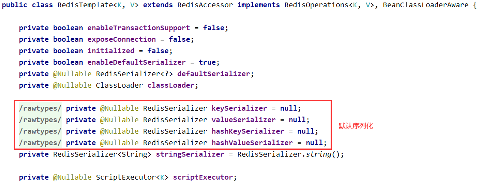

   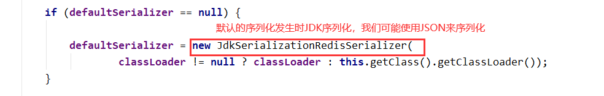

   关于对象的保存（需要序列化）

   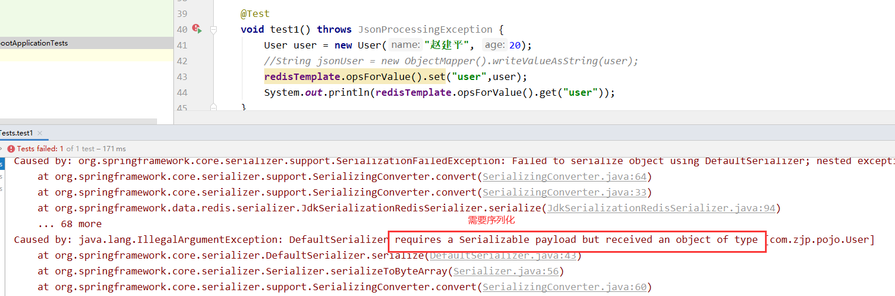

   Redis自定义序列化配置类

   ```java
   @Configuration
   public class RedisConfig {
   
       // 编写自己的RedisTemplate
       @Bean
       public RedisTemplate<String, Object> myRedisTemplate(RedisConnectionFactory redisConnectionFactory) {
           RedisTemplate<String, Object> template = new RedisTemplate<String, Object>();
           template.setConnectionFactory(redisConnectionFactory);
           Jackson2JsonRedisSerializer jackson2JsonRedisSerializer = new Jackson2JsonRedisSerializer(Object.class);
           ObjectMapper om = new ObjectMapper();
           om.setVisibility(PropertyAccessor.ALL, JsonAutoDetect.Visibility.ANY);
           om.activateDefaultTyping(LaissezFaireSubTypeValidator.instance, ObjectMapper.DefaultTyping.NON_FINAL);
           //om.enableDefaultTyping(ObjectMapper.DefaultTyping.NON_FINAL);     弃用
           jackson2JsonRedisSerializer.setObjectMapper(om);
           StringRedisSerializer stringRedisSerializer = new StringRedisSerializer();
   
           // key采用String的序列化方式
           template.setKeySerializer(stringRedisSerializer);
           // hash的key也采用String的序列化方式
           template.setHashKeySerializer(stringRedisSerializer);
           // value序列化方式采用jackson
           template.setValueSerializer(jackson2JsonRedisSerializer);
           // hash的value序列化方式采用jackson
           template.setHashValueSerializer(jackson2JsonRedisSerializer);
           template.afterPropertiesSet();
           return template;
       }
   }
   ```

    

### Redis.conf详解

启动的时候，就通过配置文件来启动！

> 单位

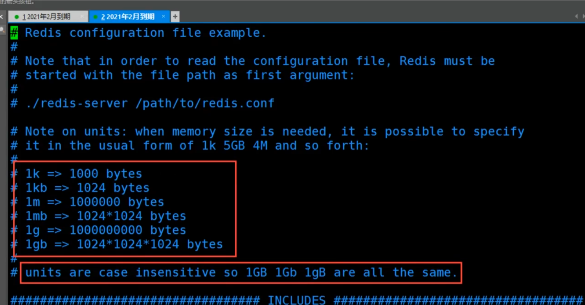

1、配置文件 unit单位对大小写不敏感

> 包含（INCLUDES）

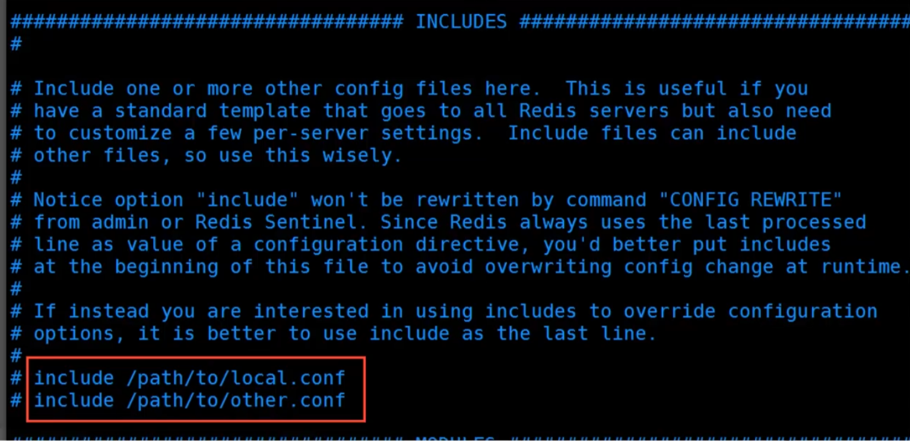

Spring中的 import	|	 jsp 中的 include

> 网络（NETWORK）

```bash
bind 127.0.0.1				# 绑定的ip
protected-mode yes			# 保护模式
port 6379					# 端口设置

```

> 通用（GENERAL）

```bash
daemonize yes				# 以守护进程的方式运行，默认是no，需要手动开启为yes
pidfile/var/run/redis_6379.pid		# 如果以后台的方式运行，需要一个pid文件

# 日志
# Specify the server verbosity level.
# This can be one of:
# debug (a lot of information, useful for development/testing)
# verbose (many rarely useful info, but not a mess like the debug level)
# notice (moderately verbose, what you want in production probably)	生产环境（默认）
# warning (only very important / critical messages are logged)
loglevel notice
logfile ""				# 日志的文件位置名
databases 16			# 数据库的数量，默认是 16 个数据库
always-show-logo yes	# 是否总是显示LOGO
```

> 快照（SNAPSHOTTING）

持久化，在规定的时间内，执行了多少次操作，则会持久化到文件 .rdb  .aof

redis是内存数据库，没有持久化，数据断电即失

```bash
# 如果900s内，如果至少有一个1key进行了修改，我们及进行持久化操作
save 900 1
# 如果3005内，如果至少10key进行了修改，我们就进行持久化操作
save 300 10
# 如果60s内，如果至少10000key进行了修改，我们及进行持久化操作
save 60 10000
# 我们之后学习持久化，会自己定义这个测试！

stop-writes-on-bgsave-error yes		# 持久化如果出错，是否还需要继续工作！
rdbcompression yes					# 是否压缩 .rdb 文件，需要消耗一些cpu资源
rdbchecksum yes						# 保存rdb文件时，进行错误检查校验
dir ./								# rdb文件保存的目录
```

> 主从复制（REPLICATION）


```bash
replicaof <masterip> <masterport>		# 配置主机的 ip 端口号

masterauth <master-password>			# 主机密码（如果有的话）
```


> 安全（SECURITY）

可以在这里设置redis的密码，默认是没有密码！

```bash
127.0.0.1:6379> ping
PONG
127.0.0.1:6379> config get requirepass				# 获取redis的密码
1) "requirepass"
2) ""
127.0.0.1:6379> config set requirepass "123456"		# 设置redis的密码
OK
127.0.0.1:6379> config get requirepass				# 所有命令没有权限使用
(error) NOAUTH Authentication required.
127.0.0.1:6379> ping
(error) NOAUTH Authentication required.
127.0.0.1:6379> auth 123456							# 使用密码登录
OK
127.0.0.1:6379> config get requirepass
1) "requirepass"
2) "123456"
```

> 客户端限制（CLIENTS）

```bash
maxclients 10000					# 设置能连接上redis的最大客户端的数量
maxmemory <bytes>					# redis 配置的最大容量
maxmemory-policy noeviction			# 内存达到最大上限之后的处理策略
        # 移除一些过期的 key	# 报错	# ……
    1、volatile-lru：只对设置了过期时间的key进行LRU（默认值） 
    2、allkeys-lru ： 删除lru算法的key   
    3、volatile-random：随机删除即将过期key   
    4、allkeys-random：随机删除   
    5、volatile-ttl ： 删除即将过期的   
    6、noeviction ： 永不过期，返回错误

```

> AOF（APPEND ONLY MODE ）

```bash
appendonly no						# 默认是不开启 aof 模式，默认是使用rdb方式持久化的，在大部分情况下，rdb完全够用
appendfilename "appendonly.aof"		# 持久化文件的名字

# appendfsync always				# 每次修改都会同步sync
appendfsync everysec				# 每秒执行一次 sync ，可能会丢失这个1s的数据
# appendfsync no					# 不同步，这时候操作系统自己同步数据，速度最快
```


### Redis持久化

Redis是内存数据库，如果不将内存中的数据库状态保存到磁盘，那么一旦服务器进程退出，服务器中的数据库状态也会消失。所以Redis 提供了持久化功能！

#### RDB（Redis DataBase）

> 什么是 RDB

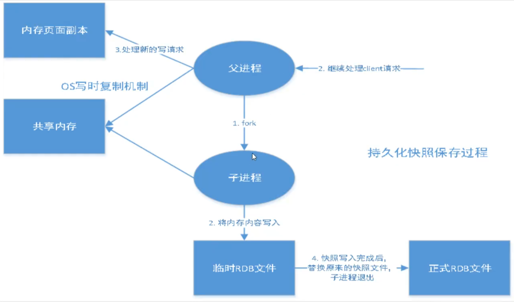

在指定的时间间隔内将内存中的数据集快照写入磁盘，也就是行话讲的Snapshot快照，它恢复时是将快照文件直接读到内存里。

Redis会单独创建（fork）一个子进程来进行持久化，会先将数据写入到一个临时文件中，待持久化过程都结束了，再用这个临时文件替换上次持久化好的文件。整个过程中，主进程是不进行任何IO操作的。这就确保了极高的性能。如果需要进行大规模数据的恢复，且对于数据恢复的完整性不是非常敏感，那RDB方式要比AOF方式更加的高效。RDB的缺点是最后一次持久化后的数据可能丢失。我们默认的就是RDB，一般情况下不需要修改这个配置！

==rdb保存的文件是dump.rdb== 都是在配置文件的 快照 配置的


> 触发机制

1. save的规则满足的情况下，会触发 rdb 规则
2. 执行了 `flushall` 命令，也会触发 rdb 规则
3. 退出 redis ，也会产生 rdb 文件

备份就自动生成一个 dump.rdb 文件

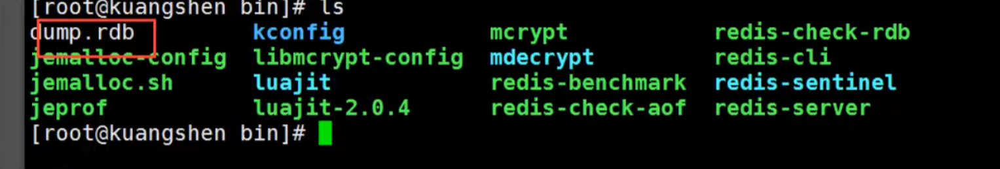

> 如何恢复 rdb 文件

1、只需要将rdb文件放在我们redis启动目录就可以，redis启动的时候会自动检查dump.rdb恢复其中的数据！

2、查看需要存在的位置

```bash
127.0.0.1：6379>config get dir
1）"dir"
2）"/usr/1ocal/bin"				# 如果在这个目录下存在 dump.rdb 文件，启动就会自动恢复其中的数据
```

> 几乎默认配置就够用了，但是我们还是要去学习

优点：

1. 适合大规模的数据恢复！
2. 对数据的完整性要不高！

缺点：

1. 需要一定的时间间隔进行操作！如果redis意外宕机了，这个最后一次修改数据就没有的了！
2. bgsave 执行fork操作创建子进程，会占用一定的内容空间！

#### AOF（Append Only File）

将我们的所有命令（写、删除操作）都记录下来，history，恢复的时候就把这个文件全部在执行一遍！

> AOF 是什么

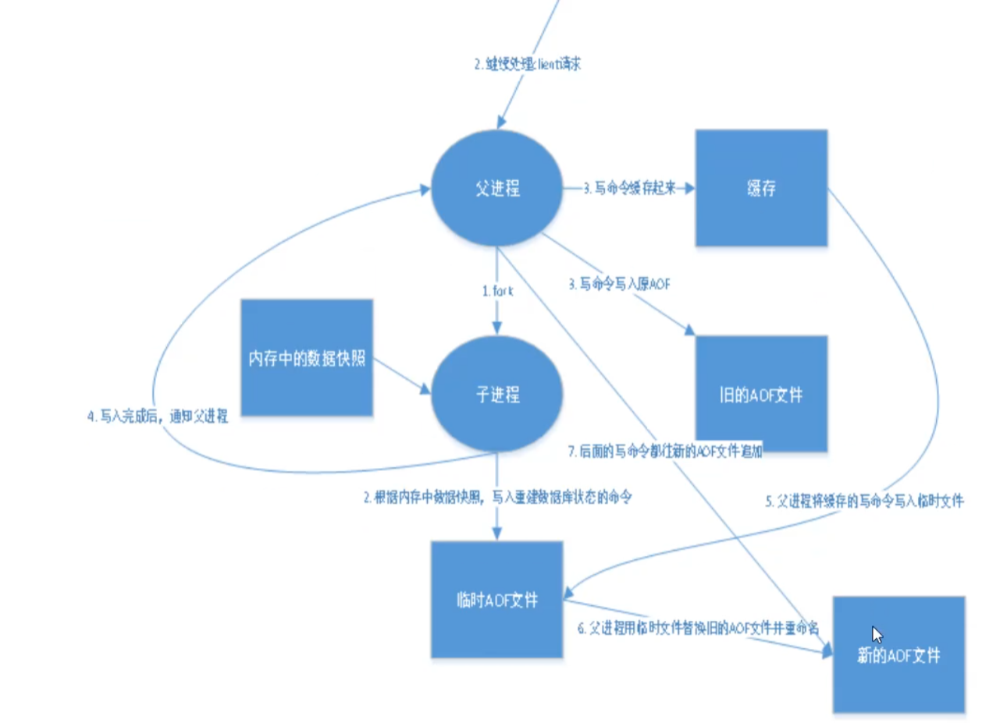

以日志的形式来记录每个写操作，将Redis执行过的所有指令记录下来（**读操作不记录**），只许追加文件但不可以改写文件，redis启动之初会读取该文件重新构建数据，换言之，redis重启的话就根据日志文件的内容将写指令从前到后执行一次以完成数据的恢复工作

==Aof保存的是appendonly.aof文件==

> append

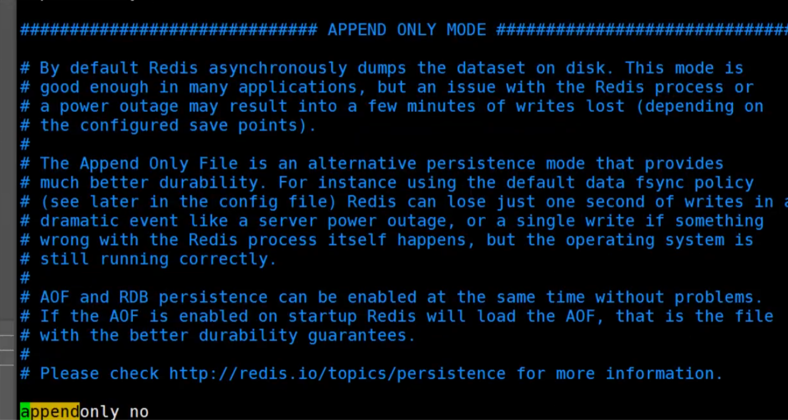

默认是不开启的，需要手动进行配置开启 	appendonly yes

重启 redis 就可以生效！

如果 aof 文件有错误， 这时 redis 无法启动。需要修复 aof 文件

redis 提供了修复 aof 的工具 `redis-check-aof`

```bash
[ root@ kuangshen bin] redis-check-aof --fix appendonly.aof		# 修复 aof 文件
0xa4: Expected \ rin, got:6461
AOF analyzed: size=185, ok up to=139, diff=46
This will shrink the AOF from 185 bytes, with 46 bytes, to 139 bytes
Continue?[y/N]:y
Successfully truncated AOF
[ root@ kuangshen bin]#
```

**注意：**这时清除掉错误的数据了！！！

**官网流程是：**aof文件备份->redis-check-aof –fix ->diff -u对比

> 重写规则

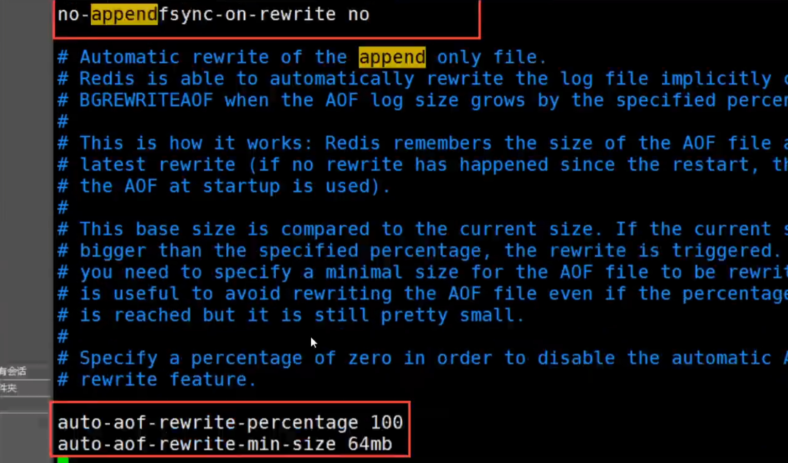

==auto_aofrewrite_perc==: aof文件的大小==超过基准百分之多少后触发==bgrewriteaof。默认这个值设置为100，意味着当前aof是基准大小的两倍的时候触发bgrewriteaof。把它设置为0可以禁用自动触发的功能。

==auto_aofrewrite_min_size==: 当前==aof文件大于多少字节后才触发==。避免在aof较小的时候无谓行为。默认大小为64mb。
两个参数都是可以在conf里静态配置，或者通过config set来动态修改的。

> 优点和缺点

```bash
appendonly no						# 默认是不开启 aof 模式，默认是使用rdb方式持久化的，在大部分情况下，rdb完全够用
appendfilename "appendonly.aof"		# 持久化文件的名字

# appendfsync always				# 每次修改都会同步sync
appendfsync everysec				# 每秒执行一次 sync ，可能会丢失这个1s的数据
# appendfsync no					# 不同步，这时候操作系统自己同步数据，速度最快
```

优点：

1. 每一次修改都同步，文件的完整会更加好！
2. 默认开启每秒同步一次，可能丢失一秒的数据
3. 从不同步，效率是最高的！

缺点：

1. 相对于数据文件来说，aof远远大于rdb，修复的速度也比rdb慢
2. aof 运行效率也比rdb慢，所以我们redis默认的配置就是rdb持久化！

扩展：

1. RDB持久化方式能够在指定的时间间隔内对你的数据进行快照存储
2. AOF持久化方式记录每次对服务器写的操作，当服务器重启的时候会重新执行这些命令来恢复原始的数据，AOF命令以Redis协议追加保存每次写的操作到文件未尾，Redis还能对AOF文件进行后台重写，使得AOF文件的体积不至于过大。
3. 只做缓存，如果你只希望你的数据在服务器运行的时候存在，你也可以不使用任何持久化
4. 同时开启两种持久化方式
   - 在这种情况下，当redis重启的时候会优先载入AOF文件来恢复原始的数据，因为在通常情况下AOF文件保存的数据集要比RDB文件保存的数据集要完整。
   - RDB的数据不实时，同时使用两者时服务器重启也只会找AOF文件，那要不要只使用AOF呢？作者建议不要，因为RDB更适合用于备份数据库（AOF在不断变化不好备份），快速重启，而且不会有AOF可能潜在的Bug，留着作为一个万一的手段。
5. 性能建议
   - 因为RDB文件只用作后备用途，建议只在Slave上持久化RDB文件，而且只要15分钟备份一次就够了，只保留 save9001这条规则。
   - 如果EnableAOF，好处是在最恶劣情况下也只会丢失不超过两秒数据，启动脚本较简单只load自己的AOF文件就可以了，代价一是带来了持续的I0，二是AOF rewrite的最后将 rewrite过程中产生的新数据写到新文件造成的阻塞几乎是不可避免的。只要硬盘许可，应该尽量减少AOF rewrite的频率，AOF重写的基础大小默认值64M太小了，可以设到5G以上，默认超过原大小100%大小重写可以改到适当的数值。
   - 如果不EnableAOF，仅靠Master-Slave Repllcation实现高可用性也可以，能省掉一大笔1O，也减少了rewrite时带来的系统波动。代价是如果Master/Slave同时倒掉，会丢失十几分钟的数据，启动脚本也要比较两个Master/Slave中的RDB文件，载入较新的那个，微博就是这种架构。

### Redis发布订阅

订阅与发布

`Redis`发布订阅(`pub`/`sub`)是一种==消息通信模式==：发送者(`pub`)发送消息,订阅者(sub)接收消息。

> `Redis` 通过 PUBLISH 、 SUBSCRIBE等命令实现了订阅与发布模式， 这个功能提供两种信息机制， 分别是订阅/发布到频道和订阅/发布到模式。


`Redis `的 SUBSCRIBE 命令可以让客户端订阅任意数量的频道， 每当有新信息发送到被订阅的频道时， 信息就会被发送给所有订阅指定频道的客户端。

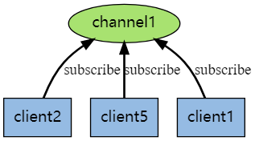

当有新消息通过 PUBLISH 命令发送给频道 `channel1` 时， 这个消息就会被发送给它的三个客户端：


> 命令

| 序号 | 命令及描述                                                   |
| ---- | ------------------------------------------------------------ |
| 1    | PSUBSCRIBE pattern [pattern ...]订阅一个或多个符合给定模式的频道。 |
| 2    | PUBSUB subcommand argument [argument ...]查看订阅与发布系统状态。 |
| 3    | PUBLISH channel message 将信息发送到指定的频道。             |
| 4    | PUNSUBSCRIBE pattern [pattern ...]退订所有给定模式的频道。   |
| 5    | SUBSCRIBE channel [channel ...]订阅给定的一个或多个频道的信息。 |
| 6    | UNSUBSCRIBE channel [channel ...\]] 指退订给定的频道。       |

> 测试

订阅端：

```bash
127.0.0.1:6379> subscribe zjp					# 订阅一个频道
Reading messages... (press Ctrl-C to quit)
1) "subscribe"
2) "zjp"
3) (integer) 1
# 等待读取推送的信息
1) "message"			# 消息
2) "zjp"				# 频道
3) "hello,zjp!"			# 消息内容

1) "message"
2) "zjp"
3) "nuozhi"
```

发生端：

```bash
127.0.0.1:6379> publish zjp hello,zjp!			# 发布者发布相信到频道
(integer) 1
127.0.0.1:6379> publish zjp nuozhi				# 发布者发布相信到频道
(integer) 1
```

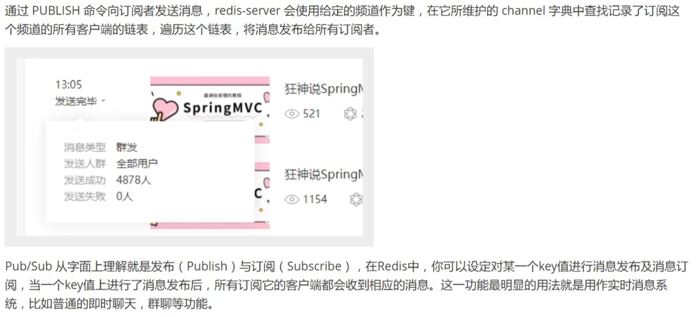

**使用场景：**

1. 实时消息系统
2. 实时聊天
3. 订阅、关注系统都可以

稍微复杂的场景，就会使用消息中间件MQ（）

### Redis主从复制

#### 概念

主从复制，是指将一台Redis服务器的数据，复制到其他的Redis服务器。前者称为主节点（master/leader），后者称为从节点
（slave/follower）；数据的复制是单向的，==只能由主节点到从节点==。Master以写为主，Slave以读为主。==默认情况下，每台Redis服务器都是主节点==；且一个主节点可以有多个从节点（或没有从节点），但一个从节点只能有一个主节点。
主从复制的作用主要包括：

​		1、数据冗余：主从复制实现了数据的热备份，是持久化之外的一种数据冗余方式。
​		2、故障恢复：当主节点出现问题时，可以由从节点提供服务，实现快速的故障恢复；实际上是一种服务的冗余。
​		3、负载均衡：在主从复制的基础上，配合读写分离，可以由主节点提供写服务，由从节点提供读服务（即写Redis数据时应用连接主节点，读Redis数据时应用连接从节点），分担服务器负载；尤其是在写少读多的场景下，通过多个从节点分担读负载，可以大大提高Redis服务器的并发量。
​		4、高可用基石：除了上述作用以外，主从复制还是哨兵和集群能够实施的基础，因此说主从复制是Redis高可用的基础。
一般来说，要将Redis运用于工程项目中，只使用一台Redis是万万不能的（宕机），原因如下：
​		1、从结构上，单个Redis服务器会发生单点故障，并且一台服务器需要处理所有的请求负载，压力较大；
​		2、从容量上，单个Redis服务器内存容量有限，就算一台Redis服务器内存容量为256G，也不能将所有内存用作Redis存储内存，一般来说，==单台Redis最大使用内存不应该超过20G==。
电商网站上的商品，一般都是一次上传，无数次浏览的，说专业点也就是"多读少写”。
对于这种场景，我们可以使如下这种架构：

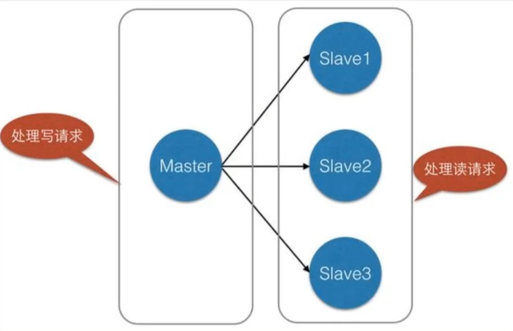

主从复制，读写分离！80%的情况下都是在进行读操作！减缓服务器的压力！架构中经常使用！一主二从！

#### 环境配置

只配置从库，不用配置主库！

```bash
127.0.0.1:6379>info replication 				# 查看当前库的信息
#Replication
role:master							# 角色	master
connected_slaves:0					# 没有从机
master_replid:b63c90e6c501143759cb0e7f450bd1ebOc70882a
master_replid2:0000000000000000000000000000000000000000
master_repl_offset:0
second_repl_offset:-1rep1_backlog_active:0
rep1_backlog_size:1048576
rep1_backlog_first_byte_offset:0
rep1_backlog_histlen:0
```

 复制3个配置文件，然后修改对应的信息

- 端口
- pid名字
- log文件名字
- dump.rdb名字

修改完毕之后，启动3个redis服务器，可以通过进程信息查看！

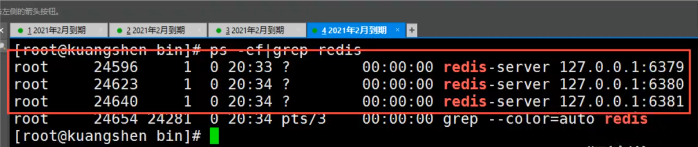

#### 一主二从

==默认情况下，每台Redis服务器都是主节点== 一般情况下只要配置从机就好

一主（79）二从（80，81）

```bash
127.0.0.1：6380>SLAVEOF 127.0.0.1 6379		# SLAVEOF host 6379 找谁当自己的老大！
OK
127.0.0.1：6380>info replication
# Replication
role:slave									# 角色 从机
master_host：127.0.0.1						# 可以看到主机信息
master_port：6379
master_link_status:up
master_last_io_seconds_ago：3
master_sync_in_progress：0
slave_rep1_offset：14
slave_priority：100
slave_read_only：1
connected_slaves：0
master_replid:a8 1be8dd257636b2d3e7a9f595e69d73ff03774
emaster_replid2：0000000000000000000000000000000000000000
master_repl_offset：14
second_repl_offset:-1rep1_backlog_active：1
rep1_backlog_size：1048576
rep1_backlog_first_byte_offset：1
rep1_backlog_histlen：14

# 在主机中查看
127.0.0.1：6379>info replication
#Replication
role:master connected_slaves：1			# 多了从机的配置
slave0：ip=127.0.0.1，port=6380，state=online，offset=42，1ag=1		# 多了从机的信息
master_replid:a8 1be8dd257636b2d3e7a9f595e69d73ff03774
emaster_replid2：0000000000000000000000000000000000000000
master_repl_offset：42
second_repl_offset: -1
rep1_backlog_active：1
rep1_backlog_size：1048576
rep1_backlog_first_byte_offset：1
rep1_backlog_histlen：42
```

如果配置两个从机完成后

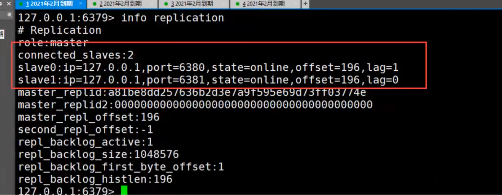

真实的从主配置应该在配置文件中配置，这样的话是永久的，我们这里使用的是命令，暂时的！（见 redis.conf 的 replication）

> 细节

==主机==可以==写==，==从机==不能写==只能读==！主机中的所有信息和数据都会被从机保存

测试：主机断开连接，从机依旧连接到主机的，但是没有写操作，这个时候，主机如果回来了，从机依旧可以直接获取到主机写的

如果是使用命令行，来配置的主从，这个时候如果重启了，就会变回主机！只要变为从机，立马就会从主机中获取值！

> 复制原理

Slave 启动成功连接到master 后会发送一个sync同步命令

Master接到命令，启动后台的存盘进程，同时收集所有接收到的用于修改数据集命令，在后台进程执行完毕之后，==master将传送整个数据文件到slave，并完成一次完全同步。==

- 全量复制：而slave服务在接收到数据库文件数据后，将其存盘并加载到内存中。
- 增量复制：Master继续将新的所有收集到的修改命令依次传给slave，完成同步

但是只要是重新连接master，一次完全同步（全量复制）将被自动执行

> 层层链路

上一个M链接下一个S


> 如果没有老大了，这个时候能不能选择一个老大出来呢？手动！

如果主机断开了连接，我们可以使用`SLAVEOF no one` 让自己变成主机，其他的节点可以手动连接到这个最新的主节点（==手动==）！如果这个时候老大修复了，那就重新连接！

#### 哨兵模式（重点 ）

自动选举老大的模式

> 概述

主从切换技术的方法是：当主服务器宕机后，需要手动把一台从服务器切换为主服务器，这就需要人工干预，费事费力，还会造成一段时间内服务不可用。这不是一种推荐的方式，更多时候，我们优先考虑哨兵模式。Redis从2.8开始正式提供了Sentinel（哨兵）架构来解决这个问题。

谋朝篡位的自动版，能够后台监控主机是否故障，如果故障了根据投票数自动将从库转换为主库。

哨兵模式是一种特殊的模式，首先Redis提供了哨兵的命令，哨兵是一个独立的进程，作为进程，它会独立运行。其原理是**哨兵通过发送命令，等待Redis服务器响应，从而监控运行的多个Redis实例。**

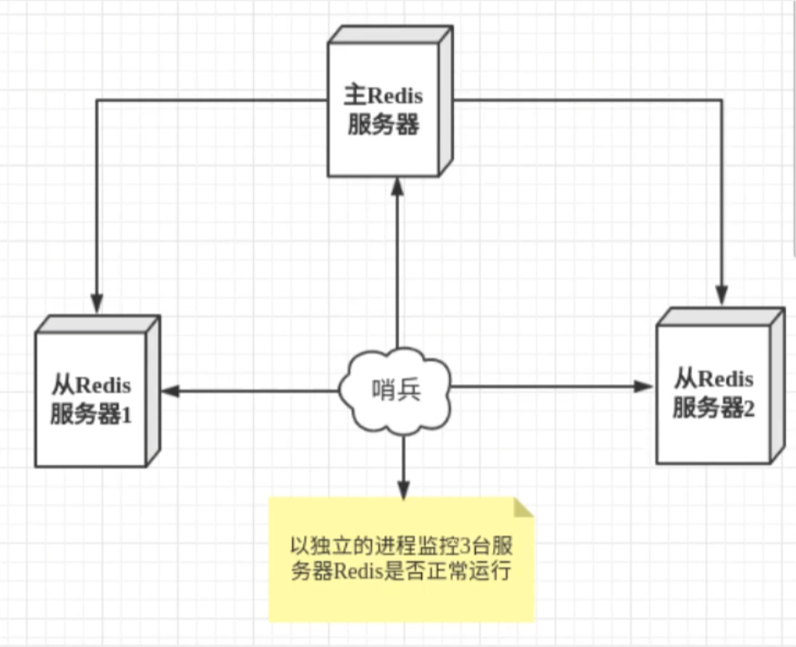

这里的哨兵有两个作用

- 通过发送命令，让Redis服务器返回监控其运行状态，包括主服务器和从服务器。
- 当哨兵监测到master宕机，会自动将slave切换成master，然后通过发布订阅模式通知其他的从服务器，修改配置文件，让它们切换主机。

然而一个哨兵进程对Redis服务器进行监控，可能会出现问题，为此，我们可以使用多个哨兵进行监控。各个哨兵之间还会进行监控，这样就形成了多哨兵模式。

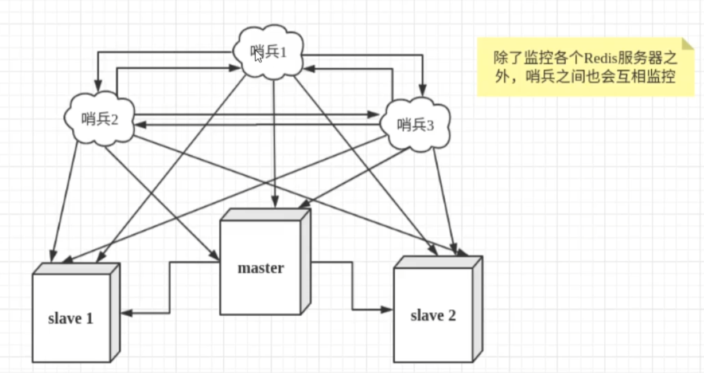

​		假设主服务器宕机，哨兵1先检测到这个结果，系统并不会马上进行failover过程，仅仅是哨兵1主观的认为主服务器不可用，这个现象成为**主观下线**。当后面的哨兵也检测到主服务器不可用，并且数量达到一定值时，那么哨兵之间就会进行一次投票，投票的结果由一个哨兵发起，进行failover[故障转移]操作。切换成功后，就会通过发布订阅模式，让各个哨兵把自己监控的从服务器实现切换主机，这个过程称为**客观下线**。


> 测试

一主二从

1. 配置哨兵配置文件 sentinel.conf

   ```bash
   # sentinel monitor 被监控的名称  host port 1
   sentinel monitor myredis 127.0.0.1 6379 1
   ```

   1 代表只有一个或一个以上的哨兵认为主服务器不可用的时候，才会进行failover操作（重选主机）

2. 启动哨兵       redis-sentinel kconfig/sentinel. conf

   ```bash
   [ root@ kuangshen bin]# redis-sentinel kconfig/sentinel. conf
   26607:X31 Mar 202021:13:10.027#o00000000000o Redis is starting oo00o000o000026607:X31Mar
   202021:13:10.027# Redis version=5.0.8, bits=64, commit=00000000, modified=0, pid=26607, just started
   26607:X31Mar 202021:13:10.027# Configuration loaded 
                                                   Redis 5.0.8(00000000/0)64 bit.-l,) 
                                                   Running in sentinel mode 
                                                   Port:26379
                                                   IPID:266071
                                                   http://redis. io
   26607:×31 Mar 202021:13:10.029#WARNING:The Tcp backlog setting of 511 cannot be enforced because
   /proc/sys/net/core/somaxconn is set to the lower value of 128.
   26607:×31 Mar 202021:13:10.031#sentinel ro is 4c780da7e22d2aebe3bc20c333746f202ce72996
   26607:×31 Mar 2020 21:13:10.031#+monitor master myredis 127.0.0.1 6379 quorum 1
   26607:×31 Mar 202021:13:10.031*+slave slave 127.0.0.1:6380 127.0.0.1 6380 @ myredis 127.0.0.16379
   26607:×31 Mar 202021:13:10.033*+slave slave 127.0.0.1:6381 127.0.0.1 6381 @ myredis 127.0.0.16379
   ```

3. 如果Master节点断开了，这时候就会从 Slave 从机中随机选择一个服务器作为主机

   哨兵日志

   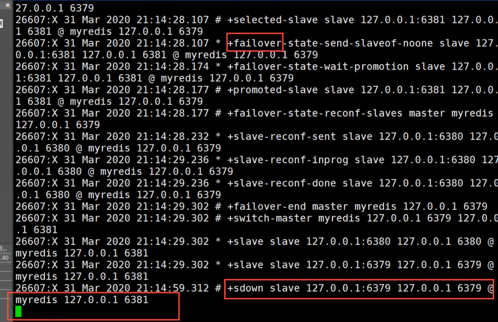

   如果主机此时回来了，只能归并到新的主机下，当做从机，这就是哨兵模式的规则！

> 哨兵模式

优点：

1. 哨兵集群，基于主从复制模式，所有的主从配置优点，它全有
2. 主从可以切换，故障可以转移，系统的可用性就会更好
3. 哨兵模式就是主从模式的升级，手动到自动，更加健壮！

缺点：

1. Redis不好在线扩容的，集群容量一旦到达上限，在线扩容就十分麻烦！
2. 实现哨兵模式的配置其实是很麻烦的，里面有很多选择！

> 哨兵模式的全部配置


```bash
# 哨兵sentinel实例运行的端口，默认26379  
port 26379
# 哨兵sentinel的工作目录
dir ./

# 哨兵sentinel监控的redis主节点的 
## ip：主机ip地址
## port：哨兵端口号
## master-name：可以自己命名的主节点名字（只能由字母A-z、数字0-9 、这三个字符".-_"组成。）
## quorum：当这些quorum个数sentinel的哨兵认为master主节点失联 那么这时 客观上认为主节点失联了  
# sentinel monitor <master-name> <ip> <redis-port> <quorum>  
sentinel monitor mymaster 127.0.0.1 6379 2

# 当在Redis实例中开启了requirepass <foobared>，所有连接Redis实例的客户端都要提供密码。
# sentinel auth-pass <master-name> <password>  
sentinel auth-pass mymaster 123456  

# 指定主节点应答哨兵sentinel的最大时间间隔，超过这个时间，哨兵主观上认为主节点下线，默认30秒  
# sentinel down-after-milliseconds <master-name> <milliseconds>
sentinel down-after-milliseconds mymaster 30000  

# 指定了在发生failover主备切换时，最多可以有多少个slave同时对新的master进行同步。这个数字越小，完成failover所需的时间就越长；反之，但是如果这个数字越大，就意味着越多的slave因为replication而不可用。可以通过将这个值设为1，来保证每次只有一个slave，处于不能处理命令请求的状态。
# sentinel parallel-syncs <master-name> <numslaves>
sentinel parallel-syncs mymaster 1  

# 故障转移的超时时间failover-timeout，默认三分钟，可以用在以下这些方面：
## 1. 同一个sentinel对同一个master两次failover之间的间隔时间。  
## 2. 当一个slave从一个错误的master那里同步数据时开始，直到slave被纠正为从正确的master那里同步数据时结束。  
## 3. 当想要取消一个正在进行的failover时所需要的时间。
## 4.当进行failover时，配置所有slaves指向新的master所需的最大时间。不过，即使过了这个超时，slaves依然会被正确配置为指向master，但是就不按parallel-syncs所配置的规则来同步数据了
# sentinel failover-timeout <master-name> <milliseconds>  
sentinel failover-timeout mymaster 180000

# 当sentinel有任何警告级别的事件发生时（比如说redis实例的主观失效和客观失效等等），将会去调用这个脚本。一个脚本的最大执行时间为60s，如果超过这个时间，脚本将会被一个SIGKILL信号终止，之后重新执行。
# 对于脚本的运行结果有以下规则：  
## 1. 若脚本执行后返回1，那么该脚本稍后将会被再次执行，重复次数目前默认为10。
## 2. 若脚本执行后返回2，或者比2更高的一个返回值，脚本将不会重复执行。  
## 3. 如果脚本在执行过程中由于收到系统中断信号被终止了，则同返回值为1时的行为相同。
# sentinel notification-script <master-name> <script-path>  
sentinel notification-script mymaster /var/redis/notify.sh

# 这个脚本应该是通用的，能被多次调用，不是针对性的。
# sentinel client-reconfig-script <master-name> <script-path>
sentinel client-reconfig-script mymaster /var/redis/reconfig.sh
```


### Redis缓存穿透和雪崩

​		Redis缓存的使用，极大的提升了应用程序的性能和效率，特别是数据查询方面。但同时，它也带来了一些问题。其中，最要害的问题，就是数据的一致性问题，从严格意义上讲，这个问题无解。如果对数据的一致性要求很高，那么就不能使用缓存。

另外的一些典型问题就是，缓存穿透、缓存雪崩和缓存击穿。目前，业界也都有比较流行的解决方案。

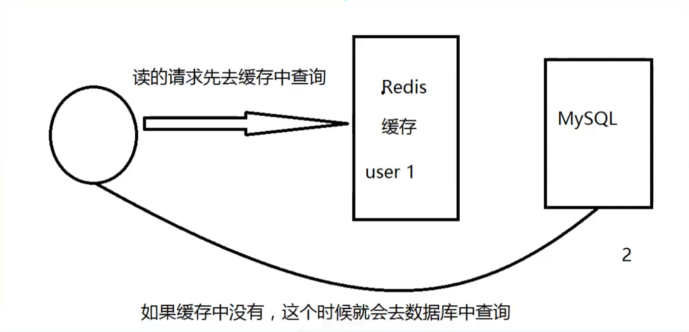

#### 缓存穿透（查不到）

> 概念

缓存穿透的概念很简单，用户想要查询一个数据，发现redis内存数据库没有，也就是缓存没有命中，于是向持久层数据库查询。发现也没有，于是本次查询失败。当用户很多的时候，缓存都没有命中，于是都去请求了持久层数据库。这会给持久层数据库造成很大的压力，这时候就相当于出现了缓存穿透。

> 解决方案

##### 布隆过滤器

布隆过滤器是一种数据结构，对所有可能查询的参数以hash形式存储，在控制层先进行校验，不符合则丢弃，从而避免了对底层存储系统的查询压力；

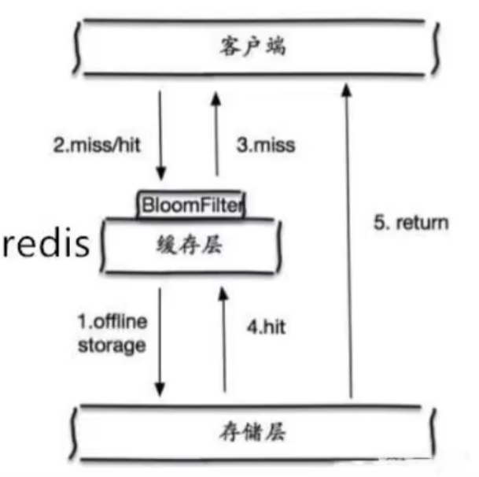

##### 缓存空对象
当存储层不命中后，即使返回的空对象也将其缓存起来，同时会设置一个过期时间，之后再访问这个数据将会从缓存中获取，保护了后端数据源；

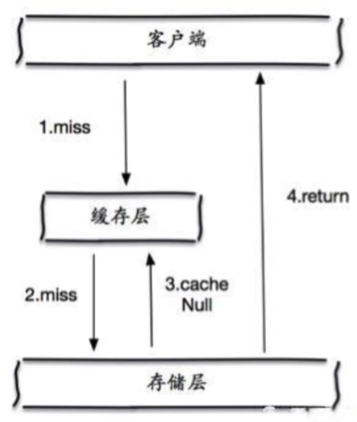

但是这种方法会存在两个问题：

1. 如果空值能够被缓存起来，这就意味着缓存需要更多的空间存储更多的键，因为这当中可能会有很多的空值的键；
2. 即使对空值设置了过期时间，还是会存在缓存层和存储层的数据会有一段时间窗口的不一致，这对于需要保持一致性的业务会有影响。

#### 缓存击穿（量太大，缓存过期）

> 概述

这里需要注意和缓存击穿的区别，缓存击穿，是指一个key非常热点，在不停的扛着大并发，大并发集中对这一个点进行访问，当这个key在失效的瞬间，持续的大并发就穿破缓存，直接请求数据库，就像在一个屏障上凿开了一个洞。

当某个key在过期的瞬间，有大量的请求并发访问，这类数据一般是热点数据，由于缓存过期，会同时访问数据库来查询最新数据，并且回写缓存，会导使数据库瞬间压力过大。

> 解决方案 

##### 设置热点数据永不过期
从缓存层面来看，没有设置过期时间，所以不会出现热点key 过期后产生的问题。
##### 加互斥锁
分布式锁：使用分布式锁，保证对于每个key同时只有一个线程去查询后端服务，其他线程没有获得分布式锁的权限，因此只需要等待即可。这种方式将高并发的压力转移到了分布式锁，因此对分布式锁的考验很大。

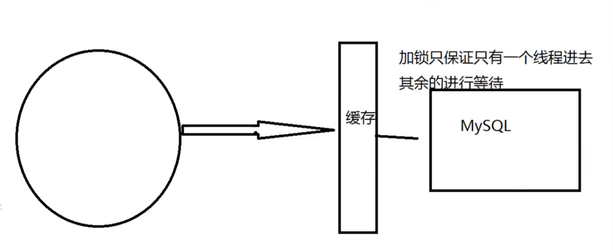

#### 缓存雪崩

> 概念

缓存雪崩，是指在某一个时间段，缓存集中过期失效。Redis宕机

产生雪崩的原因之一，比如在写本文的时候，马上就要到双十二零点，很快就会迎来一波抢购，这波商品时间比较集中的放入了缓存，假设缓存一个小时。那么到了凌晨一点钟的时候，这批商品的缓存就都过期了。而对这批商品的访问查询，都落到了数据库上，对于数据库而言，就会产生周期性的压力波峰。于是所有的请求都会达到存储层，存储层的调用量会暴增，造成存储层也会挂植的情况。


其实集中过期，倒不是非常致命，比较致命的缓存雪崩，是缓存服务器某个节点宕机或断网。因为自然形成的缓存雪崩，一定是在某个时间段集中创建缓存，这个时候，数据库也是可以顶住压力的。无非就是对数据库产生周期性的压力而已。而缓存服务节点的宕机，对数据库服务器造成的压力是不可预知的，很有可能瞬间就把数据库压垮。

> 解决方案

##### redis高可用
这个思想的含义是，既然redis有可能挂掉，那我多增设几台redis，这样一台挂掉之后其他的还可以继续工作，其实就是搭建的集群。（异地多活！）

##### 限流降级
这个解决方案的思想是，在缓存失效后，通过加锁或者队列来控制读数据库写缓存的线程数量。比如对某个key只允许一个线程查询数据和写缓存，其他线程等待。

##### 数据预热

数据加热的含义就是在正式部署之前，我先把可能的数据先预先访问一遍，这样部分可能大量访问的数据就会加载到缓存中。在即将发生大并发访问前手动触发加载缓存不同的key，设置不同的过期时间，让缓存失效的时间点尽量均匀。