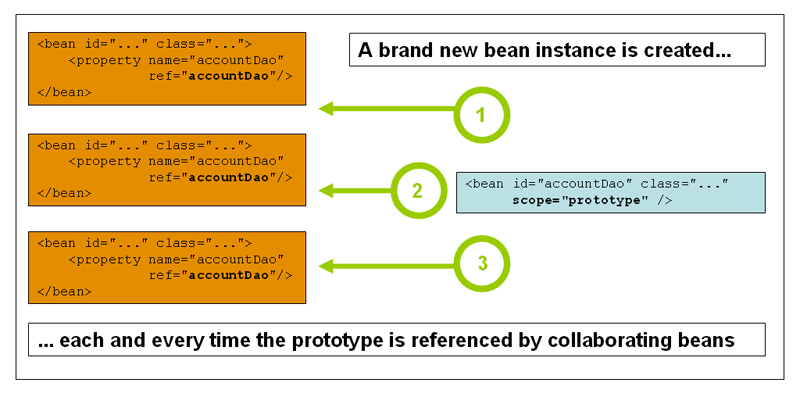
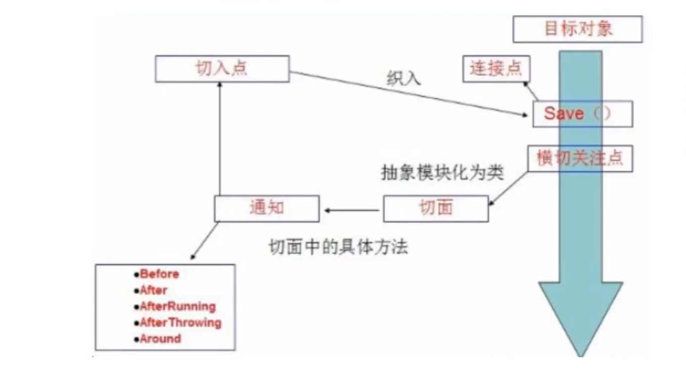

# 1.Spring相关

- 目录
  - [1.1IOC（控制反转）](#1.1IOC（控制反转）)
    - [IOC 本质）](#IOC 本质)
    - [IOC创建对象的方式）](#IOC创建对象的方式)
  - [1.2 Spring配置](#1.2 Spring配置)
    - [1.2.1 别名](#1.2.1 别名)
    - [1.2.2 Bean的配置](#1.2.2 Bean的配置)
    - [1.2.3 Import](#1.2.3 Import)
  - [1.3  依赖注入](#1.3  依赖注入)
    - [1.3.1 构造器注入](#1.3.1 构造器注入)
    - [1.3.2 set方式注入 (重点)](#1.3.2 set方式注入 (重点))
  - [1.4 bean的作用域](#1.4 bean的作用域)
    - [1.4.1 单例模式](#1.4.1 单例模式)
    - [1.4.2 原型模式](#1.4.2 原型模式)
    - [1.4.3 其余的 request、session、application，web开发中使用](#1.4.3 其余的 request、session、application，web开发中使用)
  - [1.5 bean自动装配](#1.5 bean自动装配)
  - [1.6 使用注解开发](#1.6 使用注解开发)
  - [1.7 使用java的方式配置Spring](#1.7 使用java的方式配置Spring)
  - [1.8 AOP（面向切面）](#1.8 AOP（面向切面）)
    - [1.8.1 代理模式](#1.8.1 代理模式)
      - [静态代理：](#静态代理：)
      - [动态代理](#动态代理)
    - [使用Spring实现AOP](#使用Spring实现AOP)
      - [方式一：使用Spring API接口实现](#方式一：使用Spring API接口实现)
      - [方式二：使用自定义类](#方式二：使用自定义类)
      - [方式三：使用注解](#方式三：使用注解)
    - [1.9 Spring中的事务管理](#1.9 Spring中的事务管理)
      - [1.事务](#1.事务)

## 1.1IOC（控制反转）

由以前的程序控制（获取需要的DAO）变为用户控制（所需的DAO）
		**对象由Spring来创建、管理、分配**

```java
private UserDao userDao;

//使用set方法进行动态注入值
public void setUserDao(UserDao userDao) {
    this.userDao = userDao;
}
```

- 之前，程序(业务层)主动创建对象 ，控制权在程序(业务层)手上
- 使用set注入后，程序不在具有主动性，而是被动的接受对象

这种思想，从本质上解决了问题，我们程序员不用在管理对象的创建了。系统的耦合性大大降低。可以更加专注的在业务的实现上。==这是IOC原型==

#### IOC 本质

**控制反转是一种通过描述（XML或注解）并通过第三方去生产或获取特定对象的方式。在Spring中实现控制反转的是loC容器，其实现方法是依赖注入（Dependency Injection，Dl）。**

### IOC创建对象的方式

1.使用无参构造创建对象，默认！

2.如果使用有才构造创建对象

1.下标赋值

```java
<bean id="exampleBean" class="examples.ExampleBean">
    <constructor-arg index="0" value="7500000"/>
    <constructor-arg index="1" value="42"/>
</bean>
```

2.类型赋值

```java
<bean id="exampleBean" class="examples.ExampleBean">
    <constructor-arg type="int" value="7500000"/>
    <constructor-arg type="java.lang.String" value="42"/>
</bean>
```

3.参数名称赋值

```java
<bean id="exampleBean" class="examples.ExampleBean">
    <constructor-arg name="years" value="7500000"/>
    <constructor-arg name="ultimateAnswer" value="42"/>
</bean>
```

总结：在配置文件加载的时候，容器中管理的对象就已经初始化了！

## 1.2 Spring配置

### 1.2.1 别名

alias

###  1.2.2 Bean的配置


###  1.2.3 Import

团队开发使用，将多个配置文件导入合并为一个

## 1.3  依赖注入

### 1.3.1 构造器注入

IOC创建对象的方式(上面) xml文件的bean注入

### 1.3.2 set方式注入 (重点)

- 依赖注入：set注入！

  - 依赖：bean对象的创建依赖于Spring容器！

  - 注入：bean对象中的所有**属性**，由容器来注入！

      常量、数组、集合、Map、Set、Property

 拓展方式

- P命名空间

  - 默认依赖无参构造方法

    ```xml
    <bean name="classic" class="com.example.ExampleBean">
            <property name="email" value="someone@somewhere.com"/>
        </bean>
        <bean name="p-namespace" class="com.example.ExampleBean"
            p:email="someone@somewhere.com"/>
    ```

    

- C命名空间

  - 必须包含有参构造方法，可能需要无参构造 方法

    ```xml
     <!-- traditional declaration with optional argument names -->
        <bean id="beanOne" class="x.y.ThingOne">
            <constructor-arg name="thingTwo" ref="beanTwo"/>
            <constructor-arg name="thingThree" ref="beanThree"/>
            <constructor-arg name="email" value="something@somewhere.com"/>
        </bean>
        <!-- c-namespace declaration with argument names -->
        <bean id="beanOne" class="x.y.ThingOne" c:thingTwo-ref="beanTwo"
            c:thingThree-ref="beanThree" c:email="something@somewhere.com"/>
    ```

    注意点：P命名空间和C命名空间不能直接使用，需要引入xml约束

## 1.4 bean的作用域

### 1.4.1 单例模式

```xml
<bean id="accountService" class="com.something.DefaultAccountService" scope="singleton"/>
```


### 1.4.2 原型模式

```xml
<bean id="accountService" class="com.something.DefaultAccountService" scope="prototype"/>
```



### 1.4.3 其余的 request、session、application，web开发中使用

## 1.5 bean自动装配

- 自动装配是Spring满足bena依赖的一直方式！
- Spring会在上下文中自动寻找，并给bean装配属性！

Spring中有三种装配方式

​	1.xml中显示的配置

​	2.在Java中显示配置

​	3.隐式的自动装配bean 【**重要**】

- ​	**ByName 自动装配** (根据自己对象set方法后面值对应的bean的id)

  ```xml
  <bean id="people" class="com.kuang.pojo.People" autowire="byName"></bean>
  ```

  

- **ByType 自动装配** (根据自己对象set方法类型对应的bean)

  小结：

  - byname的时候，需要保证所有bean的id唯一，并且这个bean需要和自动注入的属性的set方法的值一致！
  - bytype的时候，需要保证所有bean的class唯一，并且这个bean需要和自动注入的属性的类型一致！

  

- **注解实现自动装配**

  jdk1.5支持注解，Spring2.5支持注解

  使用注解须知：

  1. ​	导入约束	context约束(beans里的网址)

  2. 配置注解支持    context:annotation-config(开启注解支持)

     ```xml
     <?xml version="1.0" encoding="UTF-8"?>
     <beans xmlns="http://www.springframework.org/schema/beans"
         xmlns:xsi="http://www.w3.org/2001/XMLSchema-instance"
         xmlns:context="http://www.springframework.org/schema/context"
         xsi:schemaLocation="http://www.springframework.org/schema/beans
             https://www.springframework.org/schema/beans/spring-beans.xsd
             http://www.springframework.org/schema/context
             https://www.springframework.org/schema/context/spring-context.xsd">
     
         <context:annotation-config/>
     
     </beans>
     ```

     **@AutoWired**

     直接在属性上使用；也可以在set方法上使用

     使用@AutoWired注解在属性上后，可以不写set方法，**满足byName或byType中的一种即可**（官方说是byType）,先通过类型，再通过名称查找

     对于自动装配 环节比较复杂的情况，可使用【@AutoWired】 + 【@Qualifier(vale="XXX")】组合使用，指定一个唯一的bean对象注入 

     科普：

     ```java
     @Nullabel	字段标记后，此字段了为null
     @AutoWired(required = false) 表示此对象可谓null
     ```

## 1.6 使用注解开发

Spring4之后，使用注解开发，需要导入aop包、context支持、开启注解支持

1.bean

2.属性注入

```java
@Component：组件，放在类上，说明此类被Spring托管
@Value("XXX")：属性值注入
```

3.衍生注解

@Component的衍生注解，根据web开发中的MVC三层架构分层

- dao 【@Repository】

- service 【@Service】

- controller 【@Controller  】

  这四个（@Component）注解功能是一样的，都是将某个类注册到Spring中，装配Bean

  

4.自动装配

```java
@AutoWired：自动中配通过类型、名字
@Nullabel	字段标记后，此字段了为null
@Resource：自动中配通过名字，类型 (java 自带注解)
```

6.作用域

```java
@Scop("singleton/prototype")
```

小结

​	xml与注解：

- xml更加万能，适用于任何场合！维护简单方便
- 注解 不是自己的类不能使用，维护相对复杂

xml 与 注解最佳实践

- xml 管理bean
- 注解只负责完成属性注入
- 注意：注解生效需要开启注解的支持！

## 1.7 使用java的方式配置Spring

```java
@Configuration：标识配置类，等价于配置文件xml
@Bean：注册bean，等级于xml配置文件中的bean标签，方法名为id,返回值等价于bean标签中的class属性
@ComponentScan("com.kuang.pojo")：包扫描@Import(kuangConfig2.class)：合并配置(类)
```

配置类

```java
// @Configuration 标识该类也会被Spring注册到容器中，因为他本身就是一个@Component(组件)
// @Configuration 代表这是一个配置类，等价于之前的bean.xml
@Configuration
@ComponentScan("com.kuang.demo3")
@Import({Config2.class})
public class AnnocationConfig {

    // @Bean 注册一个bean，等价于之前的bean标签
    // getUser 这个方法的名称，等价于之前bean标签的 id
    // 这个方法的返回值，等价于bean标签的 class 属性
    @Bean
    public User getUser(){
        return new User();
    }
}
```

使用

```java
// 完全使用配置类，只能通过AnnotationConfig上下文来获取容器，通过配置类的class对象价值
ApplicationContext context = new AnnotationConfigApplicationContext(AnnocationConfig.class);
User user = context.getBean("getUser",User.class);
System.out.println(user.toString());
```


## 	1.8 AOP（面向切面）

### 1.8.1 代理模式

Spring AOP的底层就是代理模式！

代理模式的分类：

- 静态代理
- 动态代理

#### 静态代理：


​	角色分析：

- 抽象角色：一般使用接口或抽象类来解决（房子）
- 真实角色：被代理的角色（房东）
- 代理角色：代理真实角色，代理证书角色后，一般会做一些附属操作（中介）
- 客户：访问代理对象的人（租房者）

代理模式的好处：

- 使真实角色的操作更加纯粹，不用关注一些公共的业务
- 公共的业务交给代理角色，实现了业务的分工
- 公共业务发生扩展的时候，方便扩展

缺点：

- 一个真实的角色就会产生一个代理角色；代码量会翻倍，开发效率会变低

 

备注：在不改变源代码的基础上，多功能进行扩展

```java
    private UserService userService;

    public void setUserService(UserService userService) {
        this.userService = userService;
    }

    public void add(){
        printMsg("增加");
        userService.add();
    }

    public void delete(){
        printMsg("删除");
        userService.delete();
    }

    public void update(){
        printMsg("更新");
        userService.update();
    }

    public void query(){
        printMsg("查询");
        userService.query();
    }

    public void printMsg(String msg){
        System.out.println("[debug] " + msg + "一个客户");
    }
```


### 动态代理

- 动态代理和静态代理角色一样

- 动态代理的代理类是动态生成的，不是我们写好的

- 动态代理分为两大类：基于接口的动态代理；基于类的动态代理

  - 基于接口--JDK 动态代理【以此为例】
  - 基于类：cglib
  - java字节码实现：javasist

  了解两个类：Proxy（代理）、InvocationHandler（调用处理程序）

  **InvocationHandler**

动态代理的好处：

- 使真实角色的操作更加纯粹，不用关注一些公共的业务

- 公共的业务交给代理角色，实现了业务的分工

- 公共业务发生扩展的时候，方便扩展

  （以上是静态代理的好处）

- 一个动态代理类代理的是一个接口，一般就是对应的一类业务

- 一个动态代理类可以代理多个类，只要是实现了同一个接口即可

  自动生成动态代理类

  ```java
  //自动生成动态代理类
  public class ProxyInvacationHandler implements InvocationHandler{
      //被代理的接口(被代理的 真实角色)
      private Object target;
    
      public void setTarget(Object target) {
          this.target = target;
      }
    
      //生成得到 代理类（接口）
      public Object getProxy() {
          return Proxy.newProxyInstance(this.getClass().getClassLoader(),target.getClass().getInterfaces(),this);
      }
    
      @Override
      //处理 代理类 实例，并返回结果
      //代理类 所有调用 真实角色 的方法都是执行此invoke方法
      public Object invoke(Object proxy, Method method, Object[] args) throws Throwable {
          //输出日志
          log(method.getName());
          //最终都是调用此方法来执行，反射机制 
          Object result = method.invoke(target,args);
          return result;
      }
    
      public void log(String msg){
          System.out.println("调用" + msg + "方法");
      }
  }
  ```

  使用动态代理

  ```java
  public static void main(String[] args) {
          //真实实例
          UserServiceImpl userService = new UserServiceImpl();
  
          //代理角色(类)--不存在
          ProxyInvacationHandler pix = new ProxyInvacationHandler();
          //设置要代理的对象
          pix.setTarget(userService);
          //动态生成代理类(接口)
          UserService userServiceProxy = (UserService) pix.getProxy();
  
          userServiceProxy.add();
          userServiceProxy.update();
          userServiceProxy.delete();
          userServiceProxy.query();
      }
  ```

  ### 1.3.2 什么是AOP

  ​	AOP(Aspect Oriented Programming)的缩写，意为：面向切面编程，通过预编译方式和运行期间动态代理实现程序功能的统一维护的一种技术。AOP是OOP的延续，是软件开发中的一个热点，也是Spring框架中的一个重要内容，是函数式编程的一种衍生范型。利用AOP可以对业务逻辑的各个部分进行隔离，从而使得业务逻辑各部分之间的耦合度降低，提高程序的可重用性，同时提高了开发的效率。

  

  ###  AOP 在 Spring 中的作用

  ==提供声明式事务允许用户自定义切面==

- 横切关注点：跨越应用程序多个模块的方法或功能。即是，与我们业务逻辑无关的，但是我们需要关注的部分，就是横切关注点。如**日志**，**安全**，**缓存**，**事务**等等…

- 切面（ASPECT）：横切关注点被模块化的特殊对象。即，它是一个类。                  (Log类)

- 通知（Advice）：切面必须要完成的工作。即，它是类中的一个方法。                   (Log的方法)

- 目标（Target）：被通知对象。                                                                                     (接口或方法)

- 代理（Proxy）：向目标对象应用通知之后创建的对象。                (代理类)

- 切入点（PointCut）：切面通知执行的“地点”的定义。

- 连接点（JointPoint）：与切入点匹配的执行点。

  切入点和连接点：在那个地方执行



SpringAOP中，通过Advice定义横切逻辑，SPring中支持5中类型了Advice


即 AOP 在不改变代码的情况下，增加新的功能

### 使用Spring实现AOP

#### 方式一：使用Spring API接口实现

【重点】使用AOP织入，需要导入依赖包

```xml
<!-- https://mvnrepository.com/artifact/org.aspectj/aspectjweaver -->
<dependency>
<groupId>org.aspectj</groupId>
<artifactId>aspectjweaver</artifactId>
<version>1.9.4</version>
</dependency>
```

前置切入配置类

```java
public class BeforeLog implements MethodBeforeAdvice {
    // method：执行的方法
    // args：参数
    // target 目标对象(被代理的类)
    @Override
    public void before(Method method, Object[] args, Object target) throws Throwable {
        System.out.println(target.getClass().getName() + "类" + "执行了" + method.getName() + "方法");
    }
}
```

后置切入配置类

```java
public class AfterLog implements AfterReturningAdvice{
    // returnVale：方法返回值
    @Override
    public void afterReturning(Object returnVale, Method method, Object[] args, Object targer) throws Throwable {
        System.out.println("执行了" + method.getName() + "方法，返回结果为：" + returnVale);
    }
}
```

AOP配置

```xml
<!-- 注册bean -->
    <bean id="userService" class="com.kuang.demo4.service.UserServiceImpl"/>
    <bean id="beforeLog" class="com.kuang.demo4.BeforeLog"/>
    <bean id="afterLog" class="com.kuang.demo4.AfterLog"/>
    
    <!-- 方式一：使用原生Spring API接口 -->
    <!--aop配置,需要导入aop的约束-->
    <aop:config>
        <!-- 切入点 expression表达式  execution(需要执行的位置 * * * * *)-->
      	<!-- (* com.kuang.demo4.service.UserServiceImpl.*(..)) 第一个*是返回类型；后面是UserServiceImpl下所有方法，带任意参数-->
        <aop:pointcut id="pointcut" expression="execution(* com.kuang.demo4.service.UserServiceImpl.*(..))"/>
        <!-- 执行环绕 -->
        <aop:advisor advice-ref="beforeLog" pointcut-ref="pointcut"/>
        <aop:advisor advice-ref="afterLog" pointcut-ref="pointcut"/>
    </aop:config>
```

执行 测试

```java
ApplicationContext context = new ClassPathXmlApplicationContext("applicationContext.xml");
        UserService userService = context.getBean("userService",UserService.class);
        userService.add();
```

#### 方式二：使用自定义类

自定义类

```java
public class DivPointCut {

    public void before(){
        System.out.println("==方法执行前==");
    }

    public void after(){
        System.out.println("==方法执行后==");
    }
}
```

AOP 配置

```xml
<bean id="div" class="com.kuang.demo4.div.DivPointCut"/>
<!--方式二：自定义类-->
    <aop:config>
        <!--自定义切面 ref: 要引用的类-->
        <aop:aspect ref="div">
            <!--切入点-->
            <aop:pointcut id="point" expression="execution(* com.kuang.demo4.service.UserServiceImpl.*(..))"/>
            <!--通知-->
            <aop:before method="before" pointcut-ref="point"/>
            <aop:after method="after" pointcut-ref="point"/>
        </aop:aspect>
    </aop:config>
```

#### 方式三：使用注解

```java
@Aspect //标注这个类是一个切面
public class AspectPointCut {

    @Before("execution(* com.kuang.demo4.service.UserServiceImpl.*(..))")
    public void before(){
        System.out.println("[注解]==方法执行前==");
    }

    @After("execution(* com.kuang.demo4.service.UserServiceImpl.*(..))")
    public void after(){
        System.out.println("[注解]==方法执行后==");
    }

    //在环绕增强中，可以给定一个参数，代表获取处理的切入点
    @Around("execution(* com.kuang.demo4.service.UserServiceImpl.*(..))")
    public void around(ProceedingJoinPoint jp) throws Throwable {
        System.out.println("[注解]==环绕前==");
        Signature signature = jp.getSignature();    //获得签名
        System.out.println("signature : " + signature);
        Object proceed = jp.proceed();
        System.out.println("返回值 : " + proceed);
        System.out.println("[注解]==环绕后==");
    }
}
```

AOP 配置

```xml
<!--方式三-->
<bean id="aspectPointCut" class="com.kuang.demo4.div.AspectPointCut"/>
<!--开启注解支持  实现方式: JDK(默认 expose-proxy="false")   cglib(expose-proxy="true")-->
<aop:aspectj-autoproxy expose-proxy="false"/>
```

### 1.9 Spring中的事务管理

####  1.事务

- 把一组业务当成一个业务来做，要么都成功，要么都失败
- 事务在项目开发中，十分重要，涉及到数据的一致性问题
- 确保完整性和一致性

==事务ACID原则==

- 原子性	操作这些指令时，要么全部执行成功，要么全部不执行
- 一致性    事务的执行使数据从一个状态转换为另一个状态，但是对于整个数据的完整性保持稳定
- 隔离性
  - 多个业务操作同意资源时，防止数据损坏
- 持久性
  - 事务一旦提交，无论发生什么问题，结果都不会再被影响，被持久化写到存储器中


1. 声明式事务 ：AOP
2. 编程式事务：需要在代码中，进行事务的管理

```xml
    <!--集合AOP实现事务的织入-->
    <!--配置事务的类-->
    <tx:advice id="txAdvice" transaction-manager="transactionManager">
        <!--给那些方法配置事务-->
        <!--配置事务的传播特性 新东西(默认 propagation="REQUIRED")-->
        <tx:attributes>
            <tx:method name="add" propagation="REQUIRED"/>
            <tx:method name="deleted"/>
            <tx:method name="update"/>
            <tx:method name="query" read-only="true"/>  <!-- 只读 -->
        </tx:attributes>
    </tx:advice>

    <!--配置事务切入-->
    <aop:config>
        <aop:pointcut id="txpointCut" expression="execution(* com.kuang.dao.*.*(..))"/>
        <aop:advisor advice-ref="txAdvice" pointcut-ref="txpointCut"/>
    </aop:config>
```

思考：

​	为什么需要事务：

- 如果不配置事务，可能存在数据提交不一致的情况
- 如果不做Spring中配置声明式事务，需要在代码中配置事务（改变原有代码）
- 事务在项目开发中是否重要，设计到数据的一致性和完整性问题
