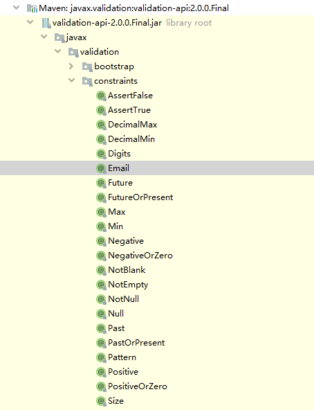

# SpringBoot

* 目录
  * [原理初探](#原理初探)
  * [注解](#注解)
  * [要解决的问题：](#要解决的问题)
    * [导入静态资源\.](#导入静态资源)
    * [首页](#首页)
    * [jsp，模板引擎Thymeleaf](#jsp模板引擎thymeleaf)
    * [装配扩展SpringMVC](#装配扩展springmvc)
    * [增删改查](#增删改查)
    * [拦截器](#拦截器)
    * [国际化！](#国际化)
  * [SpringSecurity](#springsecurity)
  * [Swagger](#swagger)
    * [Swager 简介](#swager-简介)
  * [任务](#任务)
    * [异步任务](#异步任务)
    * [定时任务](#定时任务)
    * [邮件](#邮件)
  * [分布式 Dubbo \+ Zookeeper](#分布式-dubbo--zookeeper)
    * [RPC](#rpc)

## 原理初探

自动配置：

这就是自动装配的原理！
**精髓：**

1. SpringBoot启动会加载大量的自动配置类

2. 我们看我们需要的功能有没有在SpringBoot默认写好的自动配置类当中；

3. 我们再来看这个自动配置类中到底配置了哪些组件；（只要我们要用的组件存在在其中，我们就不需要再手动配置了）

4. 给容器中自动配置类添加组件的时候，会从properties类中获取某些属性。我们只需要在配置文件中指定这些属性的值即可；

   xxxxAutoConfigurartion：自动配置类；给容器中添加组件

   xxxxProperties：封装配置文件中相关属性；

**pom.xml**

- spring-boot-dependencies: 核心依赖在父工程中
- 在引入 SpringBoot依赖时，不需要指定版本，因为有这个版本仓库

**启动器**

- ```xml
  <dependency>
      <groupId>org.springframework.boot</groupId>
      <artifactId>spring-boot-starter</artifactId>
  </dependency>
  ```

- 启动器：说白了就是Springboot的启动场景；

- 比如spring-boot-starter-web，他就会帮我们自动导入web环境所有的依赖！

- springboot会将所有的功能场景，都变成一个个的启动器

- 我们要使用什么功能，就只需要找到对应的启动器就可以了`starter`

**主程序**

```java
// @SpringBootApplication : 标注这个类是一个springboot的应用
@SpringBootApplication
public class Springboot01HelloworldApplication {

    public static void main(String[] args) {
        //将springboot应用启动
        SpringApplication.run(Springboot01HelloworldApplication.class, args);
    }

}
```

- 注解

  - ```java
    @SpringBootConfiguration	springboot的配置
    	@Configuration : spring配置类
            @Component : spring组件
                
    @EnableAutoConfiguration	自动导入配置
        @AutoConfigurationPackage : 自动配置包
            @Import({AutoConfigurationPackage.Registrar.class}) 自动配置包注册
        @Import({AutoConfigurationImportSelector.class})自动配置导入选择器
            
            AutoConfigurationImportSelector
            // 获取所有的配置
            List<String> configurations = 					this.getCandidateConfigurations(annotationMetadata, attributes);
    ```

    获取候选的配置

    ```java
    protected List<String> getCandidateConfigurations(AnnotationMetadata metadata, AnnotationAttributes attributes) {
            List<String> configurations = SpringFactoriesLoader.loadFactoryNames(this.getSpringFactoriesLoaderFactoryClass(), this.getBeanClassLoader());
            Assert.notEmpty(configurations, "No auto configuration classes found in META-INF/spring.factories. If you are using a custom packaging, make sure that file is correct.");
            return configurations;
        }
    ```

    META-INF/spring.factories : 自动配置的核心文件


```java
Properties properties = PropertiesLoaderUtils.loadProperties(resource);
所有资源加载到配置类中
```


结论：springboot所有自动配置都是在启动的时候扫描并加载：spring.factories所有的自动配置类都在这里面，但是不一定生效，要判断条件是否成立，只要导入了对应的start，就有对应的启动器了，有了启动器，我们自动装配就会生效，然后就配置成功！


1. springboot在启动的时候，从类路径下 /META-INF/spring.factories 获取指定的自动配置类
2. 将这些自动配置的类导入容器，自动配置类就会生效，进行自动配置
3. 以前需要手动配置的东西，springboot 帮忙做了
4. 整合Java EE，解决方案和自动配置的东西都在 spring-boot-autoconfigure-2.3.5.RELEASE.jar 包下
5. springboot 会把所有需要导入的组件，以类名的方式返回，这些组件就会被添加到容器
6. 容器中也会存在非常多的 XXXAutoConfiguration(@Bean) 文件，这些类给容器中导入了这个长期需要的所有组件，并自动配置，@Configuration ，JavaConfig
7. 有了自动配置类，免去了我们手动编写配置文件的工作

run() 方法

1. 推断应用的类型是普通的项目还是Web项目
2. 推断并设置main方法的定义类，找到运行的主类
3. run方法的全局监听器，从上下文中获取bean并处理


## 注解

yml里的配置，都能找到对应的 XXXAutoConfiguration 自动配置类以及对应的 XXXProperties属性类

application.yml

```yml
server:
  port: 8083
```

```
ServerProperties-->ServletWebServerFactoryAutoConfiguration（-->DispatcherServletAutoConfiguration-->WebMvcAutoConfiguration）
```

`@ConfigurationProperties(prefix = "person")` yml给类赋值

`@PropertySource(value = "classpath:application.properties")` 加载指定的配置文件 	`@Value` 配合使用

yml文件支持							yml						类

- 松散绑定						last-name				lastName

- JSP303数据校验

  ```java
  @Validated	//开启数据校验
  @Email(message = "邮箱格式错误")
  ```

  

## 要解决的问题：

### 导入静态资源.

| 访问url                 | 对应路径                       | 优先级 |
| ----------------------- | ------------------------------ | ------ |
| localhost:8080/webjars/ | /META-INF/resources/webjars/   |        |
| localhost:8080/         | /META-INF/resources/           |        |
| localhost:8080/         | /resources/                    | 最高   |
| localhost:8080/         | /static/                (默认) | 其次   |
| localhost:8080/         | /public/                       | 最低   |

```java
/webjars/** 	classpath:/META-INF/resources/webjars/

														优先级
/** 	classpath:/META-INF/resources/					 
/** 	classpath:/resources/		 					 最高	
/** 	classpath:/static/			 					 其次
/** 	classpath:/public/			 					 最低
```

### 首页

首页如何定制

/public/ | /static/ | /resources/ 下的 index.html

### jsp，模板引擎Thymeleaf

```xml
<!--引入thymeleaf依赖-->
<dependency>
    <groupId>org.springframework.boot</groupId>
    <artifactId>spring-boot-starter-thymeleaf</artifactId>
</dependency>
```

thymeleaf 语法与 Vue 类似

### 装配扩展SpringMVC

- 自定义视图解析器（没有具体功能）

  ```java
  // 扩展 springMVC 配置
  @Configuration
  public class MyMvcConfig implements WebMvcConfigurer {
      // public interface ViewResolver 实现了视图解析接口的类，我们就可以把它看作视图解析器
  
      @Bean
      public ViewResolver myViewResolver(){
          return new MyViewResolve();
      }
  
      // 自定义视图解析器 MyViewResolve
      public static class MyViewResolve implements ViewResolver{
          @Override
          public View resolveViewName(String s, Locale locale) throws Exception {
              return null;
          }
      }
  }
  ```

- 扩展SpringMVC配置 

  MyMvcConfigTwo.java

  ```java
  // 如果要扩展springmvc，官方建议我们这样去 做
  @Configuration
  public class MyMvcConfigTwo implements WebMvcConfigurer {
  
      // 试图跳转
      @Override
      public void addViewControllers(ViewControllerRegistry registry) {
          registry.addViewController("/").setViewName("/pages/data-tables.html");
          registry.addViewController("/index").setViewName("/pages/data-tables.html");
          registry.addViewController("/index.html").setViewName("/pages/data-tables.html");
          registry.addViewController("/login").setViewName("/pages/login.html");
      }
  }
  ```

  

```java
@Configuration
实现 WebMvcConfigurer 接口
	如果自定义视图解析器，需要实现 ViewResolver 并且重写 resolveViewName方法
```

**注意：**不能添加 `@EnableWebMvc` 注解，原因：`WebMvcAutoConfiguration` 存在 `@ConditionalOnMissingBean(WebMvcConfigurationSupport.class)` 而 `@EnableWebMvc`导入的 DelegatingWebMvcConfiguration 类，其父类就是 WebMvcConfigurationSupport ，会导致 WebMvcAutoConfiguration 失效

**在springboot中，有非常多的xxxxConfiguration帮助我们进行扩展配置，只要看见了这个东西，我们就要注意了！**

### 增删改查 

整合MyBatis

1. pom.xml 中导入依赖 （注意MySQL的依赖）

   ```xml
   <dependency>
       <groupId>org.mybatis.spring.boot</groupId>
       <artifactId>mybatis-spring-boot-starter</artifactId>
       <version>2.1.3</version>
   </dependency>
   
   <dependency>
       <groupId>mysql</groupId>
       <artifactId>mysql-connector-java</artifactId>
       <scope>runtime</scope>
   </dependency>
   ```

2. application.yml 配置数据源

   ```yml
   # 数据源配置
   spring:
     datasource:
       username: root
       password: 123456
       url: jdbc:mysql://localhost:3306/ssmbuild?serverTimezone=UTC&useUnicode=true&characterEncoding=utf-8
       driver-class-name: com.mysql.cj.jdbc.Driver
   ```

3. 编写Dao层以及 Mapper.xml 文件

   BooksDaoMapper.java

   ```java
   @Mapper
   @Repository
   public interface BooksDaoMapper {
   ```

   **或**在 主启动类加自动扫描注解

   ```java
   @MapperScan("com.zjp.dao")
   ```

4. Mybatis 配置

   ```yml
   # 整合 MyBatis
   mybatis:
     type-aliases-package: com.zjp.pojo
     mapper-locations: classpath:com/zjp/dao/*.xml
   ```

### 拦截器

1. 自定义拦截器 LoginHanderInterceptor.java 

   ```java
   public class LoginHanderInterceptor implements HandlerInterceptor {
       @Override
       public boolean preHandle(HttpServletRequest request, HttpServletResponse response, Object handler) throws Exception {
           // 获取登录用户信息
           Object userName = request.getSession().getAttribute("userName");
           if( userName == null){
               request.setAttribute("msg", "没有权限");
               request.getRequestDispatcher("/login").forward(request, response);
               return false;
           }
           return true;
       }
   }
   ```

   

2. 加入到 SpringMVC 扩展配置

   ```java
       @Override
       public void addInterceptors(InterceptorRegistry registry) {
           registry.addInterceptor(new LoginHanderInterceptor())
                   .addPathPatterns("/**")					// 拦截请求
                   .excludePathPatterns("/login","/index", "/user/login","/static/**");	// 拦截白名单
       }
   ```

3. 登陆时加上 session

   ```java
   @RequestMapping("/user/login")
   public String login(HttpServletRequest request,
                       @RequestParam("username") String userName,
                       @RequestParam("password") String passWord,
                       Model model){
       if(!StringUtils.isEmpty(userName) && "123456".equals(passWord)){
           request.getSession().setAttribute("userName", "userName");
           return "redirect:/main.html";
       }else {
           model.addAttribute("msg","用户名或密码错误！");
           return "index";
       }
   }
   ```

   

### 国际化！

1.  resources 下新疆文件夹 i18n，创建 login.properties 、login_en_US.properties、 login_zh_CN.properties 配置文件

   login.properties (默认) | login_zh_CN.properties（中文）

   ```properties
   login.btn=登录
   login.password=密码
   login.remembber=记住我
   login.tip=请登录
   login.username=用户名
   ```

   login_en_US.properties （英语）

   ```properties
   login.btn=sign in
   login.password=password
   login.remembber=Remember me
   login.tip=please sign in
   login.username=user name
   ```

2. 根据 WebMvcAutoConfiguration 的 AcceptHeaderLocaleResolver 编写自己的地区解析器

   MyLocaleResolver.java

   ```java
   //自定义地区解析器
   public class MyLocaleResolver implements LocaleResolver {
       // 解析请求
       @Override
       public Locale resolveLocale(HttpServletRequest httpServletRequest) {
           // 获取默认的地区
           Locale locale = Locale.getDefault();
           // 获取参数传递的地区
           String lang = httpServletRequest.getParameter("lang");
           if(!StringUtils.isEmpty(lang)){     // 如果请求的链接携带国际化参数
               String[] array = lang.split("_");
               Locale locale1 = new Locale(array[0], array[1]);
               return locale1;
           }
           return locale;
       }
   
       @Override
       public void setLocale(HttpServletRequest httpServletRequest, HttpServletResponse httpServletResponse, Locale locale) {
   
       }
   }
   ```

   

3. 加入到bean容器中

   MyMvcConfigTwo.java

   ```java
   // 如果要扩展springmvc，官方建议我们这样去 做
   @Configuration
   public class MyMvcConfigTwo implements WebMvcConfigurer {
   
       // 试图跳转
       @Override
       public void addViewControllers(ViewControllerRegistry registry) {
           registry.addViewController("/").setViewName("/pages/data-tables.html");
           registry.addViewController("/index").setViewName("/pages/data-tables.html");
           registry.addViewController("/index.html").setViewName("/pages/data-tables.html");
           registry.addViewController("/login").setViewName("/pages/login.html");
       }
   
       // 自定义组件加入到容器中
       @Bean
       public LocaleResolver localeResolver(){
           return new MyLocaleResolver();
       }
   }
   ```

4. 配合 thymleaf 使用

   ```html
   <a th:href="@{/login(lang='zh_CN')}" class="footer-link">中文</a>			@{}  url路径
   <a th:href="@{/login(lang='en_US')}" class="footer-link">English</a>
   ```

## SpringSecurity

​		Spring Security 是针对Spring项目的安全框架，也是Spring Boot底层安全模块默认的技术选型，他可以实现强大的Web安全控制，对于安全控制，我们仅需要引入spring-boot-starter-security模块，进行少量的配置，即可实现强大的安全管理！

记住几个类：

- WebSecurityConfigurerAdapter：自定义Security策略
- AuthenticationManagerBuilder：自定义认证策略
- @EnableWebSecurity：开启WebSecurity模式

Spring Security的两个主要目标是“认证”和“授权”（访问控制）。

“认证"（Authentication）

“授权"（Authorization）

这个概念是通用的，而不是只在Spring Security中存在。

参考官网：https://spring.io/projects/spring-security，查看我们自己项目中的版本，找到对应的帮助文档：
https://docs.spring.io/spring-security/site/docs/5.2.0.RELEASE/reference/htmlsingle

使用：

1. 引入依赖

   ```xml
   <dependency>
       <groupId>org.springframework.boot</groupId>
       <artifactId>spring-boot-starter-security</artifactId>
   </dependency>
   ```

2. 自定义配置类，继承 WebSecurityConfigurerAdapter 

   ```java
   @EnableWebSecurity
   public class SecurityConfig extends WebSecurityConfigurerAdapter
   ```

3. 认证、授权编写

   ```java
   @EnableWebSecurity
   public class SecurityConfig extends WebSecurityConfigurerAdapter {
       // 授权
       @Override
       protected void configure(HttpSecurity http) throws Exception {
           // 首页所有人跨页访问
           // 功能页只有对应权限的人才能访问
           http.authorizeRequests()
                   .antMatchers("/").permitAll()						// 所有人跨页访问首页
                   .antMatchers("/level1/**").hasRole("vip1")			// vip1 角色只能访问 /level1/下的页面
                   .antMatchers("/level2/**").hasRole("vip2")
                   .antMatchers("/level3/**").hasRole("vip3");
   
           // 没有权限默认到登录页面, 需要开启登录页面
           // /login
           http.formLogin();											// 没有权限默认到登录页面
       }
   
       // 认证
       // 密码编码：PasswordEncode
       // spring security 5.0+ 新增了加密方法
       @Override
       protected void configure(AuthenticationManagerBuilder auth) throws Exception {
           auth.inMemoryAuthentication().passwordEncoder(new BCryptPasswordEncoder())
                   .withUser("zjp").password(new BCryptPasswordEncoder().encode("123456")).roles("vip2", "vip3")
                   .and()
                   .withUser("root").password(new BCryptPasswordEncoder().encode("123456")).roles("vip1", "vip2", "vip3")
                   .and()
                   .withUser("guest").password(new BCryptPasswordEncoder().encode("123456")).roles("vip1");
   
       }
   }
   ```

## Swagger

### Swager 简介

前后端分离->需要实时更新API文档

Swagger使用

1. 导入依赖  

   Swagger2

   ```xml
   <!-- https://mvnrepository.com/artifact/io.springfox/springfox-swagger-ui -->
   <dependency>
       <groupId>io.springfox</groupId>
       <artifactId>springfox-swagger-ui</artifactId>
       <version>3.0.0</version>
   </dependency>
   
   <!-- https://mvnrepository.com/artifact/io.springfox/springfox-swagger2 -->
   <dependency>
       <groupId>io.springfox</groupId>
       <artifactId>springfox-swagger2</artifactId>
       <version>3.0.0</version>
   </dependency>
   
   ```

   ==Swagger3== 只需要引入 

   ```xml
   <dependency>
       <groupId>io.springfox</groupId>
       <artifactId>springfox-boot-starter</artifactId>
       <version>3.0.0</version>
   </dependency>
   ```

   

2. 配置Swagger

   Config类

   Swagger2

   ```java
   @Configuration
   @EnableSwagger2      // 开启Swagger2
   public class SwaggerConfig {
   }
   ```

   ==Swagger3== 

   ```java
   @Configuration
   @EnableOpenApi
   public class SwaggerConfig {
   }
   ```

   

3. 访问页面

   Swagger2 : http://localhost:8080/swagger-ui.html

   ==Swagger3==  : http://localhost:8080/swagger-ui/index.html

4. 配置 Swagger

   Swagger 的 Bean 实例 Docket （基本信息）

   ==Swagger3== 

   ```java
   // 配置Swagger 的 Docket Bean 实例
   @Bean
   public Docket docket(){
       return new Docket(DocumentationType.OAS_30)
           .apiInfo(apiInfo());
   }
   
   // 配置 Swagger 信息
   private ApiInfo apiInfo(){
       // 作者信息
       Contact contact = new Contact("zjp007", "https://github.com/zjp007", "906030149@qq.com");
       return new ApiInfo("Api Documentation",
                          "ssmbuild Books API Doc",
                          "v1.0",
                          "https://github.com/zjp007",
                          contact,
                          "Apache 2.0",
                          "http://www.apache.org/licenses/LICENSE-2.0",
                          new ArrayList());
   }
   ```

   

5. Swagger 配置扫描接口

   Docket.select()

   ==Swagger3== 

   ```java
   // 配置Swagger 的 Docket Bean 实例
   @Bean
   public Docket docket(){
       return new Docket(DocumentationType.OAS_30)
           .apiInfo(apiInfo())
           .select()
           // RequestHandlerSelectors 配置要扫描接口的方式
           // basePackage 指定要扫描的包
           // any() : 扫描全部
           // none() : 不扫描
           // withClassAnnotation(Controller.class) : 扫描类上的注解，参数时一个注解的方法对象
           // withMethodAnnotation(GetMapping.class) : 扫描方法上的注解
           .apis(RequestHandlerSelectors.basePackage("com.zjp.controller"))
           // paths() : 过滤扫描路径
           .paths(PathSelectors.ant("/zjp/**"))
           .build();
   }
   ```

   

6. 配置时候启动Swagger

   ==Swagger3== 

   ```java
   return new Docket(DocumentationType.OAS_30)
       .apiInfo(apiInfo())
       // 是否启用Swagger 如果为false ,则 Swagger 不能在页面访问
       .enable(false)
       .select()
       .apis(RequestHandlerSelectors.basePackage("com.zjp.controller"))
       .build();
   ```

   

7. 配置Swagger-ui 是否启用

   ==Swagger3== 

   ```yaml
   # Swagger 是否启用
   springfox:
     documentation:
       swagger-ui:
         enabled: true
   ```

8. 配置API分组

   ```java
   // 配置Swagger 的 Docket Bean 实例
   @Bean
   public Docket docket(){
       return new Docket(DocumentationType.OAS_30)
               .apiInfo(apiInfo())
               .groupName("张家口")
               .select()
               .apis(RequestHandlerSelectors.basePackage("com.zjp.controller"))
               .build();
   }
   ```

   配置多个分组

   配置多个Docket，其他配置看上面的即可

   ```java
   @Bean
   public Docket docket1(){
       return new Docket(DocumentationType.OAS_30).groupName("B").select().build();
   }
   ```

9. 实体类配置

   ```java
   @ApiModel(value = "book实体", description = "书籍信息")
   public class Books {
       @ApiModelProperty("书籍id")
       private Integer bookID;
   }
   ```

10. 接口配置

    ```java
    @ApiOperation(value = "根据 booksId 获取书本信息", notes = "notes", httpMethod = "GET")
    @RequestMapping(value = "/book/get",
                    produces = "application/json;charset=UTF-8")
    public Books getById(@ApiParam("书籍id") @RequestParam("booksId") Integer booksId) {
        return booksService.getById(booksId);
    }
    ```

总结：

1. 我们可以通过Swagger给一些比较难理解的属性或者接口，增加注释信息
2. 接口文档实时更新
3. 可以在线测试

【注意】正式发布的时候，关闭Swagger！！！出于安全考虑。而且节省内存

## 任务

### 异步任务

使用

1. 在需要异步执行的方法加上注解，告诉spring

   ```java
   // 告诉 spring 这是个异步方法
   @Async
   public void hello(){
       try {
           Thread.sleep(3000);
       } catch (InterruptedException e) {
           e.printStackTrace();
       }
       System.out.println("数据处理中……");
   }
   ```

2. 在主启动类开启异步注解功能

   ```java
   // 开启异步注解功能
   @EnableAsync
   ```

### 定时任务

```java
TaskScheduler	// 任务调度程序

TaskExecutor	// 任务执行程序
    
@EnableScheduling	//开启定时功能的注解
@Scheduled			//什么时候执行
Cron表达式
// 秒 分 时 日 月 星期(0/7 星期天 1-6 周一 ~ 周六)
// ? 只能用在 日期 和 星期
@Scheduled(cron = "0/3 * * * * ?")
```

使用：

1. 开启定时任务

   ```java
   // 开启定时功能的注解
   @EnableScheduling
   ```

2. 定时器任务类加入到bean 容器中(@Service/@Component/...)

   ```java
   @Component
   public class TestTask {
   
       @Scheduled(cron = "0/3 * * * * *")
       public void task1(){
           System.out.println("任务执行……");
       }
   }
   ```

3. 定时任务

### 邮件

使用：

1. 导入依赖

   ```xml
   <dependency>
       <groupId>org.springframework.boot</groupId>
       <artifactId>spring-boot-starter-mail</artifactId>
   </dependency>
   ```

2. 设计源码部分

   搜索 mailAuto 可以找到对应自动配置类 MailSenderAutoConfiguration

   以及 MailProperties 属性类，可以在配置文件中根据属性类进行配置

   ```yaml
   spring:
     mail:
       username: 906030149@qq.com
       password: ywatrizghpjtbdgg		# 设置->账户->开启 POP3/SMTP服务
       host: smtp.qq.com
       # 开启加密验证 仅QQ需要
       properties:
         mail:
           smtp:
             ssl:
               enable: true
   ```

3. 测试

   前提：

   ```java
   @Autowired
   private JavaMailSenderImpl javaMailSender;
   ```

   - 简单邮件

     ```java
     // 一个简单的邮件
     SimpleMailMessage simpleMailMessage = new SimpleMailMessage();
     simpleMailMessage.setSubject("zzz,你好");
     simpleMailMessage.setText("谢谢你的课程");
     simpleMailMessage.setTo("906030149zhao@gmail.com");
     simpleMailMessage.setFrom("906030149@qq.com");
     javaMailSender.send(simpleMailMessage);
     ```

   - 复杂邮件

     ```java
     // 一个复杂的邮件
     MimeMessage mimeMessage = javaMailSender.createMimeMessage();
     // 组装
     MimeMessageHelper mimeMessageHelper = new MimeMessageHelper(mimeMessage,true, "utf-8");
     // 正文
     mimeMessageHelper.setSubject("zzz,你好~plus");
     mimeMessageHelper.setText("<p style='color:red;'>谢谢你的课程</p>", true);
     
     //附件
     mimeMessageHelper.addAttachment("1.png", new File("C:\\Users\\Zjp\\Desktop\\1.png"));
     mimeMessageHelper.setTo("906030149@qq.com");
     mimeMessageHelper.setFrom("906030149@qq.com");
     javaMailSender.send(mimeMessage);
     ```

## 分布式 Dubbo + Zookeeper

### RPC

RPC两个核心模块：通讯，序列化。

**序列化**: 数据传输需要转换

Dubbo


zookeeper：注册中心

​		dubbo-admin：是一个监控管理后台，查看我们注册了哪些服务，哪些服务被消费了（相当于后台管理页面，不是必须）

Dubbo:jar包

步骤：

前提：zookeeper服务已开启！

1. 提供者提供服务
   1. 导入依赖
   2. 配置注册中心的地址、以及服务发现名，和要扫描的包
   3. 在想要被逐出的服务上面增加注解 `@DubboService `
2. 消费者消费
   1. 导入依赖
   2. 配置注册中心的地址，配置自己的服务名
   3. 从远程注入`@DubboReference`

```
未来与展望

	三层机构    MVC
		开发框架 Spring-->SpringBoot
		Spring
			IOC		AOP 
			Spring是一个轻量级的Java开源框架，容器
			目的：解决企业开发的复杂性问题
			Spring是春天，觉得他是春天，也十分复杂，配置文件！
			IOC：控制反转
			原来我们都是自己一步步操作，现在交给容器了！我们需要什么就去拿就可以了
			AOP：切面（本质：动态代理）
			为了解决什么？不影响业务本来的情况下，实现动态增加功能，大量应用在日志，事务...等等方面
		SpringBoot
			SpringBoot并不是新东西，就是spring的升级版！
			新一代JavaEE的开发标准，开箱即用！->拿过来就可以用！
			它自动帮我们配置了非常多的东西，我们拿来即用！
			特性：约定大于配置
	微服务架
		微服务架构问题？
		分布式架构会遇到的四个核心问题？
			1. 这么多服务，客户端如何去访问？ 
			2. 这么多服务，服务之间如何进行通信？
			3. 这么多服务，如何治理？
			4. 服务挂了，怎么办？
		解决方案：
		SpringCloud，时一套生态，就是来解决以上分布式架构的4个问题
		想使用SpringCloud，必须掌握SpringBoot，因为Spring Cloud是基于Spring Boot；
		
        1. SpringCloud NetFlix，出了一套解决方案	一站式解决方案。可以直接去使用
            Api网关	zuul组件
            通信	Feign-->HttpClient-->HTTP的通信方式，同步并阻塞
            服务注册与发现	Eureka
            熔断机制	Hystrix
        2. Apache Dubbo zookeeper     第二套解决系统
            API： 没有，要么找第三方组件，要么自己实现
            通信	Dubbo : 高性能基于Java实现的RPC通信框架
            服务注册与发现	第三方的 zookeeper :动物园管理者（Hadoop、Hive）
            熔断机制	没有	借助了 Hystrix
        3. SpringCloud Alibaba    一站式解决方案
            API	服务网关 Gateway
            通信	Dubbo RPC
            服务注册与发现	Nacos
            熔断机制	Alibaba Sentinel
    新的方案：
    	服务网格：下一代微服务标准	Server Mesh
    代表解决方案：istio
万变不离其宗，一通百通！
    1. API网关，服务路由
    2. HTTP，RPC框架，异步调用
    3. 服务注册与发现，高可用
    4. 熔断机制，服务降级
为什么要解决这个问题？本质：网络时不可靠的
```

