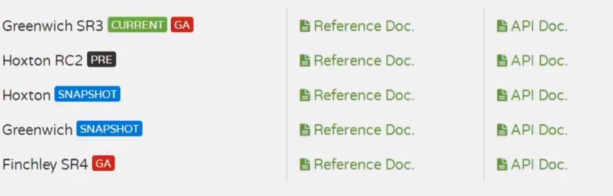

# SpringCloud

* 目录
  * [回顾](#回顾)
  * [1、常见面试题](#1常见面试题)
  * [2、微服务概述](#2微服务概述)
    * [2、1什么是微服务](#21什么是微服务)
    * [2、2 微服务与微服务架构](#22-微服务与微服务架构)
    * [2、3 微服务优缺点](#23-微服务优缺点)
    * [2、4 微服务技术栈](#24-微服务技术栈)
    * [2、5 为什么选择SpringCloud作为微服务架构](#25-为什么选择springcloud作为微服务架构)
  * [3、SpringCloud 入门概述](#3springcloud-入门概述)
    * [3、1 SpringCloud是什么](#31-springcloud是什么)
    * [3、2 SpringCloud 和 SpingBoot 的关系](#32-springcloud-和-spingboot-的关系)
    * [3、3 Dubbo 和 SpringCloud 技术选型](#33-dubbo-和-springcloud-技术选型)
      * [1、 分布式 \+ 服务治理Dubbbo](#1-分布式--服务治理dubbbo)
      * [2、Dubbo 和 SpringCloud对比](#2dubbo-和-springcloud对比)
    * [3、4 SpringCloud 能干什么](#34-springcloud-能干什么)
    * [3、5 SpringCloud下载](#35-springcloud下载)
  * [4、](#4)
    * [4、1 总体介绍](#41-总体介绍)
    * [4、2 SpringCloud版本选择](#42-springcloud版本选择)
    * [4、3 创建父工程](#43-创建父工程)

## 回顾

```
	微服务架
		微服务架构问题？
		分布式架构会遇到的四个核心问题？
			1. 这么多服务，客户端如何去访问？ 
			2. 这么多服务，服务之间如何进行通信？
			3. 这么多服务，如何治理？
			4. 服务挂了，怎么办？
		解决方案：
		SpringCloud，时一套生态，就是来解决以上分布式架构的4个问题
		想使用SpringCloud，必须掌握SpringBoot，因为Spring Cloud是基于Spring Boot；
		
        1. SpringCloud NetFlix，出了一套解决方案	一站式解决方案。可以直接去使用
            Api网关	zuul组件
            通信	Feign-->HttpClient-->HTTP的通信方式，同步并阻塞
            服务注册与发现	Eureka
            熔断机制	Hystrix
        2. Apache Dubbo zookeeper     第二套解决系统
            API： 没有，要么找第三方组件，要么自己实现
            通信	Dubbo : 高性能基于Java实现的RPC通信框架
            服务注册与发现	第三方的 zookeeper :动物园管理者（Hadoop、Hive）
            熔断机制	没有	借助了 Hystrix
        3. SpringCloud Alibaba    一站式解决方案
            API	服务网关 Gateway
            通信	Dubbo RPC
            服务注册与发现	Nacos
            熔断机制	Alibaba Sentinel
    新的方案：
    	服务网格：下一代微服务标准	Server Mesh
    代表解决方案：istio
万变不离其宗，一通百通！
    1. API网关，服务路由
    2. HTTP，RPC框架，异步调用
    3. 服务注册与发现，高可用
    4. 熔断机制，服务降级
为什么要解决这个问题？本质：网络时不可靠的
```


## 1、常见面试题
1.1、什么是微服务？
1.2、微服务之间是如何独立通讯的？
1.3、SpringCloud和Dubbo有哪些区别？
1.4、SpringBoot和SpringCloud，请你谈谈对他们的理解
1.5、什么是服务熔断？什么是服务降级
1.6、微服务的优缺点是分别是什么？说下你在项目开发中遇到的坑
1.7、你所知道的微服务技术栈有哪些？请列举一二1.8、eureka和zookeeper都可以提供服务注册与发现的功能，请说说两个的区别？

……

## 2、微服务概述

### 2、1什么是微服务

- 就目前而言，对于微服务，业界并没有一个统一的，标准的定义
- 但通常而言，微服务架构是一种架构模式，或者说是一种架构风格，**它提倡将单一的应用程序划分成一组小的服务**，每个服务运行在其独立的自己的进程内，服务之间互相协调，互相配置，为用户提供最终价值。服务之间采用轻量级的通信机制互相沟通，每个服务都围绕着具体的业务进行构建，并且能够被独立的部署到生产环境中，另外，应尽量避免统一的，集中式的服务管理机制，对具体的一个服务而言，应根据业务上下文，选择合适的语言，工具对其进行构建，可以有一个非常轻量级的集中式管理来协调这些服务，可以使用不同的语言来编写服务，也可以使用不同的数据存储；

**可能有的人觉得官方的话太过生涩，我们从技术维度来理解下：**

- 微服务化的核心就是将传统的一站式应用，根据业务拆分成一个一个的服务，彻底地去耦合，每一个微服务提供单个业务功能的服务，一个服务做一件事情，从技术角度看就是一种小而独立的处理过程，类似进程的概念，能够自行单独启动或销毁，拥有自己独立的数据库。

### 2、2 微服务与微服务架构

**微服务**

强调的是服务的大小，他关注的是某一个点，是具体解决某一个问题/提供落地对应服务的一个服务应用，狭义的看，可以看做是IDEA中的一个个微服务工程，或者Moudel

```java
IDEA 工具里面使用Maven开发的一个个独立的小Moudle，它具体是使用springboot开发的一个小模块，专业的事情交给专业的模块来做，一个模块就做着一件事情
强调的是一个个的个体，每个个体完成一个具体的任务或者功能！
```


**微服务架构**

一种新的架构形式，Martin Fowler，2014提出

微服务架构是一种架构模式，它提倡将单一应用程序划分成一组小的服务，服务之间互相协调，互相配合，为用户提供最终价值。每个服务运行在其独立的进程中，服务于服务间采用轻量级的通信机制互相协作，每个服务都围绕着具体的业务进行构建，并且能够被独立的部署到生产环境中，另外，应尽量避免统一的，集中式的服务管理机制，对具体的一个服务而言，应根据业务上下文，选择合适的语言，工具对其进行构建。

### 2、3 微服务优缺点

**优点**

- 单一职责原则
- 每个服务足够内聚，足够小，代码容易理解，这样能聚焦一个指定的业务功能或业务需求；
- 开发简单，开发效率提高，一个服务可能就是专一的只干一件事；
- 微服务能够被小团队单独开发，这个小团队是2~5人的开发人员组成；
- 微服务是松耦合的，是有功能意义的服务，无论是在开发阶段或部署阶段都是独立的。
- 微服务能使用不同的语言开发。
- 易于和第三方集成，微服务允许容易且灵活的方式集成自动部署，通过持续集成工具，如jenkins，Hudson，bamboo
- 微服务易于被一个开发人员理解，修改和维护，这样小团队能够更关注自己的工作成果。无需通过合作才能体
- 微服务允许你利用融合最新技术。
- **微服务只是业务逻辑的代码，不会和HTML，CSS或其他界面混合**
- **每个微服务都有自己的存储能力，可以有自己的数据库，也可以有统一数据库**

**缺点**

- 开发人员要处理分布式系统的复杂性
- 多服务运维难度，随着服务的增加，运维的压力也在增大
- 系统部署依赖
- 服务间通信成本
- 数据一致性
- 系统集成测试
- 性能监控.…

### 2、4 微服务技术栈

| 微服务条目                               | 落地技术                                                     |
| ---------------------------------------- | ------------------------------------------------------------ |
| 服务开发                                 | SpringBoot，Spring，SpringMVC                                |
| 服务配置与管理                           | Netflix公司的Archaius、阿里的Diamond等                       |
| 服务注册与发现                           | Eureka、Consul、Zookeeper等                                  |
| 服务调用                                 | Rest、RPC、gRPC                                              |
| 服务熔断器                               | Hystrix、Envoy等                                             |
| 负载均衡                                 | Ribbon、Nginx等                                              |
| 服务接口调用（客户端周用服务的简化工具） | Feign等                                                      |
| 消息队列                                 | Kafka、RabbitMQ、ActiveMQ等                                  |
| 服务配置中心管理                         | SpringcloudConfig、Chef等                                    |
| 服务路由（API网关）                      | zuul等                                                       |
| 服务监控                                 | Zabbix、Nagios、Metrics、Specatator等                        |
| 全链路追踪                               | Zipkin、Brave、Dapper等                                      |
| 服务部署                                 | Docker、Openstack、Kubernetes等                              |
| 数据流操作开发包                         | Springctoud stream（封装与Recis，Rabbit，kafk等发送接收消息） |
| 事件消息总线                             | SpringCloud Bus                                              |

### 2、5 为什么选择SpringCloud作为微服务架构

**1、选型依据**

- 整体解决方案和框架成熟度
- 社区热度
- 可维护性
- 学习曲线

**2、当前各大IT公司用的微服务架构有哪些**

- 阿里：dubbo+HFS
- 京东：JSF
- 新浪：Motan
- 当当网Dubbox
- ……

**3、各微服务框架对比**

| 功能点/服务框架 | Netflix/SpringCloud                                          | Motan                                                        | gRPC                      | Thrift   | Dubbo/DubboX                      |
| --------------- | ------------------------------------------------------------ | ------------------------------------------------------------ | ------------------------- | -------- | --------------------------------- |
| 功能定位        | 完整的微服务框架                                             | RPC框架，但整合了Z看或Consul，实现集群环境的基本服务注册/发现 | RPC框架                   | RPC框架  | 服务框架                          |
| 支持Rest        | 是，Ribbon支持多种可插拔的序列化选择                         | 否                                                           | 否                        | 否       | 否                                |
| 支持RPC         | 否                                                           | 是（Hession2）                                               | 是                        | 是       | 是                                |
| 支持多语言      | 是（Rest形式）                                               | 否                                                           | 是                        | 是       | 否                                |
| 负载均衡        | 是（服务端zuul+客户端Ribbon），zuul-服务，动态路由，云端负载均衡Eureka（针对中间层服务器） | 是（客户端）                                                 | 否                        | 否       | 是（客户端）                      |
| 配置服务        | Netflix Archaius，Spring Cloud Config Server集中配置         | 是（Zookeeper提供）                                          | 否                        | 否       | 否                                |
| 服务调用链监控  | 是（zull），zull提供边缘服务，API网关                        | 否                                                           | 否                        | 否       | 否                                |
| 高可用/容错     | 是（服务器端Hystrix+客户端Ribbon）                           | 是（客户端）                                                 | 否                        | 否       | 是（客户端）                      |
| 经典应用案例    | Netflix                                                      | Sina                                                         | Google                    | Facebook |                                   |
| 社区活跃度      | 高                                                           | 一般                                                         | 高                        | 一般     | 2017年后重写开始维护，中间断了5年 |
| 学习难度        | 中断                                                         | 低                                                           | 高                        | 高       | 低                                |
| 文档丰富程度    | 高                                                           | 一般                                                         | 一般                      | 一般     | 高                                |
| 其他            | Spring Cloud Bus为我们的应用程序带来了更多管理端点           | 支持降级                                                     | Netflix内部在开发继承gRPC | IDL定义  | 时间的公司比较多                  |

## 3、SpringCloud 入门概述 

### 3、1 SpringCloud是什么


SpringCloud，基于SpringBoot提供了一套微服务解决方案，包括服务注册与发现，配置中心，全链路监控，服务网关，负载均衡，熔断器等组件，除了基于NetFlix的开源组件做高度抽象封装之外，还有一些选型中立的开源组件。

SpringCloud利用SpringBoot的开发便利性，巧妙地简化了分布式系统基础设施的开发，SpringCloud为开发人员提供了快速构建分布式系统的一些工具，**包括配置管理，服务发现，断路器，路由，微代理，事件总线，全局锁，决策竞选，分布式会话等等**，他们都可以用SpringBoot的开发风格做到一键启动和部署。

SpringBoot并没有重复造轮子，它只是将目前各家公司开发的比较成熟，经得起实际考研的服务框架组合起来，通过SpringBoot风格进行再封装，屏蔽掉了复杂的配置和实现原理，**最终给开发者留出了一套简单易懂，易部署和易维护的分布式系统开发工具包**

SpringCloud是分布式微服务架构下的一站式解决方案，是各个微服务架构落地技术的集合体，俗称微服务全家桶。

### 3、2 SpringCloud 和 SpingBoot 的关系

- SpringBoot专注于快速方便的开发单个个体微服务。
- SpringCloud是关注全局的微服务协调整理治理框架，它将SpringBoot开发的一个个单体微服务整合并管理起来，为各个微服务之间提供：配置管理，服务发现，断路器，路由，微代理，事件总线，全局锁，决策竞选，分布式会话等等集成服务。
- SpringBoot可以离开SpringClooud独立使用，开发项目，但是SpringCloud离不开SpringBoot，属于依赖关系
- **SpringBoot专注于快速、方便的开发单个个体微服务，SpringCloud关注全局的服务治理框架**

### 3、3 Dubbo 和 SpringCloud 技术选型

#### 1、 分布式 + 服务治理Dubbbo

目前成熟的互联网架构：应用服务化拆分+消息中间件


#### 2、Dubbo 和 SpringCloud对比

社区活跃度

https://github.com/dubbo 

https://github.com/spring-cloud

结果：

|              | Dubbo         | Spring                       |
| ------------ | ------------- | ---------------------------- |
| 服务注册中心 | Zookeeper     | Spring Cloud Neflix Eureka   |
| 服务调用方式 | RPC           | Rest API                     |
| 服务监控     | Dubbo-monitor | Spring Boot Admin            |
| 断路器       | 不完善        | Spring Cloud Netflix Hystrix |
| 服务网关     | 无            | Spring Cloud Netflix Zuul    |
| 分布式部署   | 无            | Spring Cloud Config          |
| 服务跟踪     | 无            | Spring Cloud Sleuth          |
| 消息总线     | 无            | Spring Cloud Bus             |
| 数据流       | 无            | Spring Cloud Stream          |
| 批量任务     | 无            | Spring Cloud Task            |

**最大区别：Springcloud抛弃了Dubbo的RPC通信，采用的是基于HTTP的REST方式。**

严格来说，这两种方式各有优劣。虽然从一定程度上来说，后者牺牲了服务调用的性能，但也避免了上面提到的原生RPC带来的问题。而且REST相比RPC更为灵活，服务提供方和调用方的依赖只依靠一纸契约，不存在代码级别的强依赖，这在强调快速演化的微服务环境下，显得更加合适。

**品牌机与组装机的区别**
很明显，Spring Cloud的功能比DUBBO更加强大，涵盖面更广，而且作为Spring的拳头项目，它也能够与Spring Framework、Spring Boot、Spring Data、Spring Batch等其他Spring项目完美融合，这些对于微服务而言是至关重要的。使用Dubbo构建的微服务架构就像组装电脑，各环节我们的选择自由度很高，但是最终结果很有可能因为一条内存质量不行就点不亮了，总是让人不怎么放心，但是如果你是一名高手，那这些都不是问题；而Spring Cloud就像品牌机，在Spring Source的整合下，做了大量的兼容性测试，保证了机器拥有更高的稳定性，但是如果要在使用非原装组件外的东西，就需要对其基础有足够的了解。
**社区支持与更新力度**
最为重要的是，DUBBO停止了5年左右的更新，虽然2017.7重启了。对于技术发展的新需求，需要由开发者自行拓展升级（比如当当网弄出了Dubbox），这对于很多想要采用微服务架构的中小软件组织，显然是不太合适的，中小公司没有这么强大的技术能力去修改Dubbo源码+周边的一整套解决方案，并不是每一个公司都有阿里的大牛+真实的线上生产环境测试过。
**总结：**
曾风靡国内的开源RPC服务框架Dubbo 在重启维护后，令许多用户为之雀跃，但同时，也迎来了一些质疑的声音。互联网技术发展迅速，Dubbo是否还能跟上时代？Dubbo与Spring Cloud 相比又有何优势和差异？是否会有相关举措保证Dubbo的后续更新频率？

### 3、4 SpringCloud 能干什么

- Distributed/versioned configuration（分布式/版本控制配置）
- Service registration and discovery（服务注册与发现）
- Routing（路由）
- Service-to-service calls（服务到服务的调用）
- Load balancing（负载均衡配置）
- Circuit Breakers（断路器）
- Distributed messaging（分布式消息管理）
- ……

### 3、5 SpringCloud下载

版本号 

2019-11-17



2020-11-21


```java
spring cloud是一个由众多独立子项目组成的大型综合项目，每个子项目有不同的发行节奏，都维护着自己的发布版本号。spring cloud通过一个资源清单BoM（Bi11 of Materials）来管理每个版本的子项目清单。为避免与子项目的发布号混淆，所以没有采用版本号的方式，而是通过命名的方式。

这些版本名称的命名方式采用了伦敦地铁站的名称，同时根据字母表的顺序来对应版本时间顺序，比如：最早的Release版本：Ange1，第二个Release版本：Brixton，然后是camden、Dalston、Edgware，目前最新的是Finchley版本。
```

参考书：

- https://springcloud.cc/spring-cloud-netflix.html
- 中文API文档：https://sgtingcloud.cc/spring-cloud-dalston.html
- SpringCloud中国社区http://springcloud.cn/
- SpringCloud中文网https://springcloud.cc

## 4、

### 4、1 总体介绍

- 我们会使用一个Dept部门模块做一个微服务通用案例Consumer消费者（Client）通过REST调用Provider提供者（Server）提供的服务。

- 回忆Spring，SpringMVC，MyBatis等以往学习的知识。。。

- Maven的分包分模块架构复习I

  ```java
  一个简单的Maven模块结构是这样的：
  
  --app-parent：一个父项目（app-parent）聚合很多子项目（app-util，app-dao，app-web...）
  	|--pom.xml
      |
  	|--app-core
      ||---pom.xml
      |
  	|--app-web
      ||-—-pom.xml
      ……
  ```

  一个父工程带着多个子Module子模块

  MicroServiceCloud父工程（Project）下初次带着3个子模块（Module）

  - omicroservicecloud-api【封装的整体entity/接口/公共配置等】
  - omicroservicecloud-provider-dept-8001【服务提供者】
  - omicroservicecloud-consumer-dept-80【服务消费者】

- 动手开干！

### 4、2 SpringCloud版本选择

**大版本说明**

| Spring Boot | Spring Cloud              | 关系                                           |
| ----------- | ------------------------- | ---------------------------------------------- |
| 1.2.x       | Angel版本（天使）         | 兼容Spring Boot 1.2.x                          |
| 1.3.x       | Brixton版本（布里克斯顿） | 兼容Spring Boot 1.3.x，也兼容Spring Boot 1.4.x |
| 1.4.x       | Camden版本（卡姆登）      | 兼容Spring Boot 1.4.x，也兼容Spring Boot 1.5.x |
| 1.5.x       | Dalston版本（多尔斯顿）   | 兼容Spring Boot 1.5.x，不兼容Spring Boot 2.0.x |
| 1.5.x       | Edgware版本（埃奇韦尔）   | 兼容Spring Boot 1.5.x，不兼容Spring Boot 2.0.x |
| 2.0.x       | Finchley版本（芬奇利）    | 兼容Spring Boot 2.0.x，不兼容Spring Boot 1.5.x |
| 2.1.x       | Greenwich版本（格林威治） |                                                |

**实际开发版本关系**

| spring-boot-starter-parent |              | spring-cloud-dependencies |              |
| -------------------------- | ------------ | ------------------------- | ------------ |
| **版本号**                 | **发布日期** | **版本号**                | **发布日期** |
| 1.5.2.RELEASE              | 2017年3月    | Dalston.RC1               | 2017年未知月 |
| 1.5.9.RELEASE              | Nov，2017    | Edgware.RELEASE           | Nov，2017    |
| 1.5.16.RELEASE             | Sep，2018    | Edgware.SR5               | Oct，2018    |
| 1.5.20.RELEASE             | Apr,   2019  | Edqware.SR5               | Oct，2018    |
| 2.0.2.RELEASE              | May,   2018  | Finchley.BUILD-SNAPSHOT   | 2018年未知月 |
| 2.0.6.RELEASE              | Oct,   2018  | Finchley.SR2              | Oct,   2018  |
| 2.1.4.RELEASE              | Apr,   2018  | Greenwich.SR1             | May,   2019  |

### 4、3 创建父工程

- 新建父工程项目microservicecloud，切记Packageing是pom模式
- 主要是定义POM文件，将后续各个子模块公用的jar包等统一提取出来，类似一个抽象父类