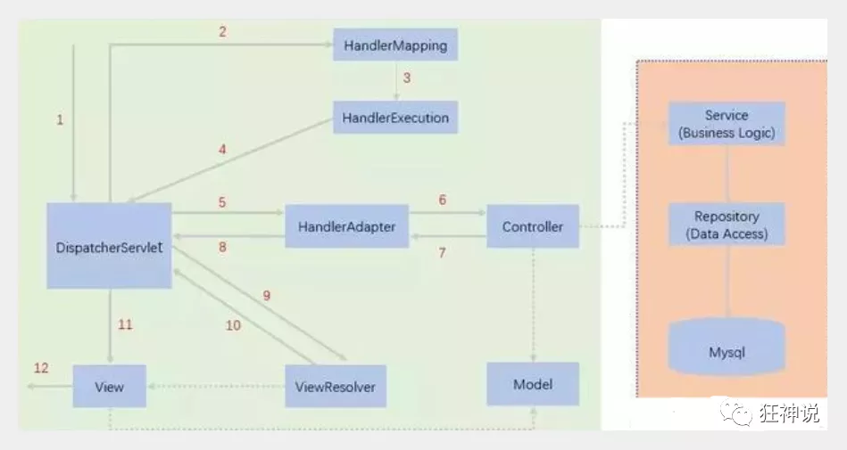

# SpringMVC

* 目录
  * [简要分析执行流程](#简要分析执行流程)
  * [使用springMVC必须配置的三大件：](#使用springmvc必须配置的三大件)

==SpringMVC的执行流程==

**MVC三层架构**

特点：

1. 轻量级，简单易学
2. 高效，基于请求响应的MVC框架
3. 与Spring兼容性好，无缝结合
4. 约定优于配置
5. 功能强大：RESTful、数据验证、格式化、本地化、主题等
6. 简洁灵活

## 简要分析执行流程

1. DispatcherServlet表示前置控制器，是整个SpringMVC的控制中心。用户发出请求，DispatcherServlet接收请求并拦截请求。
   - 我们假设请求的url为：http://localhost:8080/SpringMVC/hello
   - 如上url拆分成三部分：
   - http://localhost::8080服务器域名N
   - SpringMVC部署在服务器上的web站点
   - hello表示控制器
   - 通过分析，如上url表示为：请求位于服务器localhost:8080上的SpringMVC站点的hello控制器。
2. HandlerMapping为处理器映射。DispatcherServlet调用HandlerMapping，HandlerMapping根据请求url查找Handler。
3. HandlerExecution表示具体的Handler，其主要作用是根据url查找控制器，如上url被查找控制器为：hello。
4. HandlerExecution将解析后的信息传递给DispatcherServlet，如解析控制器映射等。
5. HandlerAdapter表示处理器适配器，其按照特定的规则去执行Handler。
6. Handler让具体的Controller执行。
7. Controller将具体的执行信息返回给HandlerAdapter，如ModelAndView。
8. HandlerAdapter将视图逻辑名或模型传递给DispatcherServlet。
9. DispatcherServlet调用视图解析器（ViewResolver）来解析HandlerAdapter传递的逻辑视图名。
10. 视图解析器将解析的逻辑视图名传给DispatcherServlet。

## 使用springMVC必须配置的三大件：

**处理器映射器**、**处理器适配器**、**视图解析器**

通常，我们只需要**手动配置视图解析器**，而**处理器映射器**和**处理器适配器**只需要**开启注解驱动**即可，而省去了大段的xml配置

