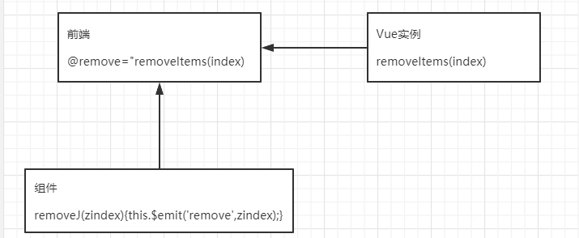
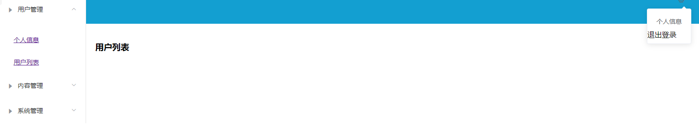
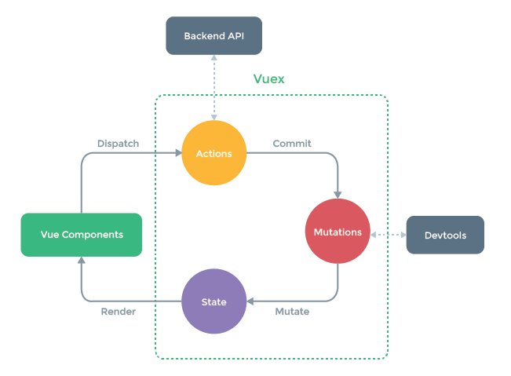

#  Vue

* [绑定: v\-bind](#绑定-v-bind)
* [事件](#事件)
* [网络通信](#网络通信)
  * [Axios](#axios)
  * [跨域问题](#跨域问题)
* [计算属性](#计算属性)
* [插槽](#插槽)
* [动态组件](#动态组件)
* [自定义指令](#自定义指令)
* [过滤器](#过滤器)
* [自定义事件](#自定义事件)
* [第一个Vue程序](#第一个vue程序)
* [Webpack](#webpack)
  * [ES6](#es6)
  * [使用webpack](#使用webpack)
* [vue\-router](#vue-router)
* [结合 ElementUI使用](#结合-elementui使用)
  * [路由嵌套](#路由嵌套)
* [参数传递和重定向](#参数传递和重定向)
  * [参数传递、嵌套路由](#参数传递嵌套路由)
  * [重定向](#重定向)
* [404和路由钩子](#404和路由钩子)
  * [路由模式](#路由模式)
  * [404](#404)
  * [路由钩子与异步请求](#路由钩子与异步请求)
* [VueX](#vuex)
  * [什么是VueX](#什么是vuex)
  * [VueX状态管理](#vuex状态管理)
  * [使用](#使用)
* [使用NPM 管理组件版本](#使用npm-管理组件版本)
* [实战小结](#实战小结)
  * [列表路由跳转](#列表路由跳转)
  * [列表跨页勾选](#列表跨页勾选)
  * [页面返回](#页面返回)

## 绑定: v-bind

绑定属性值

```html
<div id="app3">
  <span v-bind:title="message3">
    鼠标悬停查看
  </span>
</div>
<script>
  var vm = new Vue({
    el: "#app3",
    data:{
      message3: "页面加载于 " +
      new Date().toLocaleString()
    }
  });
</script>
```

v-model

双向绑定表单输入（inpu、select、textarea）与Vue实例值

##判断-循环

- v-if

  ```html
  <!-- if -->
  <h1>if</h1>
  <p v-if="ok">Yes</p>
  <p v-else="ok">No</p>
  
  <h3 v-if="type==='A'">A</h3>
  <h3 v-else-if="type==='B'">B</h3>
  <h3 v-else-if="type==='C'">C</h3>
  <h3 v-else>D</h3>
  
  <script>
      var vm = new Vue({
          el: "#app",
          data:{
              ok: true,
              type: 'A',
          }
      });
  </script>
  ```

  

- v-for

  ```html
  <ul v-for="(item,index) in items">
    <li>
      {{index}}->
      {{item.message}}
      {{item.age}}
    </li>
  </ul>
  
  <script>
      var vm = new Vue({
          el: "#app",
          data:{
              items: [
                  {message: 'z', age: 1},
                  {message: 'j', age: 2},
                  {message: 'p', age: 3}
              ]
          }
      });
  </script>
  ```

## 事件

- v-on

  ```html
  <div id="app">
    <button v-on:click="sayHi">Click Me</button>
  </div>
  <script src="https://lib.baomitu.com/vue/2.5.21/vue.min.js"></script>
  <script>
    var vm = new Vue({
      el: "#app",
      data:{
        message: "hello,Vue!",
      },
      methods:{
        sayHi: function () {
          alert(this.message);
        }
      }
    });
  </script>
  ```

  事件监听:
  		methods获取事件的event
  
  ```vue
  <li @click="getItemInfo(name, $event)" v-for="name in names">{{name}}</li>
  methods:{
    getItemInfo(data, event){
      console.log(data);
      console.log(event);
    }
  }
  ```
  
  

##  网络通信

- Axios

  ```html
  <div id="vue">
    <p>{{info.name}}</p>
    <p v-if="info.address != undefined">{{info.address.street}}</p>
    <a v-bind:href="info.url">点我</a>
  </div>
  
  <script src="https://lib.baomitu.com/vue/2.5.21/vue.min.js"></script>
  <script src="https://unpkg.com/axios/dist/axios.min.js"></script>
  <script type="text/javascript">
    var vm = new Vue({
      el: "#vue",
      data() {
        return{
          info: {
            // name:null,
            // address:{
            //     country:null,
            //     city:null,
            //     street:null
            // },
            // url:null
          }
        }
      },
      mounted() {
        axios
          .get('../data.json')
        //.then(response => (console.log(response.data)));
          .then(response => (this.info = response.data));
      }
    });
  </script>
  ```


### Axios

1. 安装 npm install axios

2. 引入加载 

   ```js
   import Axios from 'axios'
   Vue.prototype.$axios = Axios
   ```

3. 请求

   - get请求：

     ```js
     this.$axios("http://localhost:8080/static/mock/data.json",{
       params:{
         type:"junshi"
       }
     }).then(res=>{
       console.log(res)
     }).catch(error=>{
       console.log(error)
     })
     ```

   - psot请求：

     ​			form-data: ?userId=admin&password=123
     ​			x-www-from-urlencoded:{userId: "admin",password: 123}
     ​			注意：axios接受的post请求的格式是from-data格式

     ```js
     this.$axios.post("http://localhost:8080/login",
     qs.stringify({
       user_id:"admin",
       password: 123
     })).then(res=>{
       console.log(res)
     }).catch(error=>{
       console.log(error)
     })
     ```

### 跨域问题

1. 修改config中的 index.js

   ```js
   proxyTable: {
     "/api": {
       target: "http://localhost:8080",
         changeOrigin: true,
           pathRewrite: {
             '^/api': ''
           }
     }
   },
   ```

   

2. mian.js 中添加HOST

   ```js
   Vue.prototype.HOST = '/api'
   ```

   

3. 使用

   ```js
   this.$axios.post( this.HOST + "/login",
   						      {
   						        userId: 'admin',
   						        password: '123456'
   						      }
   						      ).then(res=>{
   						      console.log(res)
   						    }).catch(error=>{
   						      console.log(error)
   						    });
   ```

   **注意:** 此种跨域解决方案，只能适用于测试阶段，打包的时候，不会具备服务
   		不能跨域了，后端解决

## 计算属性

计算出来的结构，保持在属性中（内存中），内存中：虚拟Dom

类似缓存，其中任何数据发生改变，就会重新计算，放入内存

一般存放不经常改动的数据

```html
<div id="app">
    <p>currentTime1：{{currentTime1()}}</p>
    <p>currentTime2：{{currentTime2}}</p>
</div>

<script src="https://lib.baomitu.com/vue/2.5.21/vue.min.js"></script>
<script>
    var vm = new Vue({
        el: "#app",
        data:{
            message: "hello,Vue!",

        },
        methods:{
            currentTime1: function () {
                return "methods " + Date.now();//返回一个时间戳
            }
        },
        computed:{//计算属性
            // methods, computed的方法名建议不要重名
            // 重名之后，以methods中的优先
            currentTime2: function () {
                // 计算好后
                return "computed " + Date.now();//返回一个时间戳
            }
        }
    });
</script>
```

## 插槽

```html
<div id="app">
    <zjp>
        <zjp-title slot="zjp-title" :ztitle="title"></zjp-title>
        <zjp-items slot="zjp-items" v-for="(item,index) in zjpItems" :zitem="item"></zjp-items>
    </zjp>
</div>


<script src="https://lib.baomitu.com/vue/2.5.21/vue.min.js"></script>
<script>
    // slot : 插槽
    Vue.component("zjp",{
        template:
        '<div>' +
            '<slot name="zjp-title"></slot>' +
            '<ul>' +
                '<slot name="zjp-items"></slot>' +
            '</ul>' +
        '</div>'
    });

    Vue.component("zjp-title",{
        props: ['ztitle'],
        template:'<div>{{ztitle}}</div>'
    });

    Vue.component("zjp-items",{
        props: ['zitem'],
        template:'<li>{{zitem}}</li>'
    });

    var vm = new Vue({
        el: "#app",
        data:{
            zjpItems: ['Java','Vue','Linux'],
            title: "召见破"
        }
    });
</script>
```

## 动态组件

keep-alive

```vue
<template>
	<div>
		<p>big</p>
		<!--{{currentView}}		字符串切换-->
		<component :is="currentView"></component>		重新渲染
		<!-- <keep-alive>
			<component :is="currentView"></component>		缓存中直接取
		</keep-alive> -->
		<button @click="changeView">切换组件</button>
	</div>
</template>

<script type="text/javascript">
	import small1 from './small1'
	import small2 from './small2'

	export default{
		name:"big",
		data(){
			return{
				currentView: "small1"
			}
		},
		components:{
			small1,
			small2
		},
		methods:{
			changeView(){
				if(this.currentView == "small1"){
					this.currentView = "small2"
				}else {
					this.currentView = "small1"
				}
			}
		}
	}
</script>
```

## 自定义指令

- 全局指令

  main.js

  ```js
  import Vue from 'vue'
  import App from './App'
  
  Vue.config.productionTip = false
  
  //定义指令
  Vue.directive('focus',{
  	inserted: function(el){
  		el.focus();
  	}
  })
  
  /* eslint-disable no-new */
  new Vue({
    el: '#app',
    components: { App },
    template: '<App/>'
  })
  ```

  

- 局部指令

  ```vue
  <template>
  	<div>
  		<p v-mycss>haha</p>
  		<input v-focus type="text" name="hellInput">
  	</div>
  </template>
  
  <script type="text/javascript">
  	export default{
  		name:"hello",
  		directives:{
  			focus:{
  				inserted: function(el){
  					el.focus();
  				}
  			},
  			mycss:{
  				inserted: function(el){
  					el.style.color="red";
  				}
  			}
  		}
  	}
  </script>
  ```

## 过滤器

filter

```vue
<template>
	<div>
		<p>{{ price |  moneyChina}}</p>
		<p>{{msg | contextData}}</p>
	</div>
</template>

<script type="text/javascript">
	export default{
		name:"hello",
		data(){
			return{
				price: "20",
				msg: "打工人"
			}
		},
		filters:{
			moneyChina(value){
				if(typeof(value) == "number"){
					return "￥" + value;
				}
				return value;
			},
			contextData(value){
				return value + " P:来自——黑人"
			}
		}
	}
</script>
```


## 自定义事件

```html
<div id="app">
    <zjp>
        <zjp-title slot="zjp-title" :ztitle="title"></zjp-title>
        <zjp-items slot="zjp-items" v-for="(item,index) in zjpItems" :zitem="item" :zindex="index"
                   @remove="removeItems(index)"></zjp-items>
      <!--<zjp-items slot="zjp-items" v-for="(item,index) in zjpItems" :zitem="item" :zindex="index"
                   @remove="removeItems"></zjp-items>-->
    </zjp>
</div>

<script src="https://lib.baomitu.com/vue/2.5.21/vue.min.js"></script>
<script>
    // slot : 插槽
    Vue.component("zjp",{
        template:
        '<div>' +
            '<slot name="zjp-title"></slot>' +
            '<ul>' +
                '<slot name="zjp-items"></slot>' +
            '</ul>' +
        '</div>'
    });

    Vue.component("zjp-title",{
        props: ['ztitle'],
        template:'<div>{{ztitle}}</div>'
    });

    Vue.component("zjp-items",{
        props: ['zitem','zindex'],
        //只能绑定当前组件的methods
        template:'<li>{{zindex}}----{{zitem}}' +
        '<button @click="removeJ()">—</button></li>',
        methods: {
            removeJ: function (zindex) {// zindex可以省略，也可以加其他参数
                //自定义事件分发
                this.$emit('remove',zindex);// zindex可以省略，也可以加其他参数
            }
          	//removeJ: function () {
                //自定义事件分发
                //this.$emit('remove',this.countItem);
            //}
        },
      	data: function(){
          return {
                countItem: 0
            }
        }
    });

    var vm = new Vue({
        el: "#app",
        data:{
            message: "hello,Vue!",
            zjpItems: ['Java','Vue','Linux'],
            title: "召见破"
        },
        methods:{
            removeItems: function (index) {
                console.log("删除了" + this.zjpItems[index]);
                this.zjpItems.splice(index, 1);
            }
        }
    });
```



理解：组件内只能调用组件内的方法

​			通过 this.$emit('remove',zindex) ，将方法提给前端调用自定义方法 remove

​			前端自定义方法调用Vue对象实例的方法 removeItems

**注意：**

- v-bind（:）将前端属性和Vue实例值绑定
- v-on（@）将前端事件和Vue方法绑定
- this.$emit(方法名, 参数)  组件内中调用前端自定义方法
- :key            将前端值返回给Vue实例

## 第一个Vue程序

1. 安装nodeJs
2. 安装淘宝镜像  (可选)    npm install cnpm -g 
3. 进入目录，dos管理员打开    vue init webpack my-project(项目名称，会新建文件夹)
4. 进入项目目录    cd my-project
5. 安装依赖    npm install
6. 运行项目    npm run dev

## Webpack

现代JavaScript静态模块打包器，类比Maven

### ES6

- exports    导出需要暴露的接口

  ```vue
  export default {
    name: 'App',
    components: {
      HelloWorld
    }
  }
  
  module.exports=someValue;
  ```

- require    **同步**加载需要依赖的模块

  ```vue
  require("module"); 
  require("../module. js");
  ```

- model

安装Webpack

1. npm install webpack -g

2. npm install webpack-cli -g

   测试

   webpack -v

   webpack-cli -v

### 使用webpack

1. 创建项目

2. 创建名为modules的目录，用于防止JS模块等资源文件

3. 在modules下创建模块文件，如hello.js，用于编写JS模块相关代码

   ```js
   // 暴露一个方法
   exports.sayHi = function () {
       document.write("<h1>照片剑破 ES6</h1>")
   }
   ```

   

4. 在modules下创建一个名为main.js的入口文件，用于打包时设置 entry属性

   ```js
   var hello = require("./hello");
   hello.sayHi();
   ```

   

5. 在项目目录下创建 webpack.config.js配置文件，使用webpack命令打包

   ```js
   module.exports = {
       entry: './modules/main.js',
       output: {
           filename: "./js/bundle.js"
       }
   }
   ```

   

6. 在项目目录下创建HTML页面，如isdex.html，导入WebPack打包后的JS文件

   ```html
   <!DOCTYPE html>
   <html lang="en">
   <head>
       <meta charset="UTF-8">
       <title>Title</title>
   </head>
   <body>
   
   <script src="dist/js/bundle.js"></script>
   
   </body>
   </html>
   ```

   

7. 在IDEA控制台中直接执行webpack；如果失败的话，就使用管理员权限运行即可！

   **说明**

   热部署，变化即打包

   ```
   #参数--watch用于监听变化
   webpack--watch
   ```

## vue-router

1. 安装    npm install vue-router --save-dev    --save-dev：保存到配置中

2. 在 src/components 下新建vue组件

   Content.vue

   ```vue
   <template>
     <h1>内容页</h1>
   </template>
   
   <script>
       export default {
           name: "content"
       }
   </script>
   
   <style scoped>
   
   </style>
   ```

   Main.vue

   ```vue
   <template>
       <h1>首页</h1>
   </template>
   
   <script>
       export default {
           name: "main"
       }
   </script>
   
   <style scoped>
   
   </style>
   ```

   ZjpTest01.vue

   ```vue
   <template>
       <h2>赵建平Test01</h2>
   </template>
   
   <script>
       export default {
           name: "zjp-test01"
       }
   </script>
   
   <style scoped>
   
   </style>
   ```

3. 在 src 目录下创建 router 文件夹，并新建 idex.js （路配置文件）

   导入路由、自定义组件，设置路由跳转路径

   ```js
   import Vue from 'vue'
   import VueRouter from 'vue-router'
   
   import Content from '../components/Content'
   import Main from '../components/Main'
   import ZjpTest01 from '../components/ZjpTest01'
   //安装路由
   Vue.use(VueRouter);
   
   //配置到导出路由
   export default new VueRouter({
     routes: [
       {
         //路由的路径
         path: '/content',
         name: 'content',
         //跳转的组件
         component: Content
       },
       {
         //路由的路径
         path: '/main',
         name: 'main',
         //跳转的组件
         component: Main
       },
       {
         path: '/zjpTest01',
         name: 'zjpTest01',
         component: ZjpTest01
       }
     ]
   });
   ```

   

4. 在 main.js 中引入router

   ```js
   import Vue from 'vue'
   import App from './App'
   import router from './router'
   // elementUI
   import ElementUI from 'element-ui';
   import 'element-ui/lib/theme-chalk/index.css';
   
   Vue.use(router);
   Vue.use(ElementUI);
   
   Vue.config.productionTip = false
   
   new Vue({
     el: '#app',
     router,
     render: h => h(App)//elementUI
   })
   ```
   
   
   
5. 在 App.vue 中加上跳转链接

   ```vue
   <template>
     <div id="app">
       <h1>召见破</h1>
   
       <router-link to="/main">首页</router-link>
       <router-link to="/content">内容页</router-link>
       <router-link to="/zjpTest01">赵建平</router-link>
       <router-view></router-view>	//可以放到其他地方显示组件
     </div>
   </template>
   ```

## 结合 ElementUI使用

1. 创建工程 vue init webpack hello-vue

2. 安装依赖

   ```
   #进入工程目录
   cd hello-vue
   #安装vue-router
   npm install vue-router --save-dev
   #安装element-ui
   npm i element-ui -S
   #安装依赖
   npm instal1
   #安装SASS加载器
   cnpm install sass-loader node-sass --save-dev
   #启动测试
   npm run dev
   ```

   

3. 新建 views 文件夹（视图），创建两个组件

   Login.vue

   ```vue
   <template>
     <div>
       <el-form ref="loginForm" :model="form" :rules="rules" label-width="80px" class="login-box">
         <h3 class="login-title">欢迎登录</h3>
         <el-form-item label="账号" prop="username">
           <el-input type="text" placeholder="请输入账号" v-model="form.username"/>
         </el-form-item>
         <el-form-item label="密码" prop="password">
           <el-input type="password" placeholder="请输入密码" v-model="form.password"/>
         </el-form-item>
         <el-form-item>
           <el-button type="primary" v-on:click="onSubmit('loginForm')">登录</el-button>
         </el-form-item>
       </el-form>
   
       <el-dialog
         title="温馨提示"
         :visible.sync="dialogVisible"
         width="30%"
         :before-close="handleClose">
         <span>请输入账号和密码</span>
         <span slot="footer" class="dialog-footer">
           <el-button type="primary" @click="dialogVisible = false">确 定</el-button>
         </span>
       </el-dialog>
     </div>
   </template>
   
   <style lang="scss" scoped>
     .login-box{
       border: 1px solid #DCDFE6;
       width: 350px;
       margin:180px auto;
       padding:35px 35px 15px 35px;
       border-radius: 5px;
       -webkit-border-radius: 5px;
       -moz-border-radius: 5px;
       box-shadow:0 0 25px #909399;
     }
   
     .login-title{
       text-align:center;
       margin:0 auto 40px auto;
       color:#303133;
     }
   </style>
   
   
   <script>
     export  default {
       name:"Login",
       data(){
         return {
           form:{
             username: '',
             password: ''
           },
           //表单验证，需要再el-form-item 元素中增加prop属性
           rules:{
             username:[
               {required:true,message:'账号不能为空',trigger:'blur'}
             ],
             password:[
               {required: true,message: '密码不能为空',trigger:'blur'}
             ]
           },
           //对话框显示和隐藏
           dialogVisible:false
         }
       },
       methods:{
         onSubmit(formName) {
           //为表单绑定验证功能
           this.$refs[formName].validate((valid) =>{
             if (valid){
               //使用 vue-router路由到指定页面，该方式称之为编程式导航
               this.$router.push("/main");
             } else {
               this.dialogVisible = true;
               return false;
             }
           });
         }
       }
     }
   </script>
   
   ```

   Main.vue

   ```vue
   <template>
       <h1>首页</h1>
   </template>
   
   <script>
       export default {
           name: "Main"
       }
   </script>
   
   <style scoped>
   
   </style>
   ```

   

4. 新建 router 文件夹（路由配置文件），index.js（路由配置）

   index.js

   ```vue
   import Vue from 'vue'
   import VueRouter from 'vue-router'
   
   import Main from '../views/Main'
   import Login from '../views/Login'
   
   Vue.use(VueRouter);
   
   export default new VueRouter({
     routes: [
       {
         path: '/main',
         component: Main
       },
       {
         path: '/login',
         component: Login
       }
     ]
   });
   
   ```
   
   
   
5. 修改 main.js App.vue

    main.js

   ```js
   import Vue from 'vue'
   import App from './App'
   import router from './router'
   // elementUI 
   import ElementUI from 'element-ui';
   import 'element-ui/lib/theme-chalk/index.css';
   
   Vue.use(router);
   Vue.use(ElementUI);
   
   Vue.config.productionTip = false
   
   new Vue({
     el: '#app',
     router,
     render: h => h(App)//elementUI
   })
   
   ```

   App.vue 使用ElementUI，所以去掉了style

   ```vue
   <template>
     <div id="app">
       <router-view></router-view>
     </div>
   </template>
   
   <script>
   
   export default {
     name: 'App',
   }
   </script>
   
   ```

   ### 路由嵌套

   结合ElementUI使用的基础上

   1. 新建 uers 文件夹并创建两个组件

      List.vue

      ```vue
      <template>
          <h1>用户列表</h1>
      </template>
      
      <script>
          export default {
              name: "UserList"
          }
      </script>
      
      <style scoped>
      
      </style>
      
      ```

      Profile.vue

      ```
      <template>
          <h1>个人信息</h1>
      </template>
      
      <script>
          export default {
              name: "UserProfile"
          }
      </script>
      
      <style scoped>
      
      </style>
      ```

   2. 修改路由配置 index.js

      index.js

      ```js
      import Vue from 'vue'
      import VueRouter from 'vue-router'
      
      import Main from '../views/Main'
      import Login from '../views/Login'
      import UserList from '../views/user/List'
      import UserProfile from '../views/user/Profile'
      
      Vue.use(VueRouter);
      
      export default new VueRouter({
        routes: [
          {
            path: '/main',
            component: Main,//嵌套路由
            children: [
              {path: '/user/profile', component: UserProfile},
              {path: '/user/list', component: UserList}
            ]
          },
          {
            path: '/login',
            component: Login
          }
        ]
      });
      
      ```

      

   3. 修改首页 Main.vue

      Main.vue

      ```vue
      <template>
        <div>
          <el-container>
            <el-aside width="200px">
              <el-menu :default-openeds="['1']">
      
              <el-submenu index="1">
                <template slot="title"><i class="el-icon-caret-right"></i>用户管理</template>
                <el-menu-item-group>
                  <el-menu-item index="1-1">
                    <router-link to="/user/profile">个人信息</router-link>
                  </el-menu-item>
                  <el-menu-item index="1-2">
                      <router-link to="/user/list">用户列表</router-link>
                  </el-menu-item>
                </el-menu-item-group>
              </el-submenu>
      
                <el-submenu index="2">
                  <template slot="title"><i class="el-icon-caret-right"></i>内容管理</template>
                  <el-menu-item-group>
                    <el-menu-item index="2-1">分类管理</el-menu-item>
                    <el-menu-item index="2-2">内容列表</el-menu-item>
                  </el-menu-item-group>
                </el-submenu>
      
      					<!-- 根据以上自定义 -->
                <el-submenu index="3">
                  <template slot="title"><i class="el-icon-caret-right"></i>系统管理</template>
                  <el-menu-item-group>
                    <el-menu-item index="3-1">分类管理</el-menu-item>
                    <el-menu-item index="3-2">内容列表</el-menu-item>
                  </el-menu-item-group>
                </el-submenu>
      
              </el-menu>
            </el-aside>
      
            <el-container>
              <el-header style="text-align:right;font-size:12px">
                <el-dropdown>
                  <i class="el-icon-setting"style="margin-right:15px"></i>
                  <el-dropdown-menu slot="dropdown">
                    <el-dropdown-item>个人信息</el-dropdown-item><e1-dropdown-item>退出登录</e1-dropdown-item>
                  </el-dropdown-menu>
                </el-dropdown>
              </el-header>
      
              <el-main>
                <router-view/>
              </el-main>
            </el-container>
          </el-container>
        </div>
      </template>
      
      <script>
          export default {
              name: "main"
          }
      </script>
      
      <style scoped lang="scss">
        .el-header {
          background-color: #139fd1;
          color: #333;
         
          line-height: 6px;
        }
        .el-aside {
          color: #333;
        }
      </style>
      ```

      预览图：

      

## 参数传递和重定向

### 参数传递、嵌套路由

- 父->子: props

- 子->父: emit Event

  **父传子**

1. 修改 router-link 带上参数

   Main.vue

   ```vue
   <el-menu-item index="1-1">
                 <!-- name-传组件名字 params-传参数 -->
                 <router-link :to="{name:'userProfile',params:{id:1,name:'赵建平'}}">个人信息</router-link>
               </el-menu-item>
   ```

   方法中路由跳转

   ```js
   this.$router.push({name:'BookView',params:{id: row.bookID}});
   ```

   

2. 修改路由配置

   index.js

   ```js
   export default new VueRouter({
     routes: [
       {
         path: '/main',
         component: Main,//嵌套路由
         children: [
           {
             path: '/user/profile/:id/:name', 
             name:'userProfile',
             component: UserProfile, 
             props: true //可以使用props接收参数
           },
           {path: '/user/list', component: UserList}
         ]
       },
       {
         path: '/login',
         component: Login
       }
     ]
   });
   ```

   

3. 接收

   Profile.vue

   ```vue
   <template>
     <!-- 所以元素必须在根节点下 -->
     <div>
       <h1>个人信息</h1>
       <h2>{{$route.params.id}}</h2>
       <h2>{{$route.params.name}}</h2>
       <h3>----------</h3>
       <h2>{{id}}</h2>	//必须设置路由的 props: true
       <h2>{{name}}</h2>
     </div>
   </template>
   
   <script>
       export default {
         props:['id','name'],	//必须设置路由的 props: true
           name: "UserProfile"
       }
   </script>
   ```
   
   **子传父**
   
   利用自定义事件实现
   
   son.vue
   
   ```vue
   <template>
   	<div>
   		<button @click="sendMsg">传递</button>
   	</div>
   </template>
   
   <script type="text/javascript">
   	export default{
   		name:'son',
   		data(){
   			return{
   				sMsg: {
   					name: "Son-01",
   					age: 10
   				}
   			}
   		},
   		methods: {
   			sendMsg(){
   				// 参数1：key 参数2：数据
   				this.$emit('sMsg', this.sMsg)
   			}
   		}
   	}
   </script>
   
   <style type="text/css" scoped></style>
   ```
   
   father.vue
   
   ```vue
   <template>
   	<div>
   		<p>父亲</p>
   		<son @sMsg="getMsg"/>
   		<p>从子组件获取到的数据：{{getSonMsg}}</p>
   	</div>
   </template>
   
   
   <script type="text/javascript">
   	import son from './son'
   	export default{
   		name:'father',
   		data(){
   			return{
   				getSonMsg: {}
   			}
   		},
   		components:{
   			son
   		},
   		methods:{
   			getMsg(data){
   				console.log(data);
   				this.getSonMsg = data;
   			}
   		}
   	}
   </script>
   
   <style type="text/css" scoped></style>
   ```
   
   

### 重定向

1. 修改路由配置

   ```js
   export default new VueRouter({
     routes: [
       {
         path: '/main',
         component: Main,//嵌套路由
         children: [
           {path: '/user/profile/:id/:name', name:'userProfile',component: UserProfile, props: true},
           {path: '/user/list', component: UserList}
         ]
       },
       {
         path: '/login',
         component: Login
       },{// 重定向配置
         path: '/gohome',
         redirect: '/main'
       }
     ]
   });
   ```

   

2. 增加 router-link 测试

   ```vue
   <el-menu-item index="1-3">
     <router-link to="/gohome">返回首页</router-link>
   </el-menu-item>
   ```

## 404和路由钩子

### 路由模式

- hash：路径带#符号，如http://localhost/#/login

- history：路径不带#符号，如http://localhost/login

  修改路由配置

  ```js
  export default new Router({
    mode:'history',
    routes:[]
  });
  ```

### 404 

1. 新建404组件

   NotFound.vue

   ```vue
   <template>
       <div>
         <h1>你的页面走丢了</h1>
       </div>
   </template>
   
   <script>
       export default {
           name: "not-found"
       }
   </script>
   
   <style scoped>
   
   </style>
   
   ```

   

2. 增加到路由

   ```js
   import NotFount from '../views/NotFound'
   
   export default new VueRouter({
     mode: 'history',
     routes: [
       ……
       {
         path: '/login',
         component: Login
       },{
         path: '/gohome',
         redirect: '/main/admin'
       },{
         path: '*',	//以上路由都匹配不到，走404页面
         component: NotFount
       }
     ]
   });
   ```

   

### 路由钩子与异步请求

- `beforeRouteEnter`：在进入路由前执行
- `beforeRouteLeave`：在离开路由前执行N

```vue
export default {
      props:['id','name'],
        name: "UserProfile",
      //过滤器 (to, from, next) (HttpServlrtRequset,Response, Chain)
      beforeRouteEnter:(to, from, next)=>{
        console.log("进入路由之前");
        next(vm=>{
          vm.getData();//进入路由之前执行genData方法
        });
      },
      beforeRouteLeave:(to, from, next)=>{
        console.log("离开路由之后");
        next();
      },
      methods:{
        getData: function () {
          this.axios({
            method: 'get',
            url:'http://localhost:8080/static/mock/data.json'
          }).then(function (response) {
            console.log(response);
          })
        }
      }
    }
```

mian.js

```js
import axios from 'axios'
import VueAxios from 'vue-axios'

Vue.use(VueAxios, axios);
```


或者

min.js

```js
import Axios from 'axios'

Vue.prototype.$axios = Axios
```

使用

```vue
export default {
  name: 'HelloWorld',
  data () {
    return {
      msg: 'Welcome to Your Vue.js App'
    }
  },
  created(){
    this.$axios("http://localhost:8080/static/mock/data.json",{
      params:{
        type:"junshi"
      }
    }).then(res=>{
      console.log(res)
    }).catch(error=>{
      console.log(error)
    })
  }
}
```

## VueX

### 什么是VueX

Vuex 是一个专为 Vue.js 应用程序开发的状态管理模式。它采用集中式存储管理应用的所有组件的状态，并以相应的规则保证状态以一种可预测的方式发生变化。

**开发大型单页面应用时使用**

### VueX状态管理



view->(dispatch)Action->(Commit) Mutations->(Mutate)State->View
		 **注意：**Action不是必需品，如果有异步操作才可能用到，否则跨域不使用

###  使用

1. 安装

   ```js
   npm install vuex --save
   ```

   

2. 引入依赖

   ```js
   import Vuex from 'vuex'
   Vue.use(Vuex)
   ```

   

3. 创建 store 仓库

   ```js
   const store = new Vuex.Store({
   				  state: {
   				    count: 0
   				  },
   				  mutations: {
   				    increment (state) {
   				      state.count++;
   				    },
   				    desment(state){
   						state.count--;
   				    }
   				  },
   				  actions:{
   				  	incrementA(context){
   				  		context.commit("increment");
   				  	},
   				  	desmentA(context){
   						context.commit("desment");
   				    }
   				  }
   				})
   ```

   

4. 使用

   - 获取数据

     ```js
     this.$store.state.count
     ```

   - 调用 mutations 方法

     ```js
     this.$store.commit('increment');
     ```

   - 调用 actions 

     ```js
     this.$store.dispatch("incrementA");
     ```

   **注意：**
   				`Action` 提交的是 **mutation**. 而不是直接改变状态
   				`Action `可以包含任意异步操作。

##  使用NPM 管理组件版本

1. npm发布一个包

   1. 官网注册账号
   2. cmd 下登录账号 npm login
   3. 发布 npm publish

2. 创建自己的组件

   1. 初始化项目

   2. 修改 package.json 文件

      ```json
      "private": false,			修改为false
      
      "main": "dist/vue-zjp007-counter.min.js",				增加
      ```

      

   3. 修改 webpack.prod.config.js 文件

      1. 修改 out 输出目录

      2. 删除无用内容

         修改后的 webpack.prod.config.js

         ```js
         'use strict'
         const path = require('path')
         const utils = require('./utils')
         const webpack = require('webpack')
         const config = require('../config')
         const merge = require('webpack-merge')
         const baseWebpackConfig = require('./webpack.base.conf')
         const CopyWebpackPlugin = require('copy-webpack-plugin')
         const HtmlWebpackPlugin = require('html-webpack-plugin')
         const ExtractTextPlugin = require('extract-text-webpack-plugin')
         const OptimizeCSSPlugin = require('optimize-css-assets-webpack-plugin')
         const UglifyJsPlugin = require('uglifyjs-webpack-plugin')
         
         const env = require('../config/prod.env')
         
         const webpackConfig = merge(baseWebpackConfig, {
           module: {
             rules: utils.styleLoaders({
               sourceMap: config.build.productionSourceMap,
               extract: true,
               usePostCSS: true
             })
           },
           devtool: config.build.productionSourceMap ? config.build.devtool : false,
           output: {
             path: config.build.assetsRoot,
             publicPath: config.build.assetsPublicPath,
             filename: 'vue-zjp007-counter.min.js',
             library: 'vueZjp007Counter',
             libraryTarget: 'umd'
           },
           plugins: [
             // http://vuejs.github.io/vue-loader/en/workflow/production.html
             new webpack.DefinePlugin({
               'process.env': env
             }),
             new UglifyJsPlugin({
               uglifyOptions: {
                 compress: {
                   warnings: false
                 }
               },
               sourceMap: config.build.productionSourceMap,
               parallel: true
             }),
             // extract css into its own file
             new ExtractTextPlugin({
               filename: utils.assetsPath('css/[name].[contenthash].css'),
               // Setting the following option to `false` will not extract CSS from codesplit chunks.
               // Their CSS will instead be inserted dynamically with style-loader when the codesplit chunk has been loaded by webpack.
               // It's currently set to `true` because we are seeing that sourcemaps are included in the codesplit bundle as well when it's `false`, 
               // increasing file size: https://github.com/vuejs-templates/webpack/issues/1110
               allChunks: true,
             }),
             // Compress extracted CSS. We are using this plugin so that possible
             // duplicated CSS from different components can be deduped.
             new OptimizeCSSPlugin() 
           ]
         })
         
         
         module.exports = webpackConfig
         
         ```

         

      3. config下的 index.js 修改

         ```js
         assetsSubDirectory: '/',    static改为/
         ```

         

   4. 修改输出

      1. 修改 main.js 文件，输出自己的组件即可使用

3. 打包 npm run build 

4. 修改.gitignore 

   ​	去掉 /dist/

使用：

1. npm install --save-dev vue-zjp007-counter

2. 引入依赖

   ```js
   import VueZjp007Counter from 'vue-zjp007-counter'
   
   export default {
     name: 'App',
     components: {
       VueZjp007Counter
     }
   }
   ```

   作为组件使用

   ```vue
   <VueZjp007Counter />
   ```

## 实战小结

使用ELementUI的Table组件

### 列表路由跳转

思路，使用按钮的点击方法，在方法里进行路由跳转

```vue
<template slot-scope="scope">
	<el-button @click="viewClick(scope.row)" type="text" size="small">查看</el-button>
	<el-button @click="handleClick(scope.row)" type="text" size="small">编辑</el-button>
</template>

viewClick(row){   //查看路由跳转
	this.$router.push({name:'BookView',params:{id: row.bookID}});
}
```

### 列表跨页勾选

基于table的两个属性row-key、reserve-selection和一个事件selection-change即可以非常简洁的实现。

1. **给el-table绑定row-key属性**

   ```vue
   <el-table :data="tableData" stripe style="width: 100%" row-key="bookID">
   ```

2. **给type=selection的el-table-column设置reserve-selection属性**

   ```vue
   <el-table-column type="selection" width="55" :reserve-selection='true'></el-table-column>
   ```

3. **给el-table绑定selection-change事件**

   ```vue
   <el-table :data="tableData" stripe style="width: 100%" row-key="bookID"
       @selection-change="handleSelectionChange">
   ```

   ```vue
   data(){
   	return {
   		tableData:[],
   		multipleSelection:[]
   	};
   },
   methods:{
   	handleSelectionChange(rows){	//勾选、取消都会触发
   		this.multipleSelection = val;
   	}
   }
   ```

4. **可以使用计算属性实现统计**

   ```vue
   computed:{
   	checkedBookIDS(){
   		let ids = '';
   		this.multipleSelection.forEach(item=>{
   			ids += item.bookID;
   		});
   		if(ids.length > 0){
   			ids = ids.slice(0, ids.length - 1);
   		}
   		return ids;
   	}
   },
   ```

### 页面返回

```vue
this.$router.go(-1);// 利用路由返回上一个页面
```